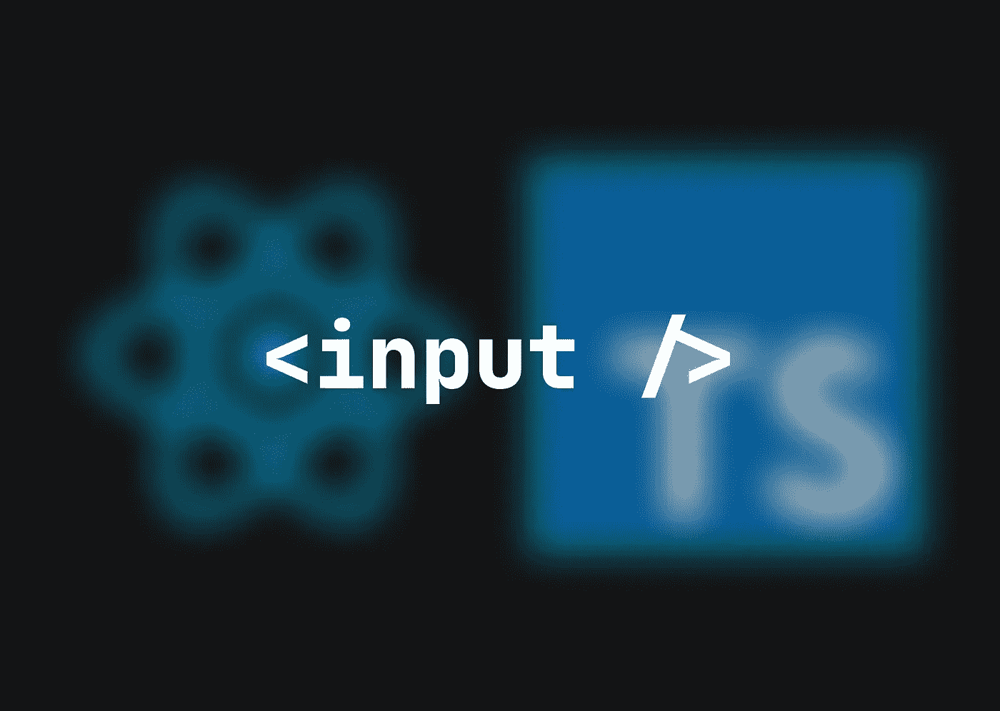
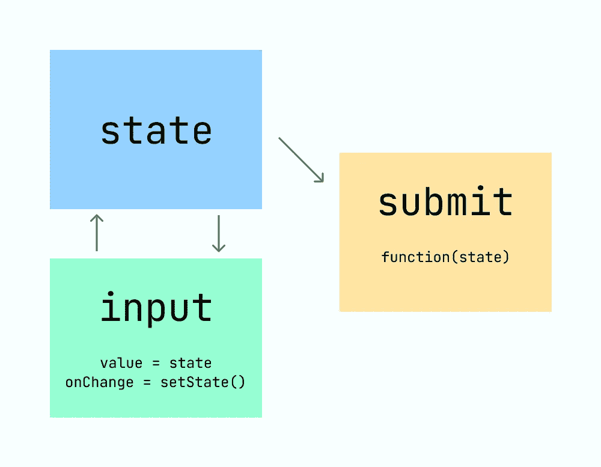

# React pro 提示:如何管理表单

> 原文：<https://medium.com/codex/react-pro-tip-how-to-manage-forms-ca99197a9800?source=collection_archive---------5----------------------->

如果您使用的是具有可变数据的 web 应用程序，您必须学会处理表单。在我看来，理想的用户体验是当用户看到输入字段中的实际数据时，可以通过提交按钮轻松地更新它；我将在本文中解释 React 应用程序中的表单更新流程。



必须更新的数据必须首先从数据库中取出，我们需要一个`state`来存储并显示在 UI 表单上。

```
⬇️ **THE FIRST STEP IS DATA FETCHING**const App = () => { const [**name, setName**] = useState<string>('')
  const [**email, setEmail**] = useState<string>('') const **getData** = async () => {
    const response = await fetch('url...').then((response) => response.json())
    **setName**(response.name)
    **setEmail**(response.email)
  } useEffect(() => {
    **getData()**
  }, []) return (
    <form>
      <input type="text" **value={name}** />
      <input type="text" **value={email}** />
    </form>
  )
}
```

上面我们定义了状态(`name`，`email`)，定义了一个获取数据并将数据值设置为状态的函数(`getData`)，在组件(页面)呈现上运行该函数(在`useEffect`)，并为呈现的输入字段传递状态值。

太好了。现在，当状态的值在输入字段中改变时，必须以某种方式修改状态。我们可以通过将状态设置函数(`setName`和`setEmail`)传递给带有`event`参数的输入`onChange` prop 来实现这一点

```
💡 *event = An object always available in React components carries information on its target, in this case, the input field and it's value*
```

因此，我们必须更新我们的输入字段

```
🤖 **UPDATE THE INPUT FIELDS**

...return (
    <form>
      <input
        type="text"
        value={name}
        **onChange={event => setName(event.target.value)}**
      />
      <input
        type="text"
        value={email}
        **onChange={event => setEmail(event.target.value)}**
      />
    </form>
  )
}
```

现在我们只剩下一件事要做了。创建一个提交按钮和一个更新数据库中数据的函数

```
💾 **CREATE A SUBMIT BUTTON AND A FUNCTION THAT RUNS ON CLICKING IT**...const getData = async () => {
   const response = await fetch('url...').then((response) => response.json())
  setName(response.name)
  setEmail(response.email)
}useEffect(() => {
  getData()
}, [])**const submit = (name: string, email: string) => {
  ...API or service call with name and email arguments
}**return(
    <form>
      <input
        type="text"
        value={name}
        onChange={event => setName(event.target.value)}
      />
      <input
        type="text"
        value={email}
        onChange={event => setEmail(event.target.value)}
      />
      **<button onClick={() => submit(name, email)}>
        Submit
      </button>**
    </form>
  )
```

我们可以将状态作为参数传递给 submit 函数，因为我们总是用新的输入值来更新它们。

流程基本上是这样的:



在组件呈现时，我们用获取的值更新状态，不断地更新它们，在提交时，我们将它们作为提交函数的参数传递。

👋我希望这在你寻找新的学习材料时对你有用。感谢您花时间阅读这篇文章！如果你想在未来读到更多这样的故事，请订阅我的电子邮件列表！