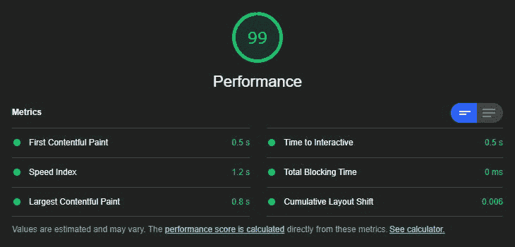

# 使用 Next.js ISR 对查询做出反应:包含动态内容的静态网站

> 原文：<https://medium.com/codex/react-query-with-next-js-isr-static-websites-with-dynamic-content-7086a15479b3?source=collection_archive---------3----------------------->


# 什么是重新验证时失效？

如果有一项技术是我在未来几年内一直关注的，那就是“过时-重新验证”:能够处理过去的查询(过时),然后在客户端重新运行这些相同的查询(重新验证)。我(和许多其他人)相信这项新技术有能力永远革新页面速度。仅在 React 领域，已经有两个重要的竞争者在扮演类似的角色: [@tannerlinsley](https://github.com/tannerlinsley) 的 [react-query](https://github.com/tannerlinsley/react-query) 和 [@vercel](https://github.com/vercel) 自己的 [swr](https://github.com/vercel/swr) 包，为其他 JavaScript 框架提供了类似的包。它们都在类似的时间出现，react-query 的第一次提交是在 2019 年 9 月，swr 在几周后的 2019 年 10 月下旬开始。虽然两者之间有一些细微的差别，但它们的目标是解决相同的问题。

# SWR 是做什么的？

stale-while-revalidate 的概念主要旨在解决围绕查询和缓存的问题，这些问题通常是定制的笨重或脆弱的系统。

**获取和缓存数据**

React Query 和 SWR 完成了数据获取的所有繁重工作:您需要做的只是提供一个查询字符串和一些关于何时刷新数据的选项，这些包会为您完成剩下的工作。Stale-while-revalidate 包使用键字符串来引用查询，然后可以缓存这些查询，在后台刷新这些查询，或者在获取新数据时提供旧数据。所有这些几乎都不需要配置，这可以节省很多时间。

```
const {
  isLoading,
  isError,
  data,
  error
} = useQuery('menus', fetchMenus) // 'menus' is the key
```

由于在单个查询中使用多个键，React Query 和 SWR 还可以处理分页和任何使用现成指针的查询，这使得分页请求更容易处理，而不是创建自定义代码。

```
// page can be incremented and the query will update automatically
useQuery(
  ['products', page],
  () => fetchProducts(page)
)
```

**重新提取焦点**

stale-while-revalidate 最方便的特性之一是对焦点的重新提取:正如它听起来的那样，一旦用户重新聚焦一个窗口，React Query 将重试任何指定的查询。这意味着，如果他们在其他网站上，或者只是离开电脑休息一会儿，数据将在他们回到你的网站时被刷新——这意味着几乎不费吹灰之力就可以完成数据同步。

**请求失败/重试处理**

如果在使用 React Query 或 SWR 时，您的请求出现任何问题，也不必担心:错误和响应失败会被自动处理。当出错时，错误将在后台处理，查询将被轮询，直到得到“OK”响应。在此之前，陈旧的数据将被提供，因此不需要备份—只需确保您有一个加载指示器，以便您的用户知道正在发生什么。

**预取**

对于在服务器端呈现的站点，React Query 可以设置为使用页面上使用的相同键系统来预取页面数据。有几个独特的函数可用于此—在 React Query 中，您可以预取查询:

```
// The results of this query will be cached like a normal query
const prefetchMenus = async () => {
   await queryClient.prefetchQuery('menus', fetchMenus)
 }
```

然后，在服务器端进行的这些查询将与在页面上进行的相同查询同步，因此，即使数据变得陈旧，也可以在客户端再次刷新。

# 重新验证时失效的用例

像 react-query 或 swr 这样的包本身就可以提供一些非常方便的用例，比如:

*   确保当用户重新聚焦窗口时提要是最新的
*   缓存在对话或模式中获取的数据，即使模式是关闭的
*   延迟加载—根据需要执行查询，提供陈旧数据或占位符，直到请求得到满足
*   轻松处理分页部分或无限滚动
*   提高提取效率——由于数据在后台被缓存并分配给一个键，因此可以在应用程序的任何地方访问这些数据

# 静态与动态网站

传统上，提供网站服务有两种方式:第一种是静态的，在提供给所有用户之前，一个网站只被导出到一个普通的 HTML 文档中一次，这意味着网站内容从它建立的时间点起就被冻结了。这意味着静态网站下载和显示内容的速度非常快。然而，静态网站的一个主要缺点是，它们提供的内容在网站建立时是冻结的。这对于 web 应用程序来说并不理想，因为 web 的一个关键特性是不断更新的。这就是动态网站要解决的问题。

动态网站是指当特定用户访问某个页面时，该页面的新版本是为他们而构建的。这意味着页面内容可以是最新的，并为每个用户量身定制。这意味着无论用户何时访问该页面，数据都是完全最新的。然而，在每个请求上呈现站点会增加服务器的负担，并增加加载时间。

还有一种情况是，由于使用了内容管理系统，客户可以更轻松地编辑动态网站，尽管实际上有许多静态网站也使用内容管理系统，但这些网站不太常见。与内容管理系统一起使用静态网站的主要问题是，每当内容发生变化时，它们都需要重建，这可能需要客户端每次进行更改时通过控制台手动重建网站(祝好运)，或者需要将 webhooks 添加到构建过程中以检测更改并相应地重建。谢天谢地，Next.js 提供了一个更好的方法:增量静态再生。

# 使用 Next.js 进行增量静态再生

你可能听说过 Next.js 构建过程的一个新特性——名字有点拗口:增量静态再生。这不是最容易记住的，但它的好处可能会对 21 世纪 20 年代的网络性能产生持久的影响——每次都有 100/100 的灯塔性能分数和惊人的页面速度

它是这样工作的:不是一次导出网站并部署网站的快照，而是在页面的 getStaticProps 函数中提供一个“重新验证”计时器。当您在服务器上没有“npm 运行开始”时，站点的图像将在当前时间导出。有趣的是，当您之前设置的“重新验证”计时器超时时。

一旦计时器下降到 0，服务器就等待，直到另一个用户访问站点上的页面，然后再重建该页面。这就是“重新验证时过时”概念再次出现的地方:再次访问页面的用户将获得过时的内容，但是一旦他们刷新页面或另一个用户出现，他们将收到新的、最新的版本。这样，ISR 提供了一种介于静态和动态之间的部署选择。该网站将具有静态网站的性能优势，但内容对大多数用户来说将是最新的。

这对于客户和网站管理员来说也是非常好的:不用每次修改都要手动重建整个网站，你只需要访问你编辑过的页面，它就会自动重建。

但是等等。

这仍然意味着，对于访问一段时间没有访问过的页面的用户来说，内容仍然是过时的。对此我们能做些什么？

# 使用 React Query 和 Next.js ISR 构建包含动态内容的静态站点

将 Next.js 的 ISR 与 React Query 或类似的包一起使用的真正好处来了。通过要求 React Query 重新运行生成站点时执行的相同查询，一旦页面被加载到客户端，就可以立即填补新数据中的空白。

通过将查询设置为在页面加载后运行，并且由于 React Query 提供的键控查询缓存系统，可以很容易地添加这个特性。重构旧的 Next.js 项目来使用这个特性也很容易，因此您可以毫不费力地投入并尝试一下。

这是我最近做的一个网站的性能分数。我真正投入性能的唯一努力是压缩图像和使用最佳文件类型:其他一切都由 Next.js 处理。



你可能会说，我真的对这项技术和这个想法的任何未来发展感到兴奋:也许在未来，像 Next.js 这样的框架可以自动处理所有这些，使超快动态网站成为行业标准。现在，我鼓励每个使用无头系统的人尝试一下——额外的性能是代理商和自由职业者的一大卖点。

以后我会在这个博客上写更多关于构建无头系统的内容，所以如果你感兴趣的话，请继续关注。感谢您走到这一步——如果您不同意我所说的任何内容，请告诉我，我会尽快解决。保重！