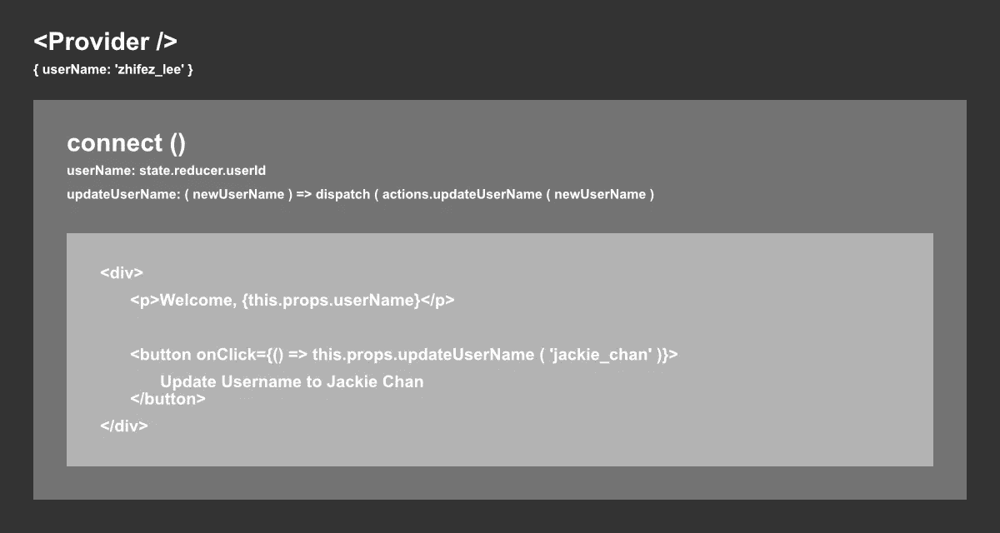
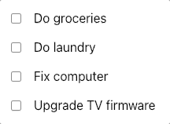

# 反应-为门外汉还原(专长。redux-Saga)——第 1 部分

> 原文：<https://medium.com/codex/react-redux-for-the-uninitiated-feat-redux-saga-part-1-8cff10003e00?source=collection_archive---------2----------------------->

马库斯·斯皮斯克在 [Unsplash](https://unsplash.com?utm_source=medium&utm_medium=referral) 上的照片

Redux 对于新手来说很难，毫无疑问。如果您刚刚开始探索 React，并且已经决定使用 Redux 作为您的 goto 状态管理，并且发现它非常难以理解它的实际工作原理，我希望本教程能够帮助您更好地理解它。

# 我什么时候用 Redux？

使用 Redux 的一个经验法则是，当您有一个包含多个模块的大规模软件时，您希望每个模块都能够访问特定的(如果不是所有的)存储状态，比如经过身份验证的用户数据、购物车等。

但对我个人来说，我在几乎所有的类和函数组件中都使用 Redux，我将 99%的状态存储在 Redux 中。

当谈到如何使用 Redux 时，真的没有具体的标准，在我的职业生涯中，我看到了许多公司组织 Redux 结构的不同方式。随着您在更多的 React 项目中工作，您将逐渐发展您自己的状态管理品味。

如果你只是做你自己的事情，而没有接触过其他人构建 Redux 的方式，你应该去读更多的 Redux 教程文章(比如这篇文章)，这会有所帮助。

# Redux 如何工作(简单来说)

如果你在此之前没有研究过[反应状态](https://reactjs.org/docs/state-and-lifecycle.html)是如何工作的，我建议你在继续之前多读一些关于它们的内容。

我可以描述 **Redux** 的最简单方式是，它是一个具有**巨大反应状态** **的组件，将数据加载到存储在**中。

使用像 [**提供者**](https://react-redux.js.org/api/provider) (将在**第 2 部分**中进一步讨论)这样的包装器，您可以系统地更新和管理那个庞大的状态；然后，您可以使用 react-redux 提供的 [**连接**](https://react-redux.js.org/api/connect) 函数来访问和更新这些状态。

然后是**动作**和**减速器**。

**Action** 有点像 **this.setState** ，允许你发出一个动作请求，一个 **Reducer** 会拦截它并用一堆新值更新状态，重新计算现有的存储数据或者简单地重置它们。你也可以触发一个**传奇**事件，我们将在**第 3 部分**中介绍。

一个**动作**的简单结构如下:

1.  它应该有一个**动作类型**(行业标准的带下划线的大写字母)；
2.  它可能有一个功能，用于简化创建动作请求的过程——一个带有强制“类型”变量的对象，用于插入一个 **ACTION_TYPE** ，以及用作 **Reducer 的**使用的参数的其他值。

**Reducer** 是您决定应该如何管理状态的地方。当它通过**动作**拦截到响应请求时，它将根据**动作**传入的任何参数更新状态。

**减速器**的简单结构如下:

1.  它应该有一个 **initialState** ，它定义了你的状态的整体结构，至少对于这个用户名模块是这样的。
2.  它应该有一个默认函数，该函数检测和拦截特定的 **ACTION_TYPE** ，并决定做什么——在上述示例代码的上下文中，它将现有的“用户名”值更新为从**操作**传入的“新用户名”参数。

# 连接(到道具)

一旦你解决了你的**动作**和**减速器**，是时候将它们传递到一个组件中使用了。你可以使用**连接**来完成:

一个 **connect** 函数接受两个参数: **mapStateToProps** 和**mapdispatctoprops**，它总是以默认组件作为其参数被调用。

顾名思义， **mapStateToProps** 和**mapdispatctoProps**用于将您需要的**状态**和**动作**映射/推送/包含到组件的 props 中。

这里对于 **mapDispatchToProps** 来说一个关键的事情是，你在里面定义的函数必须被 [**分派**](https://react-redux.js.org/using-react-redux/connect-mapdispatch) 函数包装，这是你在 Redux 中触发**动作**的唯一方式。如果你定义一个函数而没有把它们包装在 **dispatch** 中，那么什么都不会起作用。**动作**仍将被调用，但在 Redux 循环中不会被触发，并且**减速器**将不能在其末端接收任何东西。

# 给定一个待办事项列表

您需要检查列表中的一些内容，所以您单击一个复选框，列表就会以新的状态更新。

为了处理这些状态，首先，您将使用 useState 创建一个状态变量来处理 todo 列表(带有两个示例任务):

当用户切换复选框输入时更新任务:

要从列表中删除任务:

要为列表创建新任务:

# Redux 解决方案

处理上述状态的 Redux 等价如下:

1.  为每个状态更新功能(更新、删除和新建)创建一个**动作**以及它们各自的参数。
2.  默认情况下， **Reducer 的** initialState 将有一个样本待办事项列表。
3.  在被拦截的 **UPDATE_TODO** 上，Reducer 将根据提供的“index”和“isChecked”值更新 TODO 列表，同样适用于 **DELETE_TODO** 和 **CREATE_NEW_TODO** 。

*在第 2 部分中，我们将研究在 React 项目中设置 Redux:*[*https://medium . com/codex/React-Redux-for-the-initiated-feat-Redux-saga-Part-2-2a 747 c 74 ba 91*](/codex/react-redux-for-the-uninitiated-feat-redux-saga-part-2-2a747c74ba91)