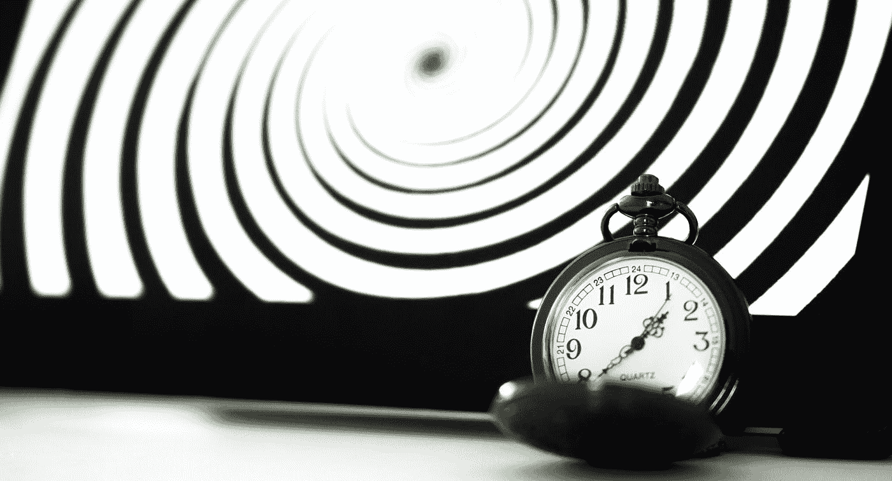
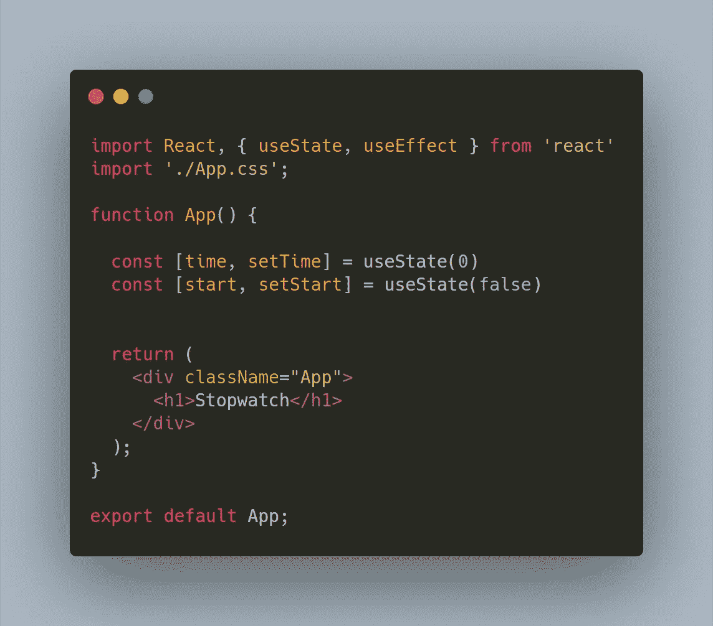
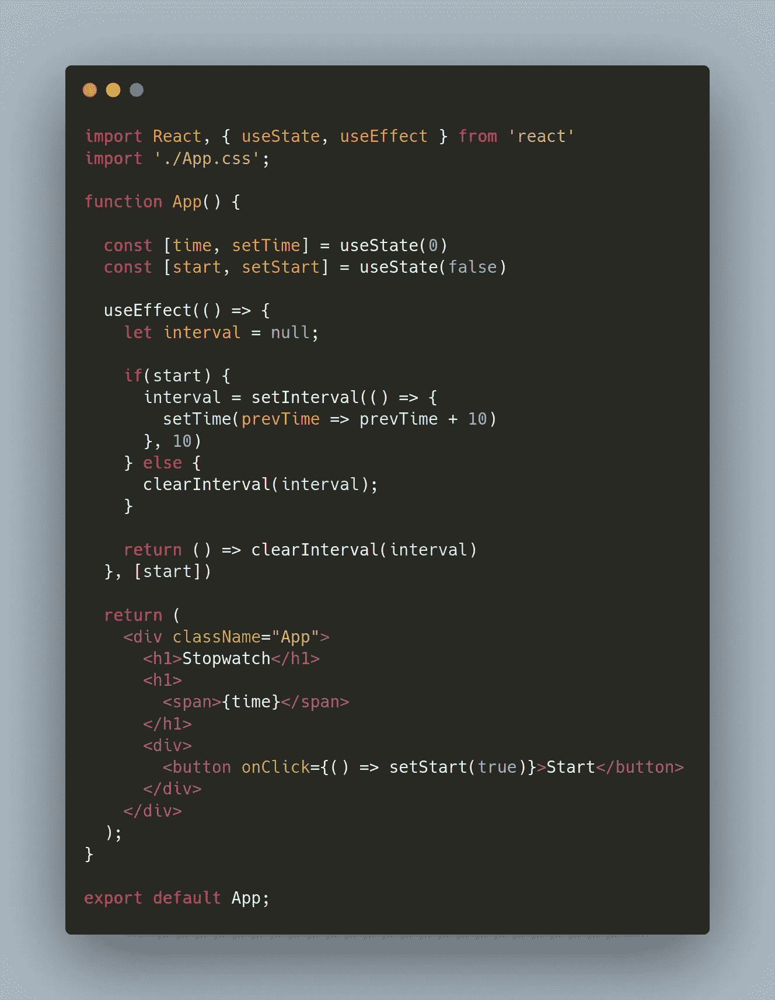
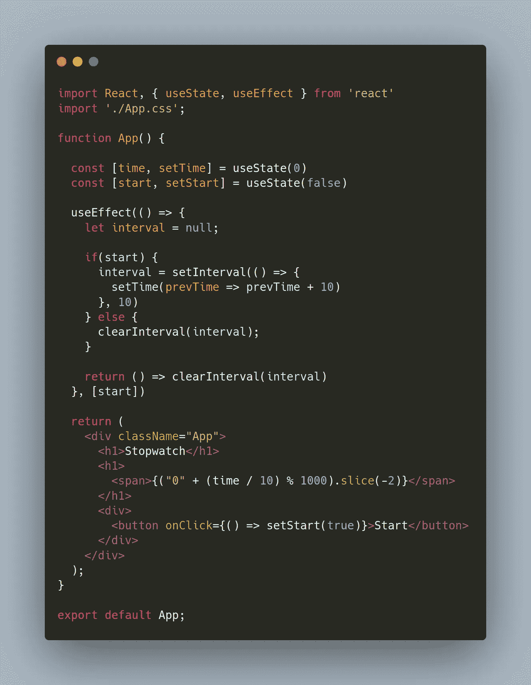
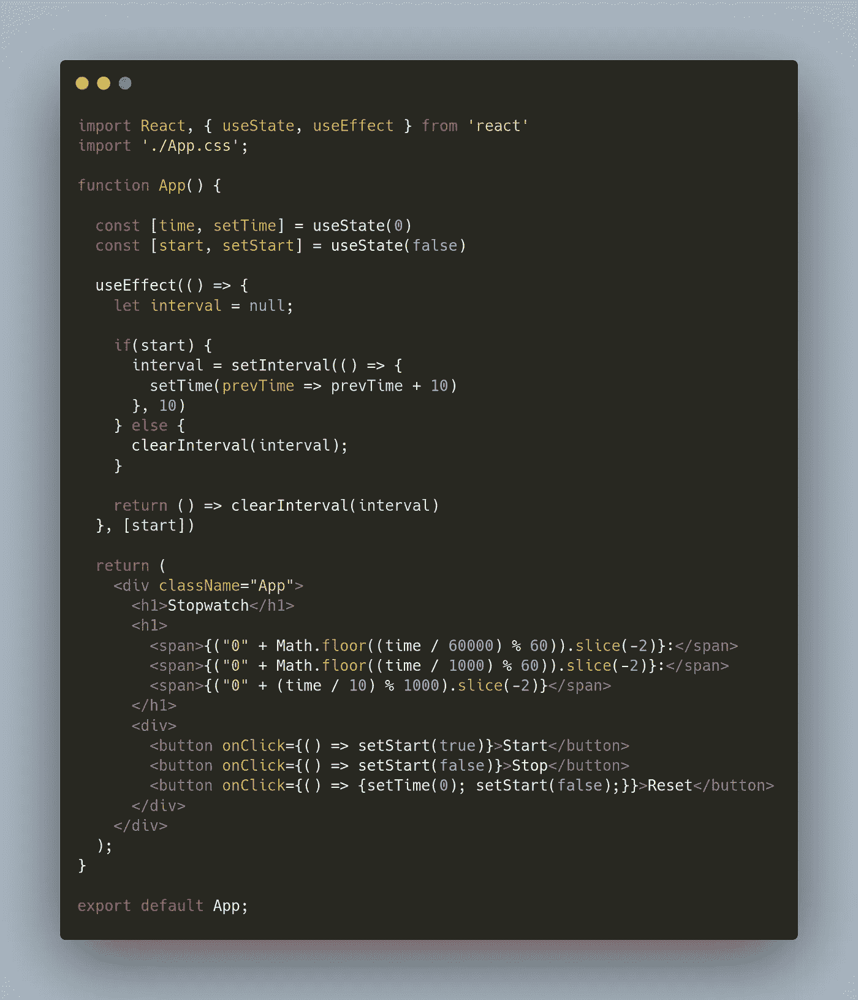

# 反应秒表

> 原文：<https://medium.com/codex/react-stopwatch-10bf9813d0ec?source=collection_archive---------1----------------------->

MK Hamilton 在 [Unsplash](https://unsplash.com?utm_source=medium&utm_medium=referral) 上的照片

本周，我回到了使用钩子的基础，用 react 制作了一个秒表。我认为这是一个很好的小项目，可以在几个小时内完成，这是一个练习 React hooks 的好方法。用这个秒表，你可以开始计时、停止计时和重置。让我们开始，看看代码。

我们将删除 src 文件夹中除 App.css、App.js 和 index.js 之外的所有文件，并删除所有导入。我们将使用状态和效果挂钩。这是我们的初始组件的样子。

很好，现在我们要展示我们的时间了。我们将从显示毫秒开始。让我们从构建我们的使用效果开始。首先，我们将定义时间间隔，如果 start 为真，计时器将启动，否则我们将清除时间间隔。在 useEffect 的第二个参数中，我们将传入一个以 start 开头的数组。这意味着我们的效果将在开始状态改变时运行。我们还将添加一个用于清理的返回语句。最后，我们将有一个按钮，一旦它被点击，将开始计时。这就是它的样子。

现在我们的时间开始倒计时。到目前为止，没有办法停止或重置秒表。我们还需要格式化显示的内容，以便数字看起来正确。做这件事有一个很好的技巧。首先我们将时间除以 10，因为这是一毫秒的值，然后取模 1000。现在我们将它附加到一个零上，这样当时间开始时，已经有一个零了，而不是只有一个数字。最后，我们将切片并传入参数-2，这样当数字变成两位数时，零将被删除。这就是它的样子。

现在显示的数字会更有意义。最后，我们需要做的是显示秒，分钟，并创建停止和重置按钮。创建分和秒与我们创建毫秒非常相似。我们可以复制粘贴并做一些修改。我们将在 60 之前使用模块，而不是在 1000 之前使用模块。另一件事，我们将不得不做的是四舍五入的数字，因为十进制数字将显示，如果我们让它保持原样。这些按钮也与我们已经有的按钮非常相似。例如，我们将在停止按钮中将开始状态设置为 false。对于重置按钮，我们将时间设置为 0，并将 start 设置为 false。这就是我们完成的秒表的样子。

这是练习一些基本技巧的好方法，比如钩子。这些相同的技术可以用来创建其他类似的项目，如计时器或时钟。这是超级有趣的建设这一点，它并没有花那么长时间去做。希望你和我一样开心。编码快乐！😎