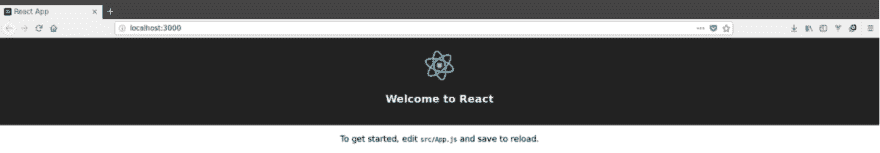
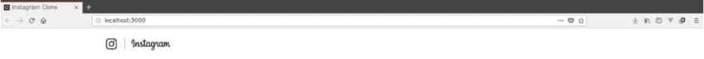
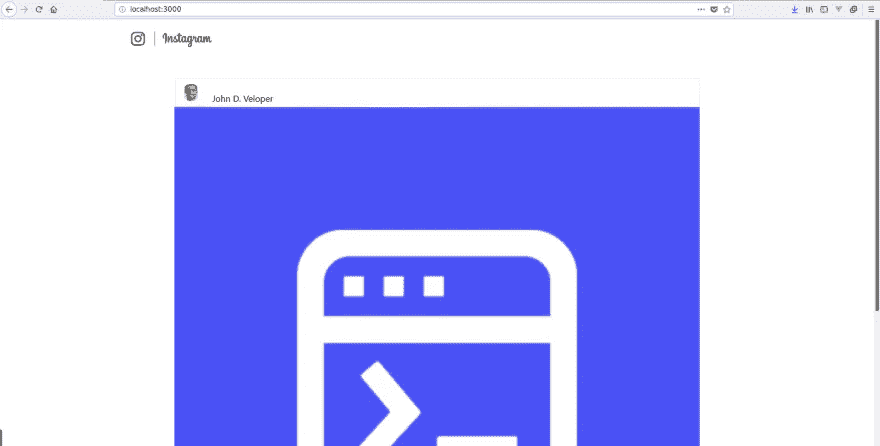

# React 教程:如何用 React 构建 Instagram UI

> 原文：<https://medium.com/codex/react-tutorial-how-to-build-the-instagram-ui-with-react-fc041f82eed?source=collection_archive---------4----------------------->


图片来源:作者

投资组合项目是作为前端开发人员或全栈开发人员获得面试的关键部分。虽然你可以有许多较小的项目，但只有几个长期项目看起来更好，比如复制流行的社交媒体或消息应用程序。这些长期项目向招聘人员展示了你有使用这类产品的经验，并且你有决心继续做下去。

今天，我们将通过使用 React 构建 Instagram 的 UI 来帮助您开始重新创建 insta gram。在本教程结束时，你将有一个很好的起点来开始你的下一个投资组合构建项目。

下面是我们今天要讲的内容:

*   先决条件
*   设置您的 React 项目
*   创建 UI 组件
*   使用属性升级您的应用程序
*   Instagram 应用的后续步骤

# 先决条件

要开始，您需要在设备上安装节点和节点程序包管理器。

在命令提示符下输入以下命令，确认它们已安装:

```
node --version
    npm --version
```

您需要 Node 版本 6 或更高版本来安装 [React](https://www.educative.io/blog/what-is-react-tutorial) 。要安装 React，请在命令提示符下输入以下内容:

```
npm install -g create-react-app
```

# 设置您的 React 项目

首先，我们将创建我们的 web 应用程序，并将其命名为`instagram-clone`。输入以下命令:

```
create-react-app instagram-clone
```

这将创建一个默认的应用程序模板，我们将使用它作为我们的起点。可以先选择 app 目录，启动所选目录，查看默认首页。

```
cd instagram-clone
npm start
```

等待服务器启动，然后进入浏览器中的`localhost:3000`查看应用模板



图片来源:作者

# 创建 UI 组件

现在，我们可以开始定制模板，使其看起来像 Instagram UI。我们将使用 React Web 组件来构建应用程序头，它将包含 Instagram 徽标和品牌名称，以及 post 组件，它将包含发布的图像、用户名和标题。

作为补充，React 有一个预建组件库，包括常见应用行为的基本结构，如标题或搜索栏。Finish React UIs 由多个 web 组件组成，您可以单独定制这些组件，并在其他页面或项目中重用它们。

我们将从创建和设计 Header 组件开始。

# 标题组件

我们需要在应用程序的`src/`目录中创建`components`文件夹来保存我们的头组件。

以下命令选择`src/`目录，在其中创建一个新文件夹，并选择新的`components`文件夹:

```
cd src
mkdir components && cd components
```

然后，我们将在`components`中为标题组件创建并选择一个文件夹，使用:

```
mkdir Header && cd Header
```

从这里，我们将创建我们的`index.js`文件，让我们使用 JSX 描述组件的内容，这是一个 JavaScript 增强版本的 [HTML](https://www.educative.io/blog/html-beginners-tutorial-build-from-scratch) 。

```
touch index.js
```

现在打开`index.js`文件并粘贴以下代码:

```
// src/components/Header/index.js import React from "react"; class Header extends React.Component{ render(){ return ( <nav className="Nav"> <div className="Nav-menus"> <div className="Nav-brand"> <a className="Nav-brand-logo" href="/"> Instagram </a> </div> </div> </nav> ); }    } export default Header;
```

这段代码创建了组件中所有内容的轮廓，但不包括任何样式。

为了在视觉上吸引人，我们必须在我们的`Header`组件目录中创建一个 CSS 样式表。

```
touch Header.css
```

打开 CSS 样式表并粘贴以下内容:

```
/* src/components/Header/Header.css */ i.Nav { background-color: #fff; border-bottom: 1px solid rgba(0, 0, 0, 0.0975); position: fixed; top: 0; width: 100%; z-index: 2; -webkit-transition: height 0.2s ease-in-out; transition: height 0.2s ease-in-out; height: 77px; } .Nav-menus { display: flex; flex-direction: row; height: 77px; width: 70%; margin: 0 auto; padding: 26px 40px; } .Nav-brand-logo { display: block; background-position: -176px 0px; background-image: url(../../logo.png); background-size: 405px 379px; background-repeat: no-repeat; height: 35px; width: 176px; text-indent: -1000% }
```

> `*background-image*` *从 URL 导入图像。您需要使用以下格式在* `*src*` *目录中包含徽标的 URL:*`*[logo.png](<URL>)*`

做出适当的样式后，更新您的`index.js`文件以引用样式表。

```
// src/components/Header/index.js import React from "react"; import "./Header.css"; class Header extends React.Component{ render(){ return ( <nav className="Nav"> <div className="Nav-menus"> <div className="Nav-brand"> <a className="Nav-brand-logo" href="/"> Instagram </a> </div> </div> </nav> ); }    } export default Header;
```

我们现在准备渲染我们的组件，看看它看起来怎么样。只需用以下代码替换您的`src/App.js`文件中的代码:

```
// src.App.js import React, { Component } from 'react'; import './App.css'; import Header from './components/Header'; class App extends Component { render() { return ( <Header /> ); } } export default App;
```

这实际上是告诉应用程序将标题显示为页面的常规特征。

要查看标题的效果，再次点击`start`应用程序并再次导航至`localhost:3000`。你应该看看我们令人敬畏的新标题！



图片来源:作者

# Post 组件

现在让我们添加文章组件。该组件将为 Instagram 的标志性 block-post 设计设定格式，并允许用户在用户名下发布带有标题的图片。

正如我们对`Header`所做的那样，我们将从在`components`目录中创建一个名为`Post`的新文件夹开始。

```
cd src/componentsmkdir Post && cd Post
```

然后我们将在`Post`文件夹中创建`index.js`文件:

```
touch index.js
```

在`index.js`文件中，粘贴以下内容:

```
// src/components/Post/index.js import React, { Component } from "react"; class Post extends Component { render() { return <article className="Post" ref="Post"> <header> <div className="Post-user"> <div className="Post-user-profilepicture">  </div> <div className="Post-user-nickname"> <span>John Doe</span> </div> </div> </header> <div className="Post-image"> <div className="Post-image-bg">  </div> </div> <div className="Post-caption"> <strong>John D. Veloper </strong> Loving Educative! </div> </article>; } } export default Post;
```

这个`index.js`文件概述了三个内容领域:

*   `Post Header` -显示个人资料图片和用户名
*   `Post Content` -显示发布的图像
*   `Post Caption` -显示用户名和标题

如果没有样式，这看起来就像一堆文字和一张图片。让我们在`Post`目录中添加一个 CSS 样式表`Post.css`。

通过输入以下命令创建一个`Post.css`文件:

```
touch Post.css
```

现在打开 CSS 样式表并粘贴以下代码:

```
/* src/components/Post/Post.css */ .Post { border-radius: 3px; border: 1px solid #e6e6e6; background-color: #fff; margin-bottom: 60px; margin-left : 20%; margin-right: 20%; } .Post-user { display: flex; padding: 16px; align-items: center; } .Post-user-profilepicture { width: 30px; height: 30px; } .Post-user-profilepicture img { width: 100%; height: 100%; border-radius: 50%; } .Post-user-nickname { margin-left: 12px; font-family: 'PT Sans', sans-serif; font-weight: bold; } .Post-image-bg { background-color: #efefef; } .Post-image img { display: block; width: 100%; } .Post-caption { padding: 16px 16px; } .Post-caption strong { font-family: 'PT Sans', sans-serif; font-weight: bold; } .vjs-fade-out { display: none; visibility: hidden; opacity: 0; }
```

和以前一样，现在我们在`Post`文件夹中的`index.js`文件的顶部添加一个导入语句。

```
import "./Post.css";
```

现在我们必须告诉应用程序呈现我们的 Post 组件。我们将编辑同一个`App.js`文件，现在看起来像这样:

```
// src/App.js import Post from './components/Post'; class App extends Component { render() { return ( <div> <Header /> <div> <Post /> </div> </div> ); } } export default App;
```

最后，`start`app，转到`localhost:3000`。



图片来源:作者

有了这两个组件，我们的 Instagram 应用程序看起来非常逼真！

# 使用属性升级您的应用程序

在我们当前的构建中，我们使用静态图片和一个帐户来测试 Post 组件。如果我们保持这种方式，我们所有的帖子都将是一样的。现在我们将把`props`添加到我们的`Posts`组件中，以允许它们动态填充。

属性，或者说`props`，本质上是一个组件中的变量，可以让你在组件之间共享数据。这有助于使组件可重用，因为我们不需要为每个帖子添加一个新组件。

更新 Post 组件中的`index.js`文件，如下所示:

```
// src/components/Post/index.js import React, { Component } from "react"; import "./Post.css"; class Post extends Component { constructor(props){ super(props); } render() { const nickname = this.props.nickname; const profilepicture= this.props.profilepicture; const image = this.props.image; const caption = this.props.caption; return ( <article className="Post" ref="Post"> ...  ...                  <span>{nickname}</span> ...  ... <strong>{nickname}</strong>{caption} ... </article> ); } } export default Post;
```

这为帖子中的每一条内容添加了`props`，用花括号`{}`标记。这些在渲染时被赋值，以允许唯一的帖子。

最后一步，我们需要更改`App.js`来将所需的数据传递给 Post 组件。

```
// src/App.js import React, { Component } from 'react'; import './App.css'; import Header from './components/Header'; import Post from './components/Post'; class App extends Component { render() { return <div className="App"> <Header /> <section className="App-main"> <Post nickname="John D. Veloper" profilepicture="https://t4.ftcdn.net/jpg/02/19/63/31/360_F_219633151_BW6TD8D1EA9OqZu4JgdmeJGg4JBaiAHj.jpg" caption="Loving Educative!" image="https://cdn-images-1.medium.com/max/1200/1*dMSWcBZCuzyRDeMr4uE_og.png" /> </section> </div>; } } export default App;
```

虽然页面在`localhost:3000`看起来是一样的，但你现在有了一个有趣的应用程序 UI，可以加载独特的帖子！

# Instagram 应用的后续步骤

恭喜你完成了你的 Instagram UI！虽然 app store 还没有准备好，但这是你专业投资组合长期项目的一个很好的起点。

接下来，您可以添加更多功能来提高开发人员的技能:

*   后端获取与图形 QL 或 Firebase 的集成
*   添加实时 Instagram 故事功能
*   创建选项卡和帐户页面来获取以前的帖子
*   使用 Firestore 添加登录验证
*   添加支持表情符号的 Instagram Messenger 功能

如果你卡住了，试着把你的项目上传到 Github 上，从其他开发者那里得到反馈！React 社区非常活跃，将帮助您找到下一步行动。

*快乐学习！*