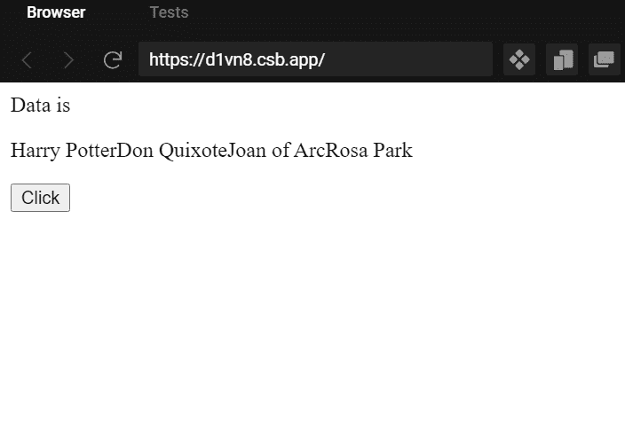

# React useState()挂钩用法。

> 原文：<https://medium.com/codex/react-usestate-hook-usage-693310f5d894?source=collection_archive---------21----------------------->


照片由[福蒂斯·福托普洛斯](https://unsplash.com/@ffstop?utm_source=medium&utm_medium=referral)在 [Unsplash](https://unsplash.com?utm_source=medium&utm_medium=referral) 拍摄

大家好，今天我们将看到如何使用 React useState 钩子。钩子是 React 16.8 的新增功能。它们允许您使用状态和其他 React 特性，而无需编写类。在 React 16.8 之前，我们没有在功能组件中声明特性用法，好像它们就像 React 中的辅助字符一样。

从 React 16.8 开始，React 团队通过引入钩子，决定将功能组件作为 React 开发中的主要角色。钩子在弥合状态和功能组件之间的鸿沟方面起着关键的作用。现在，我们可以开发主要使用功能组件的 React 应用程序(我现在正在做同样的事情，尽管我不敢重写现有的基于类的组件)。

好了，让我们进入 React.useState(“相信我，我不会用经典、传统的`You clicked {count} times`例子来烦你”)。

在基于类的组件中，我们使用 this.state()来声明状态变量及其初始值。下面是一个很好的 fat 例子，其中 state 维护多个数据。

```
constructor(props) {
        super(props);
        this.state = {
            currentPageBuilds: [],
            downloadedData: [],
            filteredData: [],
            builds: [],
            _sort: 'submittedDate',
            _page: 1,
            _order: 'desc',
            _limit: 10,
            _Type: 0,
            _boxId: '',
            boxName: '',
            selectedRows: { data: [] },
            q: '',
            totalCount: 0,
            loading: false,
            isFiltered: false,
            failure: false,
        };
```

现在我们将看到如何在功能组件中使用 useState()。首先，我们将从 react 导入所需的模块。

```
import React,{useState} from 'react'
/*here we have imported the useState to maintain the state of the React component.
*/
```

现在我们将创建一个测试功能组件来使用状态。

```
import React,{useState} from 'react'function State() { return (
        <div> </div>
    )
}export default State
```

现在我们将使用 React.useState()创建一个状态变量来存储自由 JSON API [链接](https://mocki.io/v1/d4867d8b-b5d5-4a48-a4ab-79131b5809b8)返回的数据。

```
const [characters, setCharactersData] = useState([]);
```

在上面的状态声明中，我们使用数组析构为我们的当前状态命名，并使用函数更新该状态， **characters** 保存 API 返回的字符数据， **setCharactersData** 函数用于设置/更新数据到 **characters** 变量。作为 **useState([])** 的一部分，您正在使用 react hook 创建一个具有数组数据类型的状态，并且初始数据是一个空数组。 **useState()** 将初始值作为参数。这里我们用一个空数组初始化。

让我们将它作为 CharacterSummary 功能组件的一部分，从 API 获取数据，并将名称存储为状态的一部分。

```
import "./styles.css";
import React, { useState } from "react";
export default function App() {
  const [characters, setCharactersData] = useState([]); const fetchData = async () => {
    await fetch("https://mocki.io/v1/d4867d8b-b5d5-4a48-a4ab-79131b5809b8")
      .then((res) => res.json())
      .then((data) => {
        let names = [];
        data.forEach(function (item) {
          names.push(item.name)
        }); setCharactersData(names); });
  };
  return (
    <div>
      <label>Data is</label>
      <p>{characters}</p>
      <button onClick={() => fetchData()}>Click</button>
    </div>
  );
}
```

在上面的组件中，我们在 UI 中显示一个按钮。当上面的 JSX 被渲染时，UI 中将显示一个按钮。数据将为空，因为 state 是一个空数组。

当我们点击按钮时，fetch 将从 API 获取详细信息，所有名称将作为**字符**状态的一部分存储。同样的内容也会显示在用户界面上。



# 关于 React.useState()的一些问题

1.  **如果我们想要使用不止一个状态变量**怎么办:——简单地多次使用 useState()来声明多个状态变量。如果您只想使用一个 useState()变量，那么在一个 useState()中将所有变量声明为一个对象。下面的例子。

```
const [multiple, setMultiple] = useState({currentPageBuilds: [],
            downloadedData: [],
            filteredData: [],
            builds: [],
            _sort: 'submittedDate',
            _page: 1,
            _order: 'desc',
            _limit: 10,
            _Type: 0,
            _boxId: '',
            boxName: '',
            selectedRows: { data: [] },
            q: '',
            totalCount: 0,
            loading: false,
            isFiltered: false,
            failure: false,});
```

你可以像这样更新复杂状态下的任何变量。

```
setMultiple({...multiple,failure:true});
```

1.  **我们能在任何地方使用 useState()吗** :-不能，React 钩子只能在顶级使用。不要在循环、条件或嵌套函数中调用钩子。通过遵循这条规则，您可以确保每次组件呈现时都以相同的顺序调用钩子。这使得 React 能够正确地保存多个`useState`和`useEffect`调用之间的钩子状态。

只在 React 函数中调用钩子，不从任何 Java 脚本函数中调用。

**关于 useState()的更多内容** :-

*   useState()的 update 函数不会立即更新值。它是异步的。
*   如果相同的值被更新为状态，React 不会重新渲染组件，因为 React 使用对象。将更新的状态值与以前的状态值进行比较。
*   在复杂对象的情况下，useState()替换对象，而不是合并。
*   如果使用前一个值来更新状态，则必须传递一个接收前一个值并返回更新值的函数。下面的例子。

```
setMessage(previousVal => previousVal + currentVal)
```

这就是我所有的 reg useState()。一旦我发现更多的细节，我会更新文章。谢了。