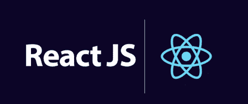

# react vs . next . js——你该选哪个？

> 原文：<https://medium.com/codex/react-vs-next-js-which-one-should-you-pick-f55089659034?source=collection_archive---------7----------------------->

## React 和 Next.js 的详细评估，帮助您确定何时为项目选择工具。

每年都有更新的 JavaScript 框架和模块发布，很难跟上 JavaScript 生态系统的快速发展。

相比之下，React 和 Next.js 在众多可用的 JavaScript 库和框架中脱颖而出。React 是最受前台程序员欢迎的 JavaScript 库。尽管不如 React 出名，但 Next.js 确实一直在快速发展，并有望超越 React，成为最著名的 JavaScript 框架。

React 的 UI 基础非常强大，但是强大也伴随着许多责任。你必须至少安装一个服务器、Babel、Webpack 和 ESLint。如此复杂的工具让所有用户感到害怕，但对于新用户和那些想要简单方法的人来说尤其如此。

Next.js 是一个依赖 React UI 库的前端 JavaScript 框架，旨在通过让开发人员在一个零配置的环境中构建 web 应用程序来减少 JavaScript 疲劳，该环境提供了所有开箱即用的基本工具。

与库相比，框架更有能力，专注于各种项目领域，并为组织文件和编写程序提供指导和准则。

习惯于构建 React 应用(React 的框架)的 React 用户可能会在转换到 Next.js 时患有 PTSD，但结果可能仍然值得开始奋斗。

在这篇文章中，我将研究这两种工具，评估它们，并讨论何时使用它们。

你可能会对学习最适合你的课程感兴趣。

# 区别:React.js 与 Next.js 中的库与框架

如果您想更好地掌握 Next.js 和 React，您必须首先理解框架和库。

框架是创建 web 应用程序的程序和设备的集合。当您使用框架时，您可以访问各种库，并且您可以通过组合这些库来快速创建一个功能完整的程序。由于框架提供的底层特性，项目可能会很快启动。

相反，库为您提供了管理应用程序流的能力。两者的根本区别在于，有了框架，流程确实可以控制。库可以用来简化应用程序的创建。

## ***为什么对比的是 Next.js 和 Create React App (CRA)而不是 Next.js 和 React？***

与 CRA 相比，Next.js 采用了不同的策略。通过将呈现组件转移到服务器，Next.js 消除了客户端处理这些数据的需要。由于主机在将完成的 HTML 发送给客户端之前预先渲染了网页，因此需要加载的 JS 更少，这有助于提高速度和 SEO。虽然爬虫可以更快地访问你的网站，更准确地索引它，用户可能会期待一个更快的网页。

预渲染有两种方法:服务器端渲染和静态生成(SSR)。就性能而言，静态发电仍将是最好的。预呈现需要在开发时创建页面，并在每个请求中使用它。实际上，静态网页通常通过内容交付网络(CDN)发送，这使得它们非常快。

在其他情况下，例如，当显示经常被修改的动态数据时，SSR 是首选，因为客户端将接收到在每个请求过程中生成的页面。

如果您不知道何时利用 SSR 而不是静态生成，您将无法利用 NextJS 的优势，即使 SSR 在效率方面仍然优于客户端呈现应用程序。

此外，Next.js 通过利用文件夹系统来支持无障碍的复杂结构，这简化并改进了流程。相反，如果路由不成问题，CRA 会自动创建单页应用程序。CRA 和 NextJS 之间的主要区别是，CRA 运行在客户端的浏览器上，而 NextJS 运行在服务器上，这需要大量的代码修改。

但是这些系统之间的比较也就到此为止了。除此之外，React.js 和 Next.js 的唯一区别在于它们的原生特性。因此，我将专注于 React 提供了什么以及 Next.js 如何增强其基本前景。

# React.js:概述

React.js 改变了 JavaScript，成为事实上的行业标准。

React.js 是用于构建复杂在线应用程序的最知名和最广泛使用的前端框架之一。程序员可以使用 ReactJS(脸书开发的开源 JavaScript 工具包)为单页应用程序或多页在线服务构建可伸缩、简单、快速的前端布局。反应式方法和编程式方法都是允许的。在这方面，我会推荐 [**雇佣 ReactJS 开发者印度**](https://www.quytech.com/hire-react-js-developers.php) ，以便从 ReactJS 的基础知识开始。

最流行的前端技术之一 ReactJS 是由脸书开发的，它允许程序员构建可重用的 UI 组件。

除了 Redux 和其他库之外，React.js 是一个易于使用的前端工具包，它提供了许多包含路由和状态管理模式的基本工具。

一个名为 React.js 的 JavaScript 包使程序员能够创建用户界面。显示较大用户界面的一小部分所需的功能包含在用户界面(UI)中，它是 HTML 和 JavaScript 的混合。

ReactJS 更先进，现在是所有部门的标准。例如，Redux 已经成为创建面向企业的 React.js 应用程序的顶级解决方案。

此外，您应该考虑以下几点:Redux 可能会使完成项目变得更加困难。当您需要在应用程序中添加特性和更改某些功能时，Redux 会让您的任务更具挑战性。

因此，选择简单的库还是更复杂的库的问题仍然存在。

您必须创建自己的 React.js 过程。这比仅仅使用其他 JavaScript 框架提供的大量现成实用程序更具挑战性。

ReactJS 与其说是一个框架，不如说是一个框架，这是众所周知的。因此，您将需要开发您的过程，其中一个过程将变成 Next.js 框架。

# 特征

脸书非常感谢 React 作为一个图书馆的名声。ReactJS 是众多 web 平台使用的软件栈的一个组件。下面是 ReactJS 提供的一些特性的列表:

*   **虚拟 DOM:**“DOMs”是“文档对象模型”的缩写。web 的模块结构执行代码。这是最重要的元素。React 的虚拟 DOM 是实际 DOM 的一个完全相同的副本。
*   **单向数据绑定:**术语“单向数据绑定”指的是仅在一个方向流动的数据流。作为响应，数据只能单向流动。信息是从父组件到子组件，从上到下显示的。这使事情顺利进行。
*   **扩展:**为了构建完整的 UI 应用程序，我们可以利用各种 React 扩展。React 支持服务器端渲染，因此适用于移动应用程序。
*   简单性:可重用代码是 React.js 基于组件方法的一个好处。此外，React.js 使用了融合 HTML 和 Javascript 的语言 JSX。因此，代码包含的代码更少，更容易理解和调试。

# 赞成的意见

*   **易于编码**:部分由于 Javascript 的使用，使得开发人员能够用更少的代码和更易识别的词汇构建动态应用，在更短的时间内，React 使在线应用的开发变得更简单。
*   **社区:**充满活力的社区提供了大量的培训和制造资源。
*   **组件:**react js 中可重用的组件可以再次加载到其他页面，同时保持其原始属性。对组件内容所做的更改将反映在所有网页上。
*   定制:它拥有一组作为库的功能，可以通过合并 Redux 之类的附加技术来增加这些功能。

# 骗局

*   **这是一个起点** : React 确实是一个专注于创建用户界面的库；因此，需要其他工具来充分发挥它的潜力。
*   **过时的文档:**由于它的开发周期非常短，现有的文档很快就过时了。真正的社区意味着对任何查询或问题的快速回复，但也意味着用户必须不断刷新他们对其功能的记忆。

# Next.js:概述

React apps 的一个简单框架叫做 Next.js，由于它的服务器端渲染和静态网站，所以在网站开发中使用它来创建快速的 web 应用。

Next 使您能够创建一个 React 应用程序，该应用程序使用服务器端缓存预先在服务器上呈现内容。在这种方法中，真正身临其境的应用程序或网站可以与访问者以及网络搜索机器人进行交流。

这种策略确保用户可以在三秒钟内访问在线平台。

Next.js 的内置定制和样式选项使开发变得更简单，并为您的在线应用程序提供对入门模板和网站的访问。

然而，Next.js 为你提供了深入研究和修改配置的机会，以从你的应用程序中获得最佳结果，无论你是否觉得大胆。然而，因为你从盒子里拿出来的东西已经很好了，你可能不需要这样做。

# 特征

与其他框架相比，Next.js 具有许多独特的特性。主要包括:

*   **数据提取:**为了获得最佳效率，Next.js 使用两种独立的预渲染技术并保留数据。可以在请求时利用服务器端呈现来检索和呈现数据(SSR)。

静态生产是另一种类型，它使用在提交应用程序之前构造应用程序时已经可用的数据。这种类型在数据可能确实被公开缓存或以前用于 SEO 的情况下特别有用。

*   **类型脚本:**函数式编程类型脚本基于 JavaScript。Next.js 在开发人员中如此受欢迎的原因之一是它支持 Typescript。
*   **Redux:** Redux 被 Next.js 平滑支持。
*   **可配置性:**虽然 Next.js 的可定制性很强，但并不是一个很难的系统。制作文件夹就像导航一样简单。

# 赞成的意见

**易于编码:** Next.js 比 React 本身以及与 React 集成的其他技术需要的代码更少。更少的代码、更好的可读性和适当的项目管理都是这种方法的好处，它只需要开发人员构建网页并引用标题中的元素。

**速度:**由于服务器端渲染&动态合成提供了一种更智能的处理数据的方式，用 Next.js 创建的应用程序运行速度很快。服务器端渲染的速度取决于服务器响应查询的速度。因为静态材料可以通过 CDN 提供，所以速度很快。此外，本机映像优化工具提高了效率。

**快速渲染:**通过重新加载网站，对内容的每一处修改都会立即显现。因为组件会立即显示出来，所以在修改发生时跟踪修改会更简单。

内置 CSS :为了更快的渲染，你可以使用 Next.js 从一个 JavaScript 文件中导入 CSS 样式，并内联使用它们。

**更好的图像优化:**利用最新的格式，如 WebP，图像被缩小并针对更小的视窗进行优化。

**SEO:** 为每个页面创建标题和关键词对于那些希望获得更高 SEO 的人来说很简单。只需使用突出显示的 Head 组件将它们添加到任何页面。

**ESLint 兼容:** ESLint 可以与 Next.js 一起使用，使用“脚本”:{ "lint": "next lint" }。真的就这么简单。

**易于定制和部署:**得益于 Babel 等插件，Next.js 具有极强的可定制性。安装设计简单明了，使应用程序能够快速启动。

# 骗局

**路由:**next js 路由系统只不过是一个文件系统，对于各种工作来说是不够的。因为 Node.js 是创建动态路由的方法，所以开发人员应该熟悉它。

社区: Next.js 起初可能很小，但它正迅速成为最成功的 web 构建模块之一。尽管它不是一个新框架，但 Next.js 专家的数量比那些专门研究 React 甚至其他框架的专家要少。

Next.js 开发人员的人才库和需求正在扩大，为任何寻求在现代商业应用程序中成名的人创造了机会。

# 最后的想法

在我看来，React 和 Next.js 都是设计漂亮、快速的在线应用程序的强大工具，没有明确的胜利者。它们各自提供特定的功能。

例如，Next.js 可以用来构建一个搜索引擎营销网页，该网页要求图像优化，无需任何配置即可启动。

对于需要出色的界面设计和跨平台应用程序可访问性的网站，React 会表现得更好。而且，如果你是新手，最好从利用 React 开始。

然而，最终都将是 React 代码。如果你选择 Next.js，你必须首先学习 React，因为它是在 React 的 UI 框架和核心部分上构建的，所以无论你走哪条路，你都需要 React。

如果你刚刚入门，我推荐 [**雇佣专门的开发人员印度**](https://www.quytech.com/hire-dedicated-developers.php) ，你先了解 React 基础知识，然后去 CRA 掌握要领。

如果你真的需要它，我会选择 Next.js。这太简单了，不能屈服于框架的疯狂。最终重要的是，当工具引起你的共鸣时，你就使用它们。

话虽如此，选择权在你，它会受到你的目标和你从事的任务的影响。

*更多内容看* [***说白了就是 io***](https://plainenglish.io/) *。报名参加我们的* [***免费周报***](http://newsletter.plainenglish.io/) *。关注我们关于* [***推特***](https://twitter.com/inPlainEngHQ) ， [***领英***](https://www.linkedin.com/company/inplainenglish/) *，*[***YouTube***](https://www.youtube.com/channel/UCtipWUghju290NWcn8jhyAw)*[***不和***](https://discord.gg/GtDtUAvyhW) *。**