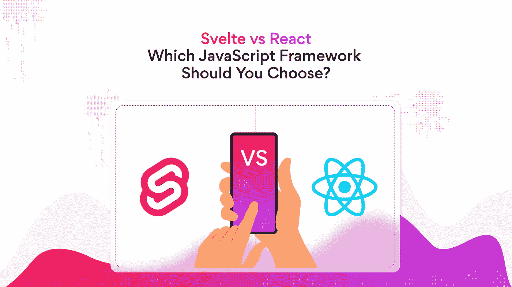
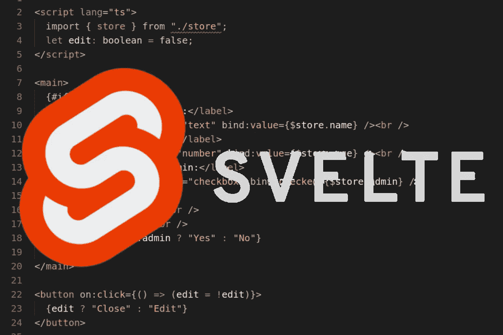

# React vs. Svelte |先学哪个？

> 原文：<https://medium.com/codex/react-vs-svelte-which-one-to-learn-first-de1278231158?source=collection_archive---------10----------------------->

如果你之前看过我的文章，我是一个自学成才的前端开发人员，没有任何 CS 或者 BootCamp 学位。我开始分享我的学习之旅，你可以在这里阅读。在这篇文章中，我将分享我对一个最受欢迎的问题的看法，“首先学习哪个 JS 框架？”。但最重要的是，我会经历 React 和 Svelte，因为我在工作中致力于这两者，而不是其他。

当我们谈到前端时，几乎每天都有新技术出现。当然，如果一开始还不知道学什么，那就太恐怖了。在这次旅程中，我了解到我们每个人都来过这里。所以，每当你觉得不知道该怎么办的时候，你并不孤单。

# 先学哪个前端框架？

我是一名 jr .前端开发人员，在这个旅程中，我尝试学习不同的技术太多次了。但是如果我今天学到了什么，不要想太多。去做吧！当你开始思考时，它不会结束。只学其中一个，对你来说更有趣的。而且不要做“懂 React/Svelte/Vue 的人”，要做前端开发者。

我看到在这个领域，人们正在学习一些技术，并成为它们的粉丝。完全不对。如果你今天用 React 写，明天你可能需要用 Angular 写，如果你理解了它们背后的逻辑，这只是关于谷歌搜索语法。

但是，事实是，在这个领域，大多数公司都有已经开始的项目，而且这个项目可能是从 React 开始的。所以，当然，你可以先开始学习 React，以便更快地找到工作。但无论如何，不要做一个“React knower”，努力理解背后的逻辑，做一个前端开发者。

# React 和 Svelte 的区别

React 于 2013 年从脸书发行，Svelte 于 2016 年从 Rick Harris 发行。两者都是开源的，都是免费的。React 有一个很棒的社区和开发团队，因为它被 Meta 用于脸书、Instagram、WhatsApp 等等。另外，如果你学习 React，你可以用 React Native 开发移动 ui。

此外，React 有一个名为虚拟 DOM 的东西。你可以认为它是页面的副本。并且，副本和原始页面同步。当虚拟 DOM 发生变化时，synchronous 会检查差异，用户只能看到发生变化的地方。所以，你不需要刷新页面来查看你是否有来自你迷恋的脸书的新消息。

但是里克·哈里斯叔叔反对的完全是这个虚拟的 DOM。所以，Svelte 没有。实际上，简单地把你的代码编译成普通的 JavaScript。所以最后，你不需要使用任何额外的工具或任何依赖，它可以帮助你更快地获得你的网站或网络应用。

# 哪些公司用的是 Svelte？

已经有足够多的公司使用 Svelte 来获得工作。雅虎、彭博、苹果、纽约时报、Square、Spotify、宜家等大公司都在其网站上使用 Svelte。公司更喜欢 Svelte，因为它可以将应用程序的代码转换为理想的 JavaScript 代码。因此，框架抽象不会影响用苗条程序编写的应用程序的性能。

# 哪些公司使用 React？

正如 Meta 发布的一样，脸书、Instagram、WhatsApp Web、Shopify、Discord、Skype 和 Pinterest 等成功的组织都使用 React 来开发他们的界面。

由于全球有大量编写 React 的开发人员，公司更喜欢 React 来创建他们网站的前端部分。此外，新开发人员学习 React 是因为大多数部门在他们的项目中使用 React。所以，现在这有点自相矛盾。

# 那又怎样？

我会在这里写同样的东西。不要做一个“反应/脆弱/苗条/有棱角的认知者”。做一个“前端开发者”。对你来说会容易些。如果你不能在需要的时候改变框架，那么你不是前端开发人员，你是知道 React 语法的编码人员。

如果你有任何相反的想法，请不要犹豫，写在评论中。我尊重所有的想法，所以我会看所有的评论。下一场见！还有，如果你觉得内容有用，可以通过下面的提示支持我😇。