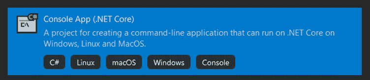
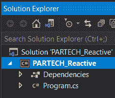
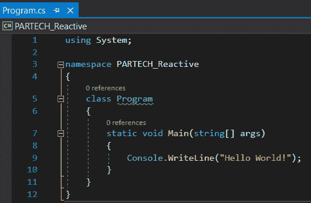
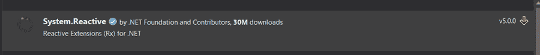
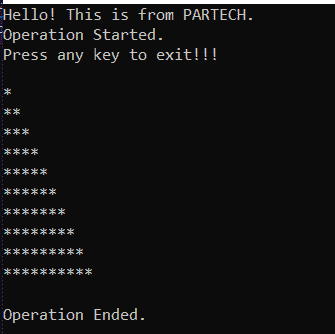
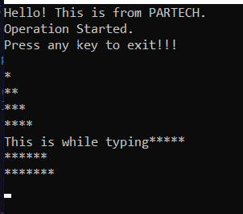

# 反应式延伸。网络核心

> 原文：<https://medium.com/codex/reactive-extensions-in-net-core-597b594675bb?source=collection_archive---------2----------------------->


这是一个快速变化的世界，事物更新很快。考虑显示股票价格、体育赛事直播比分的网站，甚至是一个视频流网站。在所有这些情况下，数据每秒都会更新。

但是你注意到什么了吗？UI 中的数据不断发生变化，用户可以实时看到变化。它在后台悄无声息地发生，也不需要刷新或重新加载页面。

这是通过异步方法实现的，在异步方法中，需要等待和侦听响应数据。同时，控件被返回给用户以浏览页面。这种编程方法被称为反应式编程。并且在各种编程语言中实现反应式编程的实践是使用可用于相应编程语言的反应式扩展来完成的。

在这篇博客中，我们将探讨反应式扩展，以及如何在运行的 C#编程语言中实现它们。网芯。

**目录**

1.  反应式编程和扩展简介
2.  反应式扩展的实际实现
3.  结论

# 反应式编程和扩展简介

反应式编程就是开发事件驱动的异步应用程序，这些应用程序可以在系统之间传递数据。这是通过创建数据流来实现的，数据流负责传递事件、消息、呼叫和故障。

让我们用一个例子来解释这一点。考虑两个系统——服务 A 和 b。它们相互通信。现在，A 向 B 发送请求，控制调用返回服务 A 代码(异步方法)。现在，在这两个服务之间已经建立了一个数据流(想象一条流动的水管)，并且请求的数据已经被一个接一个地发送到请求服务。该流将一直打开，直到发送完所有数据。一旦出现故障，它就会关闭。此外，它还处理对时间敏感的变量。这意味着变量的值随着其从属变量的变化而变化。

为了在不同的编程语言中实现反应式编程，反应式扩展可以作为外部包以多种形式提供。因此，用户不必担心如何构建实现反应式编程的代码。相反，他们可以专注于如何最好地利用反应式编程，并从中受益。

# 反应式扩展的实际实现

在这一节中，让我们用 C#代码创建一个简单的可观察实现。在这种情况下，可观察代码在控制台窗口中打印某些数据，但同时它允许用户在同一个控制台窗口中键入某些输入。

## 第一步

创建一个基于. Net Core 的控制台应用程序，并为其提供一个有效的名称。



## 第二步

创建解决方案后，文件夹结构如下所示。



program.cs 文件如下所示。这是将被修改以实现我们的更改的文件。



## 第三步

右键单击项目并转到管理 NuGet 包。搜索反应并安装系统。反应性 NuGet 包。



## 第四步

转到 program.cs 文件并包含 using System。标题部分中的 Reactive.Linq。

## 第五步

下面是需要包含在程序类中的代码。这反过来将用于实现所需的目标。

```
class Program { ​ static void Main(string[] args) ​ { ​ Console.WriteLine("Hello! This is from PARTECH."); ​ IObservable<string> observable = Observable.Generate(0, iterator => (iterator < 11), iterator => iterator + 1, iterator => new string('*', iterator), ​ iterator => TimeSpan.FromSeconds(iterator)); ​ using (observable.Subscribe(Console.WriteLine)) ​ { ​ Console.WriteLine("Operation Started."); ​ Console.WriteLine("Press any key to exit!!!"); ​ ​ Console.ReadLine(); ​ } ​ Console.WriteLine("Operation Ended."); ​ } }
```

在这里，可观察的。生成方法来自包系统。反应包。生成方法有 6 个重载。我们消费接受的方法

*   循环变量的初始状态，
*   可观察对象必须执行到的循环
*   每次迭代要添加的值
*   每次迭代要做的操作，
*   可观察对象必须被执行的周期(基本上是一个调度程序)。



同样，在上面的代码中，我们将循环的初始值设为 0。代码将循环 10 次，每循环一次就加 1。在代码中，我们将按照这样的模式添加星号——第一个循环有一个星号，第二个循环有两个星号，依此类推，直到最后一个循环有 10 个星号。

星号将出现在当前正在执行的迭代次数的间隔之后。例如，第一个星号会在一秒钟后出现，第二个星号会在两秒钟后出现，依此类推。



但是，它也为用户提供了键入任何输入数据的控件。用户不需要等到该过程完成。

在上面的例子中，observables 已经被实现，我们已经体验了它在代码中是如何工作的。除了可观察性，反应库还提供了更多。它提供了 Subjects 和 Observer，这对于异步通信和刷新系统间的数据流也很方便。

# 结论

反应性延伸部易于消耗。Net 中，它使应用程序响应更快，因为它的异步性质。开发人员使用扩展实现异步和时变数据更新变得更加容易。

*原载于*[*https://www . partech . nl*](https://www.partech.nl/nl/publicaties/2021/05/reactive-extensions)*。*