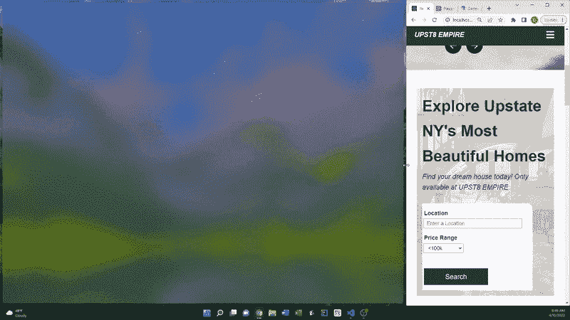
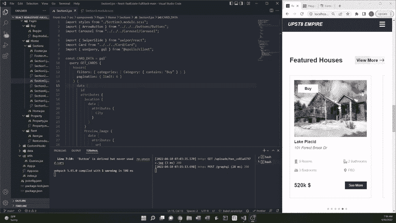

# ReactJS & GraphQL:全栈房地产 Web 应用程序

> 原文：<https://medium.com/codex/reactjs-graphql-full-stack-real-estate-web-app-98b59fddc7a6?source=collection_archive---------5----------------------->


**源代码:**[**https://github.com/lwoluke/React-RealEstate-FullStack**](https://github.com/lwoluke/React-RealEstate-FullStack)

## 背景

在完成我的房地产网站的第一部分[后，我意识到在现有的网站上有很多我想改变的东西。虽然我真的很喜欢一些功能，如英雄图像和导航条，但我注意到我构建网站的方式无法很好地扩展。这是因为在我的设计中，每个页面都有一个单独的房子，并且需要大量的上下滚动来一个接一个地查看房子。出于这个原因，我决定放弃我以前所做的大部分事情，但是保留我真正喜欢的网站的特性。](/@luke_o/reactjs-real-estate-website-part-1-47f47fd7d678)

我在构建完整网站时的主要策略是回到起点，在我前进的过程中改变网站的各个部分，并添加新的功能。

## 项目:前端

在完成我的项目的第 1 部分后，我发现[反应状态挂钩](https://reactjs.org/docs/hooks-state.html)是一个令人困惑的概念。我想确定它的用途，以及如何在网站的其他地方更有效地使用它。根据 React 文档，钩子最显著的优点是允许使用状态。这指的是 React 用来表示组件当前状态信息的普通 JavaScript 对象，它由组件本身管理。除此之外，可以用钩子代替写类。在函数组件内部，我们无法使用`this.state` *。相反，我们可以在组件中直接调用`useState`，它提供了与类中的`this.state` 完全相同的功能。调用`useState`声明一个状态变量。下面是我从 React 文档中找到的一个例子。*

```
**// Using classes**
class Example extends React.Component {
  constructor(props) {
    super(props);
    this.state = {
      count: 0
    };
  }render() {
    return (
      <div>
        <p>You clicked {this.state.count} times</p>
        <button onClick={() => this.setState({ count: this.state.count + 1 })}>
          Click me
        </button>
      </div>
    );
  }
}**//Using state hook** import React, { useState } from 'react';function Example() {
  // Declare a new state variable, which we'll call "count"
  const [count, setCount] = useState(0);return (
    <div>
      <p>You clicked {count} times</p>
      <button onClick={() => setCount(count + 1)}>
        Click me
      </button>
    </div>
  );
}
```

在这个例子中，我想要指定计数的初始状态，并且每次递增 1。当`useState`被返回时，它保存组件的当前状态，`*count*`和更新它的`setCount`函数。

我在创建前端时最大的障碍是我在使用相对文件路径时一直有问题。出于某种原因，这并没有给我这个项目的第一部分带来太大的问题。然而，有这么多的文件和目录，它变得非常混乱，做进口。如果我想重新组织我的文件结构，我必须不断地修改相对路径。显然，这是一个[非常普遍的问题](https://stackoverflow.com/questions/41993461/import-react-components-with-absolute-path)，许多其他与 React 一起工作的人都面临着这个问题。我发现如果我想使用我最熟悉的绝对路径，我需要在根目录中创建一个`jsconfig.json`文件。

```
{
    "compilerOptions": {
        "baseUrl": "src"
    }
}
```

这意味着除了能够使用相对路径导入之外，我现在可以从 src 目录开始使用绝对路径导入文件。下面是我想将一个图像文件导入到我的`Section1.js`文件中的例子。如您所见，随着项目规模的增大，管理您的文件肯定会变得更加困难。

```
**//Old method using relative path from root directory**
import building6 from "../../../../assets/building6.jpg";**//New method using src as the absolute path**
import building6 from "assets/building6.jpg";
```

另一种让我困惑的 React 语法是[事件](https://www.w3schools.com/react/react_events.asp)。这些是 React 可以根据用户的操作执行的操作。下面是一个例子:

```
**// Creates input box** 
<input 
    type="text" 
    placeholder="Enter a Location"
    onChange={(e) => setLocation(e.target.value)}    **// Event line**
/>
```

`e.target`代表触发事件的元素。在这种情况下，用户将为当前设置为占位符的位置输入一个字符串值，然后`e.target.value`获取元素的值，并将事件更新为该值。

在创建了我的房地产网站的第一部分后，我意识到我想重新设计我创建的大部分内容。我唯一保持不变的两个方面是导航条和英雄图像滑块。对于网站的下一部分，我决定在网站中加入搜索功能。我尝试在文字后面放一张图片。我知道，为了让它更容易阅读，我需要以某种方式淡出图像。为此，我没有直接改变图像的样式，而是改变了标语本身的背景颜色。

**搜索菜单**



想起上次学到的东西，我决定创建一个可以在 web 应用程序的不同区域重用的按钮。为了做到这一点，我发现了一个更聪明的方法来添加数据到一个按钮。除此之外，我为按钮创建了默认规范，这使得测试实现变得更加容易。

```
import { Link } from "react-router-dom";
import { BsArrowRight } from "react-icons/bs";
import styles from "./Buttons.module.scss"const ArrowButton = ({ text, path }) => {
    return(
    <div className={styles.btn}>
      <Link to={`${path}`}>{text}</Link>
      <BsArrowRight />
    </div>);
};ArrowButton.defaultProps = {
  text: "Test",
  path: "/",
};

export { ArrowButton };
```

对于 web 应用程序的下一部分，我决定添加访问特定属性类型的方法。除了能够使用下拉菜单和导航条之外，我认为它对 web 应用程序的用户了解去哪里访问某些类型的属性非常有帮助。我在这里使用的按钮是我之前演示过如何创建的。由于改进了创建按钮的方法，将它添加到 JavaScript 文件中要容易得多。

```
**{/* BUY HOMES SECTION */}**
<div className={styles.buy}>
  <h3>Buy a home</h3>
    <p>
      Find the most beautiful homes, all of which feature 
      an immersive photographic experience. You'll see 
      properties that are impossible to find anywhere else.
    </p>
  <ArrowButton text={"Search Houses"} path="buy" />
</div>
```

**按物业类型查找**


对于 web 应用程序的下一部分，我想添加用户可以刷过的特色房屋。这种功能被称为[转盘](https://www.mockplus.com/blog/post/website-carousel)，用于在单个空间中显示许多图像。通过鼓励用户关注 web 应用程序最重要的方面，这提高了视觉吸引力。对于 carousel，我决定使用 [Swiper](https://swiperjs.com/) ，这是一个现代的触摸滑块，用于在移动设备上查看 web 应用程序。在`Carousel`组件中，幻灯片包含每个`children`的属性，它们是转盘的单个幻灯片组件。除了滑动浏览之外，`Pagination`还能让用户点击进入不同的图片。

```
const Carousel = ({ children, slides }) => {
  return (
    <Swiper
    modules={[Pagination]}
    spaceBetween={50}
    sliderPerView={slides}
    pagination={{ clickable: true }}
    >
      {children} 
      **{/* PAGINATION MARGIN */}**
      <div style={{ marginTop: "70px" }}></div>
    </Swiper>
  );
};Carousel.defaultProps = {
  slides: "auto",
};
```

接下来，我创建了 card 组件，它代表了 carousel 中可以滑动的元素。在后端开发完成之前，每个卡组件都将拥有相同的默认图像和元数据，这是我使用 JSON 传入的。

```
**//default Props**
Card.defaultProps = {
  info: {
    id: undefined,
    imageSource: placeholder,
    category: "Buy",
    city: "Default City",
    neighborhood: "Default Neighborhood",
    street: "Default Street",
    rooms: 6,
    bedrooms: 3,
    bathrooms: 2,
    shortAddress: "Default",
    price: 325000,
    rent: 0,
  },
  showInfo: {
    price: true,
    rent: false,
  },
  secondClass: "undefined",
};
```

**带有卡片组件的传送带**


我发现，在弄清楚 web 应用程序的前面部分之后，实现接下来的两个部分(关于业务的跟踪记录和从哪里开始)非常简单。我最喜欢的是在文字后面交错放置两张图片，我觉得这看起来很酷，而且制作起来非常简单。

```
.image_container_1 {
    position: relative;
    z-index: -2;
    margin-right: 1.5rem;
    display: flex;
    align-items: flex-end;
    img {
        width: 500px;
        height: 450px;
        object-fit: cover;
        [@media](http://twitter.com/media) screen and (max-width: 1100px) {
             width: 400px;
        }
    }
}.image_container_2 {
    position: relative;
    display: flex;
    align-items: flex-end;
    z-index: -2;
    img {
        width: 40vw;
        height: 500px;
        object-fit: cover;
    }
}
```

将图片设置为`flex-end` [使其在底部](https://cssreference.io/property/align-items/)对齐，这样当我设置不同的高度并设置边距时，结果如下:


当创建关于公司信息的页脚时，我使用了 React 图标。这里有一个名为 [AI](https://react-icons.github.io/react-icons/icons?name=ai) 的子目录，里面有各种公司的图标，所以我用它们来代表 UPST8 帝国所在的社交媒体平台。

前端现在完成了！为了创建搜索、购买和租赁页面，我将通过从后端获取数据来使用 GraphQL。


## 项目:后端

虽然我已经使用 REST 创建了我的 [Java Spring 和 PostGres API](/codex/web-app-development-java-spring-postgres-rest-api-3c302e28d571) 项目，但我想尝试一些不同的东西。最近我听说了 GraphQL，这是一种开源的数据查询和操作语言，作为 REST APIs 的潜在替代者[，它已经获得了越来越多的关注。经过研究，我发现这并不适用于所有情况，但是在某些情况下，用 GraphQL APIs 代替 REST APIs 可能是有利的。GraphQL 有多种脱颖而出的方式:](https://graphcms.com/blog/graphql-vs-rest-apis)

*   客户端可以从服务器获取所需的精确资源
*   自动验证和类型检查
*   更快的性能和开发速度
*   轻松汇总各种来源的数据

如果你想了解更多关于 GraphQL 的知识，我建议你先看看这个简短的解释视频。

为了使用 GraphQL 创建后端，我决定使用 Strapi。根据这篇文章:

> Strapi 是一个开源的无头 CMS，用于构建用 JavaScript 编写的快速且易于管理的 api。它使开发人员能够使用漂亮的用户界面轻松制作灵活的 API 结构。
> 
> Strapi 可以用于各种数据库，包括 MongoDB、PostgreSQL 等。

CMS 指的是内容管理系统，它是一种用于创建、编辑和管理网站的软件。当涉及到那些[无头](https://www.sanity.io/blog/headless-cms-explained)的内容时，这意味着它不是将你的内容链接到一个网页，而是通过一个 API 将内容作为数据提供。这种类型的 CMS 的价值在于您可以选择内容发送到的头部(输出)。虽然我以前从未使用过这样的东西，但我认为尝试这个项目会很有趣。

接下来，我运行安装脚本`npx create-strapi-app@latest Back-End --quickstart`，后端是我的项目名称。创建 Strapi 帐户后，我可以开始为我的 web 应用程序的内容构建数据架构。


默认内容选项

与此同时，我需要使用`npm run strapi install graphql`导航到我刚刚创建的后端文件夹来安装 GraphQL。现在我已经拥有了开始开发所需的一切，可以运行`npm run develop`了。

在 Strapi 中，我为房子、位置、类别和用户创建了集合类型。很快，我开始真正喜欢上使用 Strapi，因为它的 UX/用户界面是如此的简单而吸引人。以下是创建集合类型的一些示例:


在添加并保存这些内容之后，会自动生成必要的 http 请求，这会更新后端。现在，我能够从我以前创建的每个集合中创建条目。


一旦创建了一些条目，我就可以运行查询来访问我想要的特定信息。这是通过在 Strapi 中修改权限后在 web 浏览器中键入`localhost:1337/graphql`来完成的。

## 查询测试条目


为了让来自 Strapi 的条目出现在 web 应用程序中，我需要使用 [Apollo](https://github.com/apollographql/apollo-client) 。这是一个缓存 GraphQL 客户端，能够与其他框架中的 React 集成。通过用 Apollo 构建 UI 组件，我可以通过 GraphQL 获取、缓存和修改数据。Apollo 的神奇之处在于，当我使用它时，它会自动更新我的 web 应用程序的 UI。为了安装，我在导航到前端目录后输入命令`npm i graphql @apollo/client`。之后，我在我的`App.js`文件中创建了 Apollo 客户端。

```
import "./App.scss";
import { Routes, Route } from "react-router-dom";
import Home from "./components/Pages/Home/Home";
import { ApolloClient, InMemoryCache, ApolloProvider } from "@apollo/client";const client = new ApolloClient({
  uri : "http://localhost1337/graphql:",
  cache: new InMemoryCache(),
})function App() {
  return (
    <ApolloProvider client={client}>
      <div className="App">
        <Routes>
          <Route path="/" element={<Home />} />
        </Routes>
      </div>
    </ApolloProvider>
  );
}export default App;
```

接下来，我想使用 GraphQL 和 Apollo 运行一个查询来更新 featured homes 部分。以前，我使用我标记为默认的同一张卡来测试转盘是否正常工作。当将这个查询添加到 React 中时，我一直得到“ [400:错误请求](https://graphcms.com/docs/api-reference/basics/errors#400-bad-request)”错误。在这上面花了很长时间，我意识到我拼错了几个单词。检查这一点的快速方法是简单地将 React 中的查询复制并粘贴到本地 GraphQL 环境中，您将立即知道是否有问题。

## React 中实现的 GraphQL 查询

```
const CARD_DATA = gql` query GET_CARDS {
    houses(
      filters: { categories: { Category: { contains: "Buy" } } }
      pagination: { limit: 6 }
    ) {
      data {
        id
        attributes {
          location {
            data {
              attributes {
                City
              }
            }
          }
          Preview_Image {
            data {
              attributes {
                url
              }
            }
          }
          categories {
            data {
              attributes {
                Category
              }
            }
          }
          Neighborhood
          Street
          Rooms
          Bedrooms
          Bathrooms
          Short_Address
          Price
        }
      }
    }
  }
`;
```

## 更新的用户界面



接下来，我创建了购买、租赁和[错误 404 页面](https://blog.hubspot.com/blog/tabid/6307/bid/33766/10-clever-website-error-messages-from-creative-companies.aspx)。为此，我在`App.js`文件中添加了额外的路由路径。除此之外，我还为购买和租赁页面创建了 JavaScript 文件。这些使用的 GraphQL 查询与上面的查询非常相似，上面的查询将 buy 卡的数量限制为 6 张。在这个例子中，我返回了所有的房子，在它们各自的页面上显示了 buy 和 rent。


我最不想创建的是每个页面上家庭的动态路由。为此，我添加了一个名为 property 的附加路由路径。在这个文件中，它将通过过滤房屋 id 进行查询，这样当单击某个特定的房屋时，只有关于它的信息会作为卡片返回。

## 动态路由


## 部署

为了部署 web 应用程序，我决定使用 [Netlify](https://www.netlify.com/) 。当我试图将应用程序的前端和后端部署在一起时，我只能做到前端，这意味着没有一所房子能够在通过 web 服务器使用它时显示出来。在我构建的下一个应用程序中，我的主要目标将是学习如何做到这一点，并能够实时对应用程序进行更改。

## **TLDR 版**

在 React 中创建了一个 UI 后，我原本计划只开发一个前端项目。然而，我意识到这将是一个绝佳的机会，利用我从第 1 部分中学到的知识，改进前端，并使用对我来说新的技术开发后端。总的来说，这是一次惊人的学习经历，我真的很期待看到我将来能够开发出什么类型的应用程序。

## 引用的作品

火船。 *GraphQL 用 100 秒解释*。YouTube，2021 年 2 月 13 日，[https://www.youtube.com/watch?v=eIQh02xuVw4&t = 82s。2022 年 4 月 10 日访问。](https://www.youtube.com/watch?v=eIQh02xuVw4&t=82s.)

加纳特拉，罗纳克。“GraphQL 与 Rest APIs。” *GraphCMS* ，GraphCMS，2021 年 11 月 11 日，[https://graph CMS . com/blog/graph QL-vs-rest-API # what-is-a-rest-API。](https://graphcms.com/blog/graphql-vs-rest-apis#what-is-a-rest-api.)

精通，JavaScript，导演。*托管&部署 React 应用的最佳方式*。 *YouTube* ，YouTube，2020 年 10 月 22 日[https://www.youtube.com/watch?v=Ey_90l9GaAw&t = 315s。](https://www.youtube.com/watch?v=Ey_90l9GaAw&t=315s.)2022 年 4 月 10 日访问。

梅尔瓦，克努特。“无头 CMS 分钟解释。”https://www.sanity.io/blog/headless-cms-explained.，2022 年 1 月 25 日

杰弗里·蒙盖。《Strapi API CMS 入门》 *Section* ，Section，[https://www . Section . io/engineering-education/getting-started-with-Strapi/#:~:text = Strapi % 20 is % 20 an % 20 open % 2d source，包括% 20 MongoDB % 2C % 20 PostgreSQL % 2C % 20 等。](https://www.section.io/engineering-education/getting-started-with-strapi/#:~:text=Strapi%20is%20an%20open%2Dsource,including%20MongoDB%2C%20PostgreSQL%2C%20etc.)

"使用状态挂钩。"https://reactjs.org/docs/hooks-state.html.*反应*，Meta 平台公司