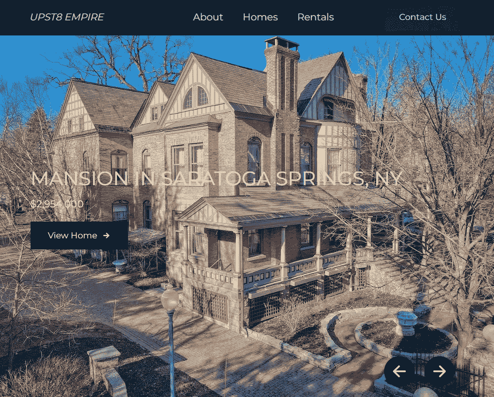
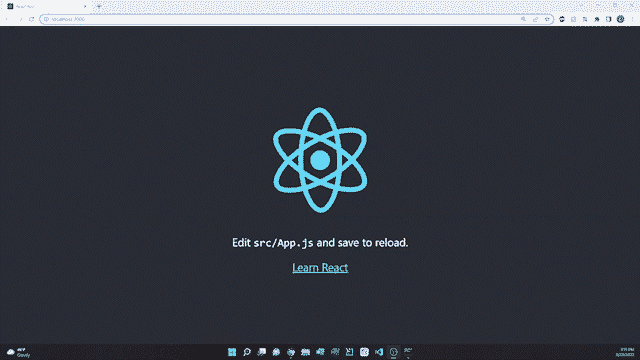
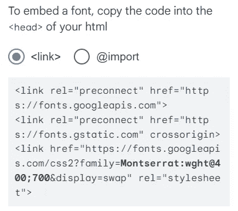
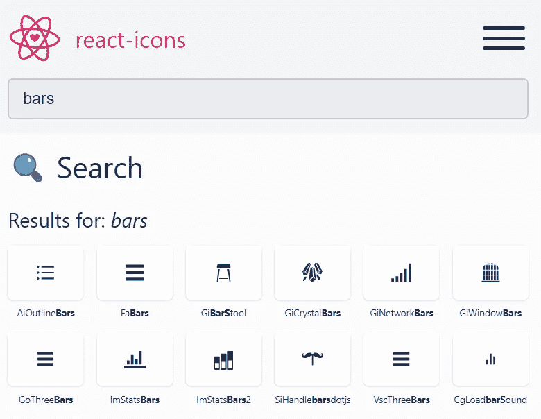
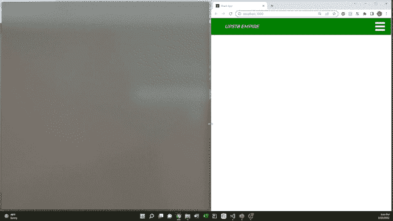
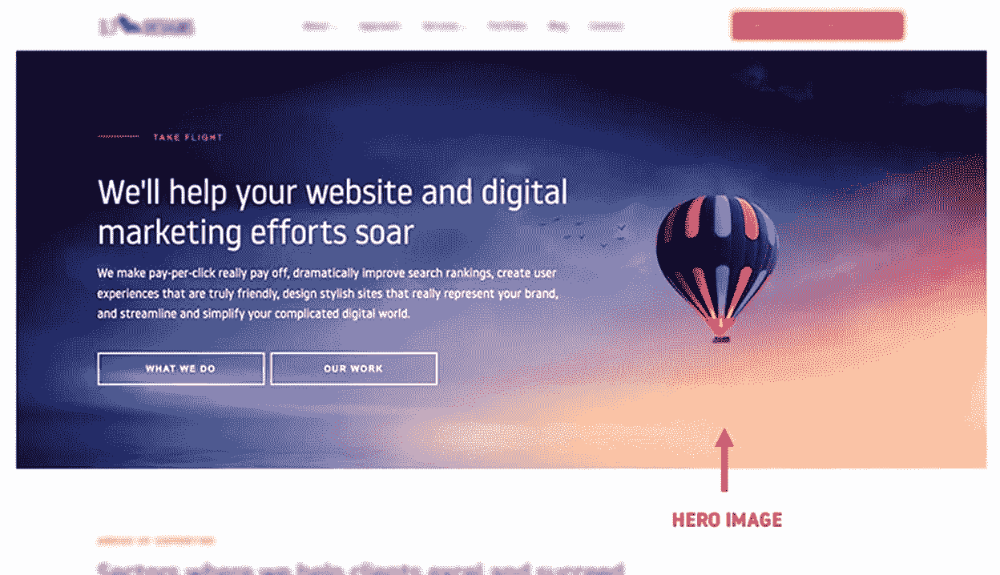
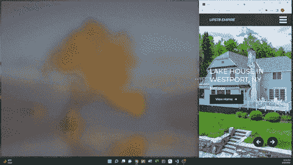
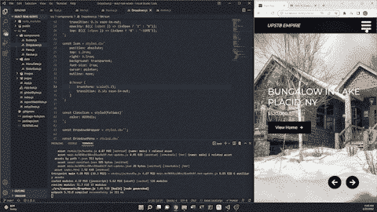
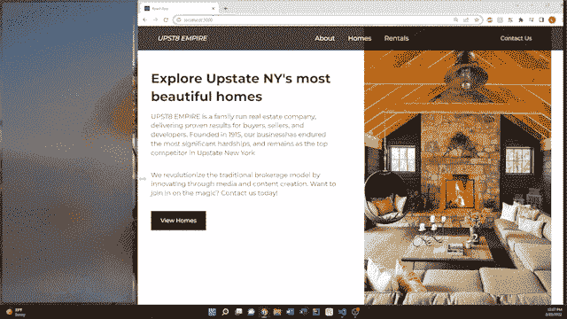

# ReactJS:房地产网站第一部分

> 原文：<https://medium.com/codex/reactjs-real-estate-website-part-1-47f47fd7d678?source=collection_archive---------2----------------------->



**源代码:**[**【https://github.com/lwoluke/React-RealEstate-Pt1】**](https://github.com/lwoluke/React-RealEstate-Pt1)

# 背景

实际上，无论我在哪里，我都能看到学习 JavaScript 对于 web 和应用程序开发以及一般的软件工程是多么重要。此外，如此大比例的实习和工作都在寻找有 JavaScript 经验的人。虽然我在高中的软件工程课程中学习了 JavaScript 来构建一个非常简单的网站，但不幸的是，我已经没有代码了，我想在此后没有使用它后获得更多的经验。我有 web 开发的经验，但我只在 Java 中做过，最近在 Python 中构建了我的 [Java Spring REST API](/@luke_o/web-app-development-java-spring-postgres-rest-api-3c302e28d571) 和 [IOU app hackathon](/@luke_o/first-hackathon-first-win-46bfd7f2be3) 项目。除了从总体上学习更多的 JavaScript，我还想通过在 [ReactJS](https://reactjs.org/) 中构建一些东西来学习，因为由于它的简单性和适应性，它是[最受欢迎的框架之一。](https://towardsdatascience.com/top-10-in-demand-web-development-frameworks-in-2021-8a5b668be0d6)

# 项目

为了入门，我先决定[安装 NodeJS](https://nodejs.org/en/download/) 。我发现，为了使编码更具可伸缩性和效率，这两者应该一起使用的原因有很多:

*   当需要持续的服务器连接时，有助于实时管理数据
*   处理请求时，帮助维护服务器负载
*   高效的异步数据加载(独立于其他部分运行代码部分的能力)

这些只是将 React 和 Node 用于大规模和单页面应用程序是一个好主意的部分原因。

安装 NodeJS 并运行命令[设置 React 应用](https://create-react-app.dev/docs/getting-started)后，我现在可以在本地运行一个 web 服务器，如下所示:



应用程序设置后的默认网页

## **导航条创建**

当谈到创建样式时，我决定使用样式组件，这涉及到将 CSS 集成到 JavaScript 中。虽然我通常单独使用和创建 CSS 文件，但我发现这个 React 项目中样式化组件的许多优点。

*   唯一的类名(消除重复和重叠问题)
*   更容易确定哪些组件是不必要的
*   动态样式允许轻松管理几个类
*   在其他项目区域中，可以导入和复制样式

**样式化组件与样式表:**

```
**//styled-components**const Nav = styled.nav`
    height: 40px;
    display: flex;
    justify-content: space-between;
    background: #00A000;
`;**//stylesheets**nav {
    height: 40px;
    display: flex;
    justify-content: space-between;
    background: #00A000;
}
```

我发现了一个关于样式化组件的巧妙技巧。因为我的常量变量`Logo`和`NavMenuLinks`使用了两个链接，并且具有非常相似的样式，所以我可以为这些特定的常量传入自定义样式，这些样式可以在以后为其他组件重用。为此，需要从 styled-component 的宏子目录中导入 css。在此之后，可以直接将`NavLink`添加到`Logo`和`NavMenuLinks`样式中。

```
const NavLink = css`
  color: #fff;
  display: flex;
  align-items: center;
  padding: 0 1rem;
  height: 100%;
  cursor: pointer;
  text-decoration: none;
`const Logo = styled(Link)`
  ${NavLink}
  color: #fff;
  font-style: italic;
`;const NavMenuLinks = styled(Link)`
  ${NavLink}
`;
```

因为我之前做的项目只是非常小的应用程序或网站，所以我在每个地方创建了不同的按钮，因为它们并不多。然而，我发现我可以将按钮导入到其他 JavaScript 文件中，这意味着相同的按钮可以在整个站点中重用。这样效率更高，因为我不必每次都重新输入每个按钮来安装。

我以前没有尝试过的另一件事是导入外部字体样式。我决定从[谷歌字体](https://fonts.google.com/)开始做这件事，其实做起来很简单。点击所需的字体后，网站上有一个解释，解释如何将它添加到我的 HTML 文件中:



为了创建菜单栏，我决定使用[反应图标](https://react-icons.github.io/react-icons/)并搜索一个工具栏模板。



之后，我可以将图标导入到我的`NavBar.js`文件中，并将其作为参数添加到`MenuBars`常量变量中。我还确保如果用户在较小的屏幕上查看网站，我的`MenuBars`、`NavMenu`和`NavBtn`不会显示。

我的导航条的样式现在已经完成了。



## 英雄形象创作

在开始这个项目之前，我并不知道这个术语。根据 Optimizely 的一个网页:

> 英雄图像是一个网站设计术语，用于描述网站顶部的超大横幅图像。有时被称为“英雄标题”，它可以作为用户对你的公司和产品的第一印象，因为它位于网页顶部的显著位置，通常是全幅的。
> 
> 除了高分辨率图形，英雄图像还可以包含贵公司的[独特卖点(USP)](https://www.optimizely.com/optimization-glossary/unique-selling-point/) 和转化目标，如注册表单或开始购物的按钮。最近的网页设计趋势是使用视频和动画来表现英雄形象，而不是静态照片。

**举例:**



为了创造英雄形象，我使用了我在纽约北部房地产网站 Zillow 上找到的图片，因为我认为这个地区的建筑风格非常酷。为了将这些插入到我的项目中，我将基于这些数据创建的对象输入到 Hero 文件中。

**豪斯 JSON:**

```
import ImageOne from '../images/one.jpg';
import ImageTwo from '../images/two.jpg';
import ImageThree from '../images/three.jpg';
import ImageFour from '../images/four.jpg';export const SliderData = [
    {
        title: 'Mansion in Saratoga Springs, NY',
        price: '2,954,000',
        path: '/homes',
        label: 'View Home',
        image: ImageOne,
        alt: 'House'
    },
    {
        title: 'Lake House in Westport, NY',
        price: '937,000',
        path: '/homes',
        label: 'View Home',
        image: ImageTwo,
        alt: 'House'
    },
    {
        title: 'Estate in Lake George, NY',
        price: '4,198,100',
        path: '/homes',
        label: 'View Home',
        image: ImageThree,
        alt: 'House'
    },
    {
        title: 'Lake House in Saranac Lake, NY',
        price: '2,750,000',
        path: '/homes',
        label: 'View Home',
        image: ImageFour,
        alt: 'House'
    }];
```

我发现 JavaScript 的一个有趣之处是之前没有遇到过的[三重等于](https://www.guru99.com/difference-equality-strict-operator-javascript.html#:~:text=%3D%20Vs%20%3D%3D%20VS%20%3D%3D%3D%20in%20JavaScript,-Here%20are%20the&text=%3D%3D%20in%20JavaScript%20is%20used,datatype%20and%20compares%20two%20values.&text=Checks%20the%20equality%20of%20two%20operands%20without%20considering%20their%20type.)操作符。double 和 triple equals 运算符之间的一个显著区别是，double 检查相等性时不考虑类型。这也是三重检查。这意味着只有当值和数据类型相同时，三重等于运算符才返回 true。

我想让我的英雄图片自己循环，但也让用户能够点击图片向前或向后。虽然赋予按钮改变图片的能力很容易，但创建图片循环的效果却很有挑战性。然而，我最终发现我需要将它添加到我的 Hero 常量变量中:

```
useEffect(
    () => {
        const nextSlide =() => {
            setCurrent(current => 
                (current === length - 1 ? 0 : current + 1));
        }; timeout.current = setTimeout(nextSlide, 2000); return function () {
            if(timeout.current) {
                clearTimeout(timeout.current);
            }
        };
    }, [current, length]
);
```

该函数调用`nextSlide`，检查幻灯片位置是否在幻灯片的末尾。如果是，则从系列中的第一张图片开始循环。参数`nextSlide`和 2000 的超时意味着每 2000 毫秒或者 2 秒发生一次载玻片变化。

**创建我的英雄图像、设置按钮和链接转场后的结果:**



## 下拉菜单创建

为了集成功能，我需要从 React 导入`[useState](https://www.geeksforgeeks.org/what-is-usestate-in-react/)`库。这允许在功能组件中使用状态变量。为了创建下拉菜单，我用它来确定菜单当前是否打开，并在用户单击菜单图标时切换它。

```
function App() {
  const[isOpen, setIsOpen] = useState(false);const toggle = () => {
    setIsOpen(!isOpen)
  };return (
    <>
      <GlobalStyle />
      <Navbar toggle={toggle} />
      <Dropdown isOpen={isOpen} toggle={toggle} />
      <Hero slides={ SliderData }/>
    </>
  );
}export default App;
```

将这些内容传递到导航条和下拉菜单后，功能就可以正常工作了。



## 信息部分创建

对于本部分，它将出现在英雄图像的下方，并包含对纽约州北部房地产公司的解释。与其对此进行硬编码，我决定创建一个 JSON info 数据文件，将这些信息传递给应用程序。



**TLDR 版:**

自从上了高中的软件工程课程后，我就没怎么用过 JavaScript 了，所以我决定再学一次。我想获得更多的网络和应用程序开发经验。此外，看到大多数实习、工作甚至研究机会都在寻找有 JavaScript 经验的人，这通常与 React 有关，我决定这将是一个很好的学习机会。

在不久的将来，我将使用 React 开发一个完整的房地产网站，并计划更新和改进这个项目。

**作品引用:**

哈特曼，詹姆斯。JavaScript 中=、==和===的区别 *Guru99* ，Guru99，2022 年 2 月 26 日，[https://www . guru 99 . com/difference-equality-strict-operator-JavaScript . html #:~:text = = % 20Vs % 20 = = % 20Vs % 20 = = = % 20in % 20 JavaScript，-Here % 20 are % 20 the&text = = = % 20in % 20 JavaScript % 20 is %&text =检查% 20 的% 20 相等% 20 of % 20 两个% 20 操作数% 20 不考虑% 20 它们的% 20 类型。](https://www.guru99.com/difference-equality-strict-operator-javascript.html#:~:text==%20Vs%20==%20VS%20===%20in%20JavaScript,-Here%20are%20the&text===%20in%20JavaScript%20is%20used,datatype%20and%20compares%20two%20values.&text=Checks%20the%20equality%20of%20two%20operands%20without%20considering%20their%20type.)

“英雄形象。” *Optimizely* ，Optimizely，Inc .[https://www . optimize ly . com/optimization-glossary/hero-image/。](https://www.optimizely.com/optimization-glossary/hero-image/.)

2021 年十大热门网络开发框架。*中*，走向数据科学，2020 年 12 月 11 日，[https://Towards Data Science . com/top-10-in-demand-we b-development-frameworks-in-2021-8 a5b 668 be 0d 6。](https://towardsdatascience.com/top-10-in-demand-web-development-frameworks-in-2021-8a5b668be0d6.)

奥蒙德，艾莉。"在 React 中使用样式化组件."*第*节，第[节，https://www . Section . io/engineering-education/working-with-styled-components-in-react/。](https://www.section.io/engineering-education/working-with-styled-components-in-react/.)