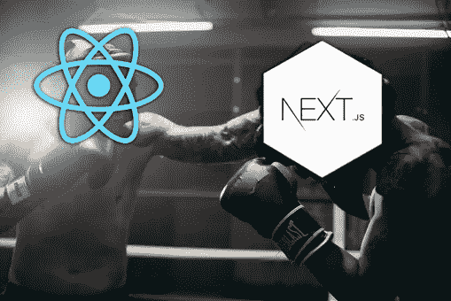
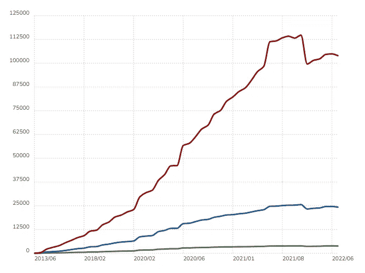
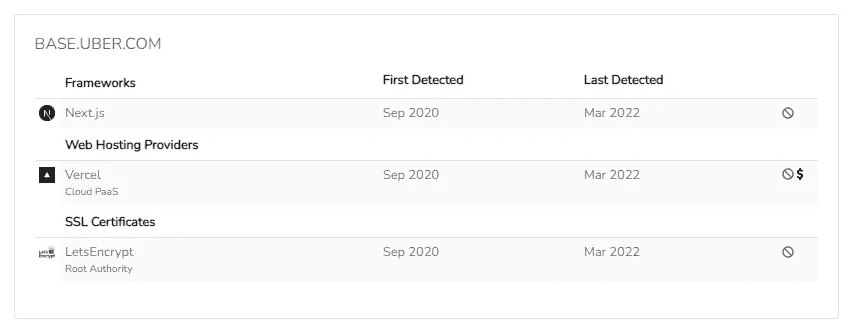
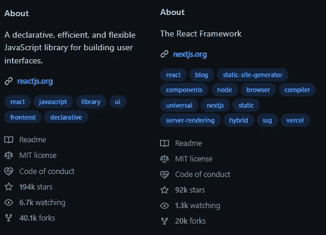

# ReactJS vs NextJS:你的下一个项目应该用哪个？

> 原文：<https://medium.com/codex/reactjs-vs-nextjs-which-one-should-you-use-for-your-next-project-22d65dc1cbef?source=collection_archive---------7----------------------->

当我们考虑下一个项目时，我们必须决定使用什么样的技术组合。在你的项目中使用 **JavaScript** 变得越来越普遍。但不仅仅是普通的 JavaScript，因为有许多**库**和**框架**来创建几乎任何东西:后端、前端、桌面应用和移动应用。

Angular、ReactJS、VueJS、NodeJS、BackboneJS、NextJS、meteor js……这些都是我们熟悉的 JavaScript 框架/库。其中两个名字对我们来说更熟悉(尤其是如果你最近在找工作的话)。还有 **NextJS** 和 **ReactJS** 。

你知道这两者中哪一个是你的项目在技术堆栈中需要的吗？如果你不知道，没问题。今天我们将见证互联网上最艰苦的战斗之一: **ReactJS vs NextJS。**

但是在我们开始之前，我们需要完全知道谁将在这场战斗中战斗。

# 什么是 ReactJS？

**ReactJS** 是一个 **JavaScript 库**，用于构建由**脸书**创建的**交互式用户界面**(用户看到并与之交互的元素)。ReactJS 有一些变体，允许我们创建更多的用户界面(例如 ReactNatvie)，但它广泛用于 web 开发。目前，它是世界开发领域中最常用的前端库之一。

[反应使用统计](https://trends.builtwith.com/javascript/React)来自[内置](https://trends.builtwith.com/javascript/Reactç)

# 什么是 NextJS？

[**NextJS**](https://nextjs.org/)**是由 [**Vercel**](https://nextjs.org/) 打造的开源 JavaScript 框架。它基于 React，允许我们使用 React 开发用户友好的网络应用。实际上， **NextJS 是一个 React 框架**(就像它自称的*“生产用 React 框架】* ) **。****

**使用 ReactJS 我们可以创建用户界面，使用 NextJS 我们可以**构建完整的网站**。利用这一点，我们可以转换我们的应用程序客户端，使用块赋予它完全的交互性。**

**目前，顶级科技公司使用这一框架:网飞、优步、星巴克或 Twitch。**

****

**使用内置的[检测](https://builtwith.com/detailed/uber.com)[优步网站](https://www.uber.com/es/es-es/)中的 NextJS**

# **ReactJs 和 NextJS 的区别**

**现在我们知道了我们的竞争者，是时候开始战斗了。ReactJs 和 NextJS 有什么区别？**

**事实上，由于 NextJS 是一个 React 框架，React 是一个 JavaScript 库，这两个工具之间不应该有冲突。使用 **React 我们可以为我们的 web 应用程序创建用户界面**，但是使用 **NextJS 我们可以创建整个应用程序**并将其投入生产。**

****ReactJS 只支持客户端渲染**，但是 **NextJS 支持服务器渲染**和代码拆分(这个事实可以提高我们 web 的性能)。然而，使用 React，您可以信任一个创建了许多不同文档的伟大社区。有了 NextJS，就没有那么正式的文档了。如果看到两个库的 GitHub 数据可以自己查一下。**

****

**NextJS 和 ReactJS 的 GitHub 数据**

**另一个根本区别是 **NextJS 是一个框架**(使用一组库的框架，其中一个库是 react js)**react js 是一个库**。当我们使用一个库时，我们可以控制一个应用程序的流程，因为我们只有一些外部化的功能。然而，当我们使用一个框架时，我们可以控制我们的应用程序的流程，这个框架可能包含一些我们不想在应用程序中使用的基本代码。**

# **那我应该用 NextJS 还是 ReactJs 呢？**

**如果…你应该使用 ReactJS**

*   **你了解 JSX，你想利用这一知识。**
*   **您计划构建多个应用程序，并且希望重用组件。**
*   **您只需要构建项目的用户界面。**
*   **你需要一个非常非常大的社区来帮助你。**
*   **你想要最好的文档和教程。**

**另一方面，您应该使用 NextJS，如果…**

*   **您的 web 应用程序需要服务器端呈现。**
*   **你想使用 ReactJS，但你想要更多的功能。**
*   **你知道反应，你想更进一步。**
*   **您希望您的应用程序具有最佳性能。**
*   **SEO 是你项目的一个重要方面(NextJS 比 React 更适合 SEO)。**

**事实上，我们可以说 Next.js 利用了 React 的特性来帮助开发者构建单页面应用。**

# **最后的想法**

**我们是开发者，我们必须创造软件。创建软件的一个重要方面是考虑用户，并始终牢记用户体验。然而，我们不要忘记我们是开发人员，因此，考虑**开发人员体验**很重要。**

**为此，我们必须考虑的主要决策之一是决定我们将在项目中使用哪个框架、库或平台。今天我们已经了解了 ReactJS 和 NextJS 之间的区别，现在我们完全知道我们应该在下一个项目中使用这两者中的哪一个。**

***之前用过 NextJS 或者 ReactJS 吗？你打算在下一个项目中使用哪一个？***

# **结论👋**

**谢谢大家！非常感谢您阅读这篇文章。我很想知道你对此的看法，所以不要写在评论里，我会读给你听。**

**反过来，如果这篇文章已经帮助你记住了，你可以为它鼓掌，并与你的同志分享。如果你不想错过我的任何一篇文章，别忘了关注我。**

# **关于作者🤓**

**我的两个爱好是技术和交流，所以我抓住一切机会谈论或写关于技术的东西。**

# **想要连接吗？📲**

**📩【jesuslagaresgalan@gmail.com 号**

**📸 [**Instagram**](https://instagram.com/jesuslagares_)**

**💼 [**领英**](https://www.linkedin.com/in/jesus-lagares/)**

**📹 [**Youtube**](https://www.youtube.com/c/Jes%C3%BAsLagares)**

**🐦 [**推特**](https://twitter.com/jesuslagares_)**

**谢谢！❣️**