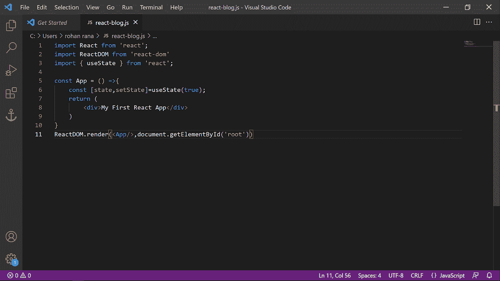

# ReactJS 与 React Native 哪个更好？

> 原文：<https://medium.com/codex/reactjs-vs-react-native-whats-better-55acee53da4c?source=collection_archive---------9----------------------->

在 IT 行业，经常会有关于 React.js 与 React Native 孰优孰劣的争论或讨论。如果你也有同样的困惑，那么这个博客就是为你而建的！我们开始吧！

React.js 是一个流行的 web 应用程序开发库。相反，React Native 是一个基于 ReactJS 的框架。React 原生框架用于跨平台移动应用开发。

React.js 和 React Native 目前都在为全球一些最流行、最广泛使用的移动应用程序和网站提供支持。因此，对开发人员的需求很高。因为企业希望 [**雇佣 Reactjs 开发者**](https://bootesnull.com/hire-developers/hire-reactjs-developers/) 或者 [**雇佣 React 本地开发者**](https://bootesnull.com/hire-developers/hire-react-native-developers/) 。现在，好奇想了解更多 React.js & React Native？是啊！请继续阅读。

# **React.js —快速概述**

脸书开发的一个流行的开源 JavaScript 库——react . js，它提供了对前端开发和服务器端的支持。此外，允许开发人员从称为“组件”的一小段或孤立的代码中创建出色的 UI(用户界面)React.js 通常用于开发 web 应用程序或网站。

**注意** —在 MVC 框架中，React.js 是库的“V”部分。它用于渲染视图。

ReactJS 由两部分组成:—组件(用户界面的 HTML 代码)和 HTML 文档(组件渲染)。

# **建立在 ReactJS 基础上的顶级品牌**

*   WhatsApp
*   照片墙

# **反应堆的优势**

**简单易学&使用** — React.js 是一个非常简单易用、简单易学的工具，任何具备 JavaScript 知识的人都可以理解并使用它来创建 web 应用。

构建动态 web 应用程序——以前创建 Web 应用程序相当困难，尤其是使用 HTML，但 React.js 让这变得轻而易举。现在，开发人员可以用更少的代码和更多的功能创建健壮的应用程序。

**可复用组件** —一个 [**web app 开发**](https://bootesnull.com/in/) 涉及多个组件，每个组件都有自己的逻辑和控件。在 React.js 中，这些组件可以重用，因此节省了时间，简化了开发过程。

**增强性能**—react . js 中的虚拟 DOM 增强了性能。但是虚拟 DOM 存在于内存中&这是 web 浏览器 DOM 的一种表示。因此，当开发人员编写 React 组件时，他/她不会直接写入 DOM。相反，编码人员在变成 DOM 的虚拟组件上编写代码。它导致平稳和快速的性能。

**多种便捷的工具** — React.js 提供了许多便捷的工具，让开发人员可以理解并轻松完成开发任务。这些工具允许程序员选择一个特定的组件，并检查和编辑当前的属性和状态。

社区支持——最后，React.js 提供了一个庞大的开发者支持社区。

# **反应本土——快速概览**

由脸书开发的流行的开源 UI 框架——React Native。它用于为 iOS、Android 和 Windows 创建跨平台的移动应用程序。然而，React Native 中的语法和工作流与 React.js 一样，只是组件不同。

**注意** —在 React JS 中，React 是 DOM 的基础抽象。在 Native 中，React 是 React Native 的基础抽象。

# **基于 React Native 打造的顶级品牌**

*   优步吃饭
*   照片墙
*   网络电话
*   爱彼迎（美国短租平台）

# **React Native 的优势**

**跨平台** — React Native 用于构建 iOS、Android、Windows 等跨平台移动应用。

**类性能**—React 原生代码编译成原生代码。它在两个平台上以相同的方式支持操作系统和功能。

**热重装** —在 React Native 中，代码中的新变化在开发过程中立即可见。因此开发人员不必刷新来加载新的更改。

**本地组件** —对于特定于平台的代码，编码人员需要根据平台要求编写不同的代码，因为该功能尚未设计。

社区 —在 React Native 上有一个非常大的开发者社区来寻求帮助。

# **React . js 和 React Native 哪个好**

对于 web 或移动应用开发，React.js 和 React Native 都是非常重要的支柱。随着灵活的功能和不断发展的生态系统库，JavaScript 库和框架每天都在获得动力。尽管 React.js 和 React Native 提供了不同的功能，但它们都是互补的。

例如，如果 React.js 非常适合构建高功能的网站，那么相反，React Native 非常适合创建移动应用程序。

如果你进退两难，不知道哪一个最适合你的项目，那么检查一下你的项目需求，然后做出相应的选择，以获得更好的结果。

关于在昌迪加尔的 ReactJS 培训，请联系 BootesNull。