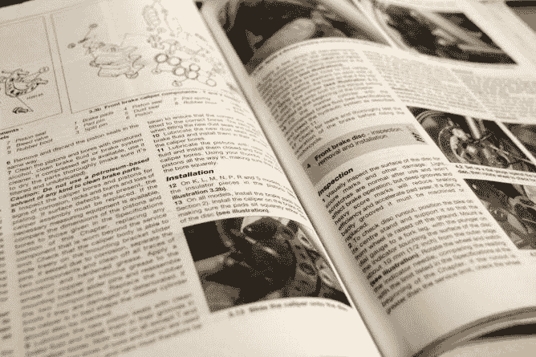

# 阅读神奇的手册:如何充分利用 Perl 文档

> 原文：<https://medium.com/codex/read-the-fantastic-manual-how-to-get-the-most-out-of-perl-documentation-5fd67929b279?source=collection_archive---------6----------------------->

无论是学习一门程序明兰语言，解决一个问题，还是尝试理解一个新的图书馆，它可能会吸引你去寻找合适的搜索引擎查询或者在像 T2 堆栈溢出这样的论坛上寻求帮助。但是看看任何关于问好问题的[指南](https://stackoverflow.com/help/how-to-ask)，你会在顶部找到这条要求:**做你的研究。**还有一个…