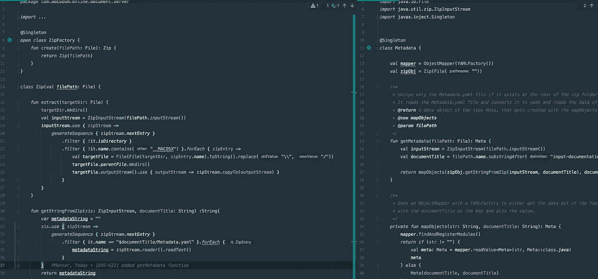

# 用 ZipInputStream 读取 Zip 文件的 YAML 内容

> 原文：<https://medium.com/codex/read-yaml-content-of-zip-file-with-a-zipinputstream-2b12b3f92f97?source=collection_archive---------3----------------------->



我最近遇到的一个问题是，我需要读取一些压缩文件的内容，我不想将它们解压缩到 temp 中，因为我真的只需要字符串形式的内容。我有一些 Zip 文件，其中包含一个 Metadata.yaml 文件，其中包含一些信息，如 id 或标题。我想读取 Metadata.yaml 文件的内容，并将值放入一个数据类，然后存储在一个 HashMap 中。

我的一些文件不包含 Metadata.yaml 文件，所以为了弥补这一点，我们使用 documentTitle 作为 HashMap 的 id，也作为数据类的 id 和标题。

在对 Kotlin 中的解压缩文件进行了相当长时间的研究后，我偶然发现了 ZipInputStream，它本质上只是一个数据流，可以像任何其他数据类型一样进行处理。

# getMetadata 函数

```
*fun* getMetadata(filePath: File): Meta {
    *val* inputStream = ZipInputStream(filePath.*inputStream*())
    *val* documentTitle = filePath.*name*.*substringBefore*(".zip")

    *return* mapObjects(getStringFromZip(inputStream, documentTitle), documentTitle)
}
```

这个函数用 filePath 创建一个 ZipInputStream。该文件需要存在，此操作才能进行。documentTitle 只是 zip 文件的名称，但没有。zip 扩展。

该函数触发 mapObjects 函数并为其提供两个字符串，其中一个由 getStringFromZip 方法生成。第二个字符串就是我们之前定义的 documentTitle。我们将在这里查看 getStringFromZip 函数。

# getStringFromZip 函数

```
*fun* getStringFromZip(zis: ZipInputStream, filePath: String) :String{
    *var* metadataString = ""
    zis.*use* **{** zipStream **->** *generateSequence* **{** zipStream.*nextEntry* **}** .*filter* **{ it**.*name* == "$filePath" **}**.*forEach* **{** metadataString = zipStream.*reader*().*readText*()
            **}
    }** *return* metadataString
}
```

该函数从 getMetadata 函数获取 ZipInputStream 和 documentTitle，并创建一个名为 metadataString 的新字符串。它使用 ZipInputStream 并从中创建一个 zipStream。每个 zipStream 都是 ZipFile 中的一个条目。它生成一个序列，确保所有的条目都被访问。因为我只想要 Metadata.yaml 文件，所以我向序列添加了一个过滤器，它将条目的名称与 Metadata.yaml 相匹配。

对于过滤标准为真的每个条目(在我的例子中只有一个)，它覆盖 metadataString 并将其设置为清单文件的内容。最后，我只是返回 metadataString。

# mapObjects 函数

由于我们现在从前面的方法中获得了字符串形式的文件内容，我们只需读出字符串的 YAML 值。

```
*val* mapper = ObjectMapper(YAMLFactory()) //creates Object Mapper*fun* mapObjects(str: String, documentTitle: String): Meta {
    mapper.findAndRegisterModules()
    *return if* (str != "") {
        *val* meta: Meta = mapper.readValue<Meta>(str, Meta::*class*.*java*)
        meta
    } *else* {
        Meta(documentTitle, documentTitle)
    }
}*data class* Meta(*val* id: String, *val* title: String)
```

首先，我们必须创建一个带有 YAMLFactory 的 ObjectMapper。我在函数之外的位置定义了它，因为我想多次使用同一个映射器，不想每次都创建它。

正如我之前提到的，不是每个文件都有 Manifest.yaml 文件，也不是有内容的字符串。如果字符串为空，我只返回 documentTitle 作为 id 和标题。如果字符串不为空，它会让映射器读取 YAML 值，并将它们放入数据类的构造函数中。

映射器的梯度依赖关系:

```
compile "com.fasterxml.jackson.dataformat:jackson-dataformat-yaml:2.11.1"
```

# 将值添加到散列表中

只需创建一个新的 hashMap，并将两个函数调用放入其中。散列表的 id 将是清单的 id，散列表的值将是包含值的数据类。

```
*val* metadata = *hashMapOf*<String, Meta>()metadata.put(getMetadata(zipFile).id, getMetadata(zipFile))
```

我希望这篇文章是有用的，你现在能够读出 Zip 文件的内容。