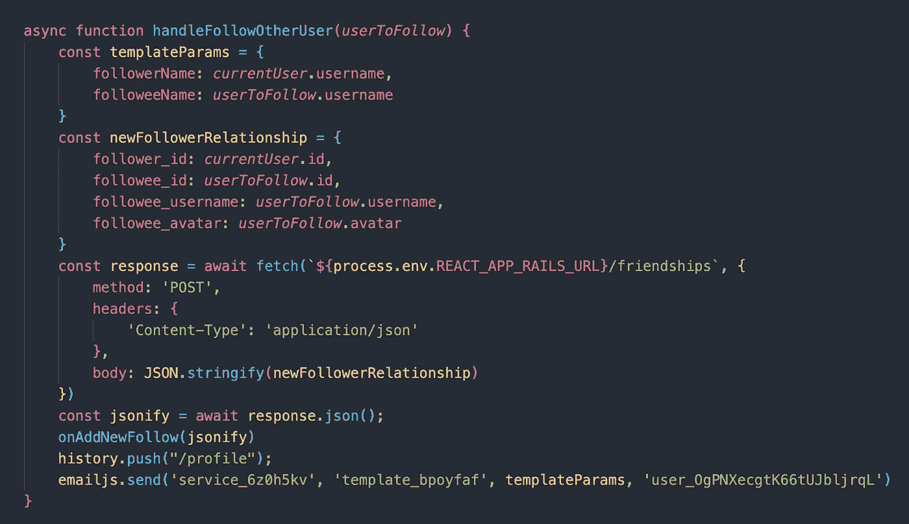
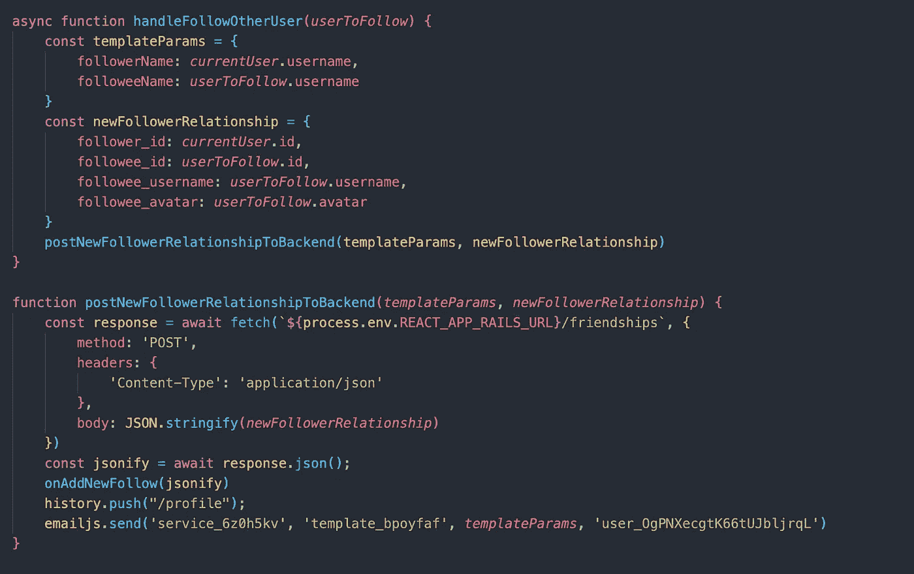
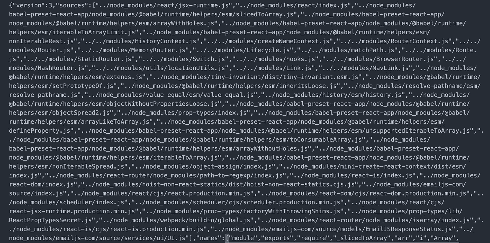
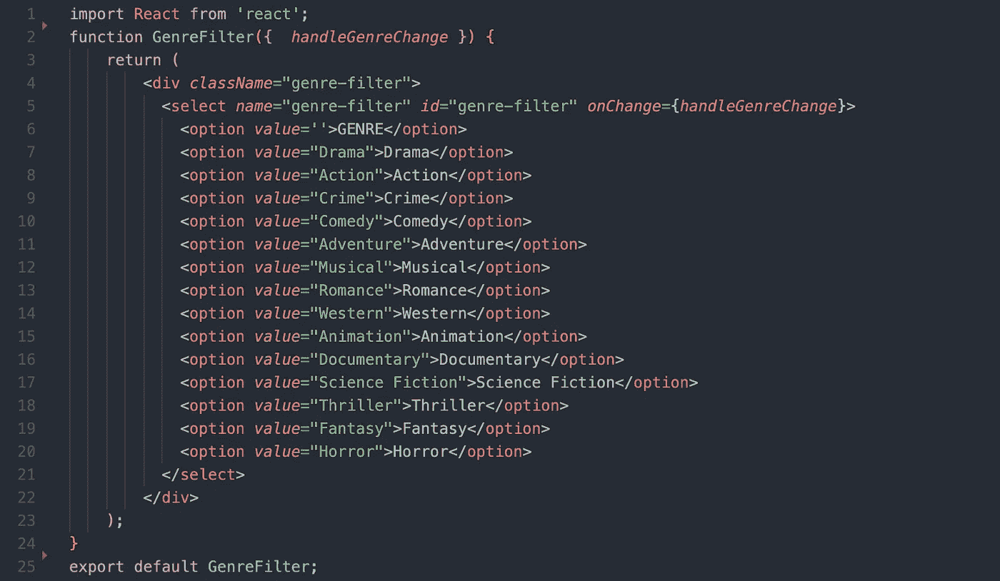
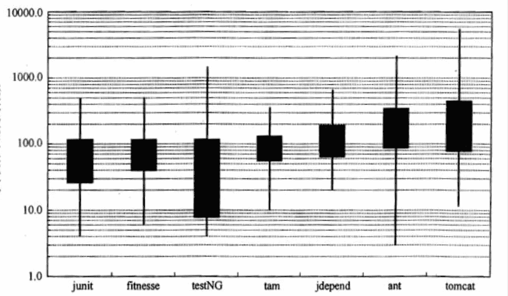
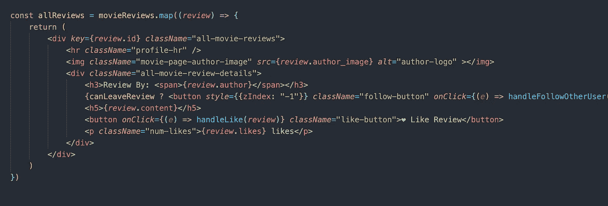
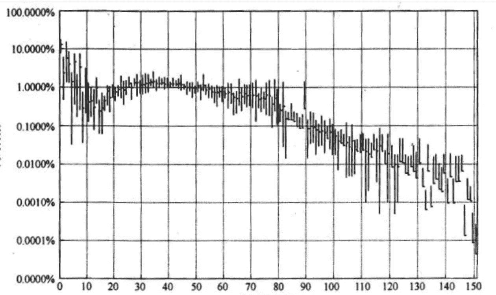
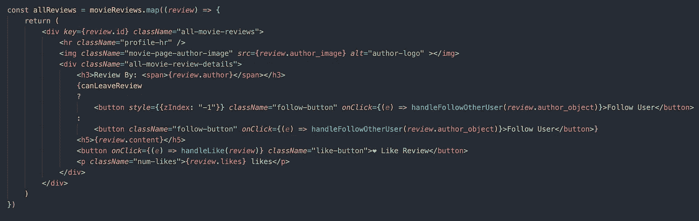

# 阅读干净的代码:第 2 周

> 原文：<https://medium.com/codex/reading-clean-code-week-2-643641e4dc28?source=collection_archive---------5----------------------->

正如这个博客的关注者所知，我目前正在[阅读](https://levelup.gitconnected.com/reading-clean-code-week-1-a4df2c392e66)到 [*干净代码*](https://www.amazon.com/Clean-Code-Handbook-Software-Craftsmanship/dp/0132350882/ref=sr_1_1?dchild=1&keywords=clean+code&qid=1622646055&sr=8-1) ，这是一本关于如何编写可读的专业代码的经典。《干净的代码》*主要由“鲍勃叔叔”马丁撰写，并由敏捷软件开发领域的一些顶尖思想家参与，它并不是一本循序渐进的编码手册。虽然我和下一个代码迷一样渴望另一本以动物为装饰的 O'Reilly 书，但 *Clean Code* 不会教你一门特定的语言或框架。相反， *Clean Code* 的副标题——“软件工艺手册”——解释了这本书更广泛的目的。*

鲍勃叔叔希望你写干净的代码

对于鲍伯·马丁和他的合著者来说，*干净的代码*提供了一种[照顾好你的代码](https://www.youtube.com/watch?v=7EmboKQH8lM)的方法。就像木匠用激光精度(现在字面上是用激光精度)引导她或他的车床穿过一块木板一样，软件工程师也应该以最大限度的关注细节来编写他们的代码。为了更具体地说明这本神奇的书提供了什么，我将从上周停止的地方继续，提供关于计算机程序的哪些元素可能需要清理的更多细节。

在这篇文章中，我将着眼于一个不同于上周的项目的代码，用完全不同于*干净代码*的经验重构我自己的工作。这本书(以及类似文本)的粉丝可能会注意到我没有按章节顺序写。根据我的经验,《干净的代码》是那种通过翻到能立即抓住你的章节来最好地消化的书。让我们开始重组我们的项目，让它变得更干净一点。

我将在这篇文章中重构的项目实际上是我在熨斗学校软件工程训练营的压轴戏项目，[腐烂的土豆](https://putridpotatoes.netlify.app/)(请原谅这个老土的名字，我真的忍不住)。腐败的土豆是电影评论网站[的翻版，它允许你记录你看过的电影，写这些电影的评论，并在网站上关注其他评论者。作为一个信箱和电影院的粉丝，我非常喜欢建立这个网站，一旦它完成，我真的觉得自己像一个成熟的软件工程师。](https://letterboxd.com/)

腐败土豆主页

也就是说，任何参加过编码训练营的人都会告诉你，在短短三周内学会制作一个完整的 web 应用程序是非常有压力的。我并不以此为荣，但我确信在那段时间里我写了一些不太干净的代码，我很高兴能从 Bob 叔叔和他的公司那里学到一些东西来整理我的工作。提醒一下，写干净的代码如此重要的原因是[花在读代码上的时间与写代码的时间是 10:1](https://www.ybrikman.com/writing/2018/08/12/the-10-to-1-rule-of-writing-and-programming/) 。这一点尤其重要，因为我仍在为腐烂的土豆构建功能，任何拥有 GitHub 账户的人都可以像任何开源软件一样贡献我的代码。如果我的代码不清晰，将会减慢他们的开发过程，甚至可能会影响网站的发展。更糟糕的是，如果腐败的土豆获得了大量的用户，并且有什么东西坏了，那就比我写干净的代码要难多了！有了这些，让我们看看在这个代码库中我们可以清理什么。

## 功能

即使你不遵循函数式编程范式，函数也是，正如 *Clean Code* 所说的，“任何程序的第一线组织。”函数允许我们在程序中传递数据，按照我们的意愿操纵数据，释放软件的真正力量。因为我们在代码中如此频繁地依赖函数，所以确保我们遵循一些最佳实践是很重要的。让我们来看看 Putrid Potatoes 的以下函数，当点击正确的按钮时，它会关注应用程序上的另一个用户，并向该用户发送电子邮件，通知他们有了新的关注者(利用奇妙的 [EmailJS](https://www.emailjs.com/) 库):

虽然这里使用的命名约定相对简单，但是这段代码有一个主要问题。正如*干净代码*所说，功能要**小！**更具体地说，Martin 告诉我们这是函数的前两条规则:

1.  功能应该很小。
2.  函数应该比这个小。

虽然`handleFollowOtherUser`可能会更长——我见过 1000 行的函数(咽！)—函数应该是我们容易找到的小块。如果编写代码像任何其他类型的写作一样，那么我们希望我们的函数像句子一样，不断地给出程序应该做什么的细节，就像写小说一样。如果我们的代码被分解成多个更小的函数，而不是像上面这样有 30 行代码的庞然大物，可读性会更好:

在我看来，即使只是将这个函数分成两部分，也会使它更具可读性。如果另一个程序员出现，他们会更容易理解这里的函数链。

以这种方式重构我的代码允许我们讨论鲍伯·马丁对我们函数的另一个建议:函数应该做一件事。之前，`handleFollowOtherUser`为我们执行了相当多的操作，接收事件，收集适当的信息以创建新的追随者-追随者关系，*然后*将这些数据发布到我们的数据库。这个函数很容易编辑。虽然我们可以将`postNewFollowerRelationshipToBackend`抽象成越来越小的块，但我认为在这种情况下最好将所有的获取逻辑放在一个地方。

虽然我不会在这里详细讨论它们，但是 *Clean Code* 关于**函数参数**、**使用描述性名称**、**、**并保持您的代码 **D.R.Y .(不要重复自己)**的建议非常值得 Google 一下，并且很可能是这里未来博客文章的主题。毫无疑问，它们会使你的功能变得更小，更容易被你的开发团队理解。

## 格式化

今天写代码的一大乐趣是我们可以给我们所写的文字的布局以灵活性。想象一下，如果我们必须编写类似于这个缩小的 JavaScript 文件的代码:

代码的噩梦燃料

幸运的是，我们的 ide 让我们能够以我们想要的任何方式格式化我们的代码。只要它在我们正在编写的语言中仍然有效，编译器就应该能够捆绑我们的代码并做我们让它做的事情。但是仅仅因为我们可以用非常宽松的格式编写代码，并不意味着我们不应该注意如何在页面上显示代码。可以肯定的是， *Clean Code* 关于格式的章节是我读过的关于编写代码的最好的句子之一，我认为它很好地总结了整本书的要点:

*“代码格式化是关于沟通的，而沟通是专业开发人员的首要任务。”*

作为软件工程师，我们必须记住，代码只是文字。尽管 fetches、try-catches 和 switch 语句变得错综复杂，但我们仍然只是编写单词，将它们连接在一起，形成一个有凝聚力的程序整体。因此，我们希望密切关注细节。让我们看看下面的代码，了解一下格式:

如您所见，`GenreFilter()`只占用了 25 行代码(它也清楚地做了一件事，并且有描述性的名字，以防您记下分数)。但是为什么垂直格式对我们的程序很重要呢？让我们来看看下面这张来自 *Clean Code* 的图表，它显示了一些大规模生产应用程序的平均文件长度:

正如*干净代码*告诉我们的，“小文件比大文件更容易理解。”与其上下滚动屏幕来理解代码应该做什么，我们可以写一些小文件，如果代码太长，就把我们的逻辑分解到其他文件中。此外，编写大约 100 行代码/文件来创建有用的应用程序显然是可能的。为了帮助我们理解这一点，马丁告诉我们使用报纸上的比喻。我们垂直阅读报纸，首先看信息丰富的标题，然后看第一段的故事梗概，并在下面的阅读中收集更多的细节。同样，我们的源文件应该有简单的、解释性的名称，随着我们往下读，文件的更多细节会显现出来。让我们看看我们应该密切关注的格式化的另一个方面:

虽然`allReviews`的功能足够清晰，但这里显然有一个大问题:以`canLeaveReview`开头的线条宽度超过了屏幕长度！就像垂直格式一样，作为程序员，我们也需要注意水平格式。为了更好地理解我在这里的意思，让我们看一下来自 *Clean Code* 的另一张图，它显示了平均线宽:

如图所示，程序员显然更喜欢短线。即使我们使用的是大型显示器，我们也应该认识到，其他程序员可能不希望扫描整个屏幕来查看相关代码应该做什么。重构这段代码使它更具可读性:

虽然编辑后的代码仍然相当宽，但最长的一行现在只有 160 个字符，大约是以前的一半。关于格式，还有很多东西需要学习，我就不在这里深究了，包括**缩进**、**水平对齐**和**概念相似性**。虽然看起来格式化仅仅是为了让你的代码看起来像样，但是在编写其他人可以轻松阅读的代码时，还是有很大的力量的。

正如我在这篇博客文章的开头提到的, *Clean Code* 是那种你可以随意翻阅直到某些东西激起你的兴趣的书。顺便说一句，这本书在每一章的开头都有一些有趣的漫画，你可以从你感兴趣的地方开始阅读。

在接下来的几周里，我将继续阅读和编写我自己的*干净代码*，当我需要学习更多关于编写好的测试或一般代码设计时，转向不同的博客主题。我希望在这个博客系列中，你能受到启发，写出好的、干净的代码，这样我们就能共同构建软件，做一些重要的事情。所以继续吧，翻来翻去，找到你感兴趣的东西，然后去写一些干净的代码。