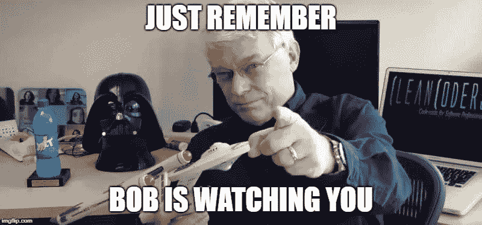
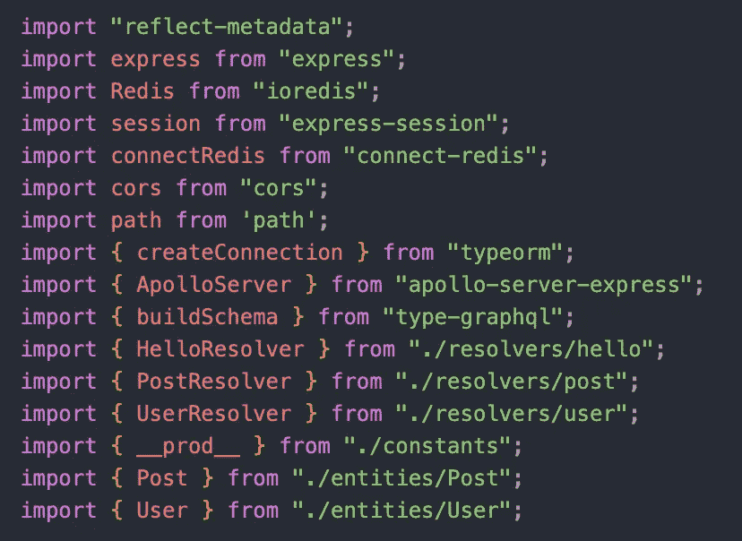

# 阅读干净代码周 5:界限

> 原文：<https://medium.com/codex/reading-clean-code-week-5-boundaries-aba7fbefb861?source=collection_archive---------8----------------------->

继上周关于 [*重构*](https://levelup.gitconnected.com/reading-c%CC%B6l%CC%B6e%CC%B6a%CC%B6n%CC%B6-c%CC%B6o%CC%B6d%CC%B6e%CC%B6-refactoring-week-4-a7abe6539eb3) *的博客之后，本周我又回来回顾*清洁代码*。虽然我本周回顾的章节很短，但这个概念非常重要。本周我将谈论[边界](https://www.cs.uct.ac.za/mit_notes/software/htmls/ch01s04.html)，我们将没有实际编写的代码合并到系统中的方式。*

仅有八页的《干净代码》关于边界的章节是书中最短的一章。虽然建议相对简洁，但在我看来，你将第三方代码干净地集成到应用程序中的能力将决定你作为开发人员的成败。

每一个软件工程师，几乎不管他们的经验，都在那里，煞费苦心地盯着电脑屏幕试图找到一个 bug。你的程序没有像预期的那样工作，而且你也不知道为什么。更糟糕的是，有时你的程序*确实像预期的那样工作*，即使你*知道*代码被破坏了。这种噩梦般的场景会发生在最优秀的程序员身上，但显然这里有问题。

虽然我们都在程序中写过 bug，但是有时候集成第三方软件会引入不是我们写的 bug！想象一下，花几个小时盯着你的电脑屏幕，你的眼睛越来越模糊，你的挫折感越来越大，而这个错误甚至不是你的错！

嗯，这不全是你的错。您可能没有在罪魁祸首代码中编写 bug，但是在您的程序中没有使用好的边界不是任何人的错，而是您自己的错。幸运的是，*干净代码*(以及章节作者[詹姆斯·格林宁的](https://wingman-sw.com/about))关于边界的建议可以帮助保护你的代码免受潜在的错误和坏软件的影响。通过以一种防止外部错误的方式设计我们的程序，您可以保持您的代码更易于维护，并且可以避免一些令人烦恼的调试会话。

事实上，边界对 web 开发人员来说是一把双刃剑。一方面，在团队中构建软件，能够依靠他人帮助你编写代码，可以显著提高你的工程经验。我在早期的 web 开发人员时代已经写了一些，但是使用外部包可以节省你写代码的时间。此外，使用第三方代码可以让您依靠潜在的更有经验和更有才华的开发人员来满足您的一些软件需求。例如，您可能需要使用外部 API 来为您的应用程序获取数据，或者可能有一个 Ruby gem 用于复杂的数学，非常适合您的用例。毕竟，开源软件对工程师如此有用是有原因的。

另一方面，正如 *Clean Code* 所说，“在接口的提供者和用户之间有一种天然的紧张关系。”虽然用户对他们希望他们的代码做什么有特定的需求，但是第三方包的提供者努力争取广泛的适用性。

cleancodejava.com 海运公司

那么，你能做些什么来为你的程序建立良好的边界呢？你应该做的第一件事是**阅读**，我保证这对一个热衷于网络开发的软件工程师来说并不令人满意。不要在你的电脑上敲敲打打，阅读关于你正在使用的外部 API 或库的文档。慢下来，慢慢来，深入理解你想用的工具。也许甚至可以写几个内部测试(Clean Code*称之为“学习测试”)来检查软件是否如预期的那样工作。只有在学习和探索了这些外部代码之后，您才能放心地将您的系统暴露给它。*

另一种处理程序边界的方法是为外部代码引入 [**包装器/适配器**](https://en.wikipedia.org/wiki/Adapter_pattern) 。通过在代码中引入适配器，我们限制了依赖性。通过限制程序对第三方代码的引用，可以限制程序崩溃的可能性。我真的很喜欢下面的播客，它对边界进行了全面的讨论，但我认为它对如何“将奇怪的东西推到我们代码的边缘”的信息特别有见地坦率地说，在解释为什么界限对于编写干净的代码如此重要方面，主持人比我做得更好。我强烈建议你听。

h/t 编码块

最后，我不想让这听起来陈腐，但是在管理第三方边界时要运用常识。就常识而言，我的意思是可能跳过几年没有更新的库，或者跳过那些有着短小精悍、令人困惑的文档的 API。让我们来看看下面来自我一直在编写的项目的代码，以便更好地理解我在这里的意思:

虽然我在这个项目中使用了大量的外部代码，但我相当确定我没有在这里过度暴露我的代码。我可以确定的一个方法是，我主要使用流行的、记录良好的项目，如 [Redis](https://redis.io/) 和 [TypeGraphQL](https://typegraphql.com/) 。这些项目有许多贡献者和完整的文档，所以如果我遇到了意外的 bug，我不会在黑暗中试图找出它。

我在这里做的另一件事是将我的第三方软件导入物理地分组在一起，远离我从自己的应用程序中导入的代码。虽然不是严格意义上的保持清晰界限的原则，但它遵循了**概念相似性**的*清晰代码*规则，即代码的某些部分应该更紧密地分组到它们相似的事物中。使用像 [yarn](https://yarnpkg.com/) 这样的包管理器也有助于维护我的外部代码。

记住，*干净的代码*不仅仅是写计算机可读的代码，而是人类可读的代码。因此，你的代码必须清楚地传达你的想法，没有什么会像别人替你说的那样混淆你想说的话。不要让第三方库插入你的代码，限制这些程序能说什么，保护你代码的整体整洁。