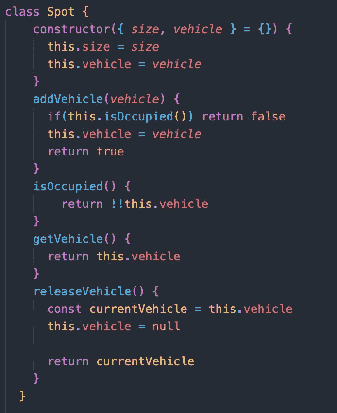
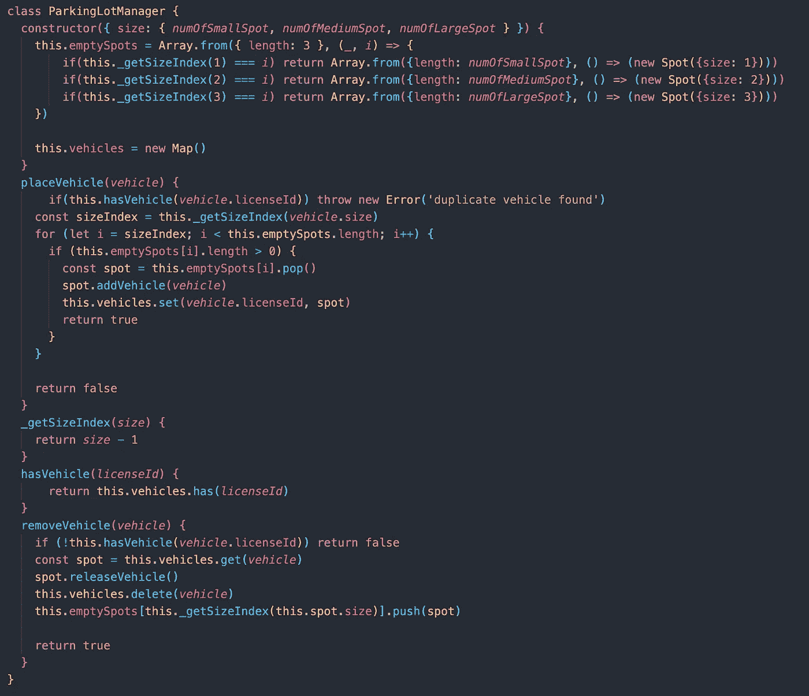
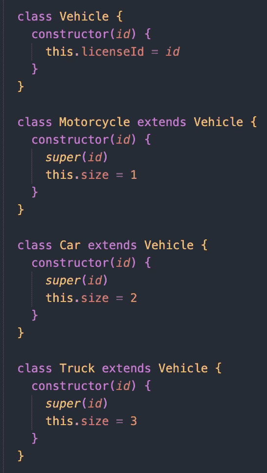
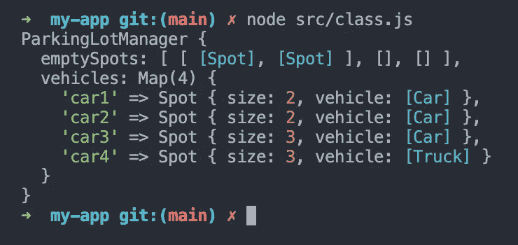
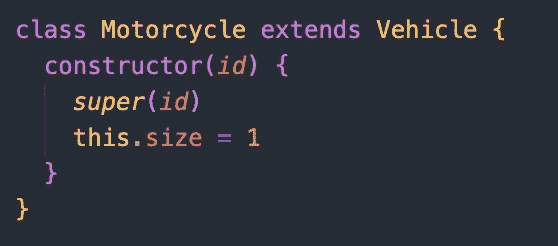
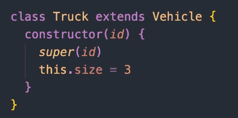
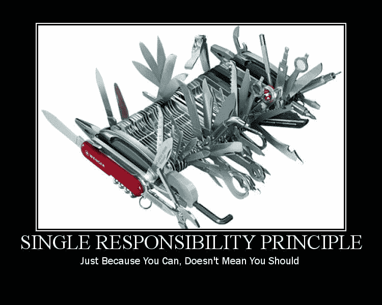

# 阅读干净代码第 6 周:类

> 原文：<https://medium.com/codex/reading-clean-code-week-6-classes-162839d9361d?source=collection_archive---------12----------------------->

在本周关于*干净代码*的博客中，我将谈论一些关于类的内容。虽然面向对象编程(OOP)本身是一个极其[庞大的主题](https://www.educative.io/blog/object-oriented-programming)，我不能在这里深入探究，但现在可以说，对象是允许我们存储数据和操作数据的代码位。通过利用 OOP，我们隐藏了程序的细节，这使得我们的代码更加灵活、模块化和抽象。在编写大型程序时，OOP 非常有用，尤其是在团队构建健壮应用程序的情况下。

正如我们编写的任何代码一样，当我们保持代码整洁时，我们有更大的成功机会，Bob 叔叔有一些有用的建议来帮助我们在课堂上做到这一点。为了阐明编写干净类的一些要点，我们将使用 JavaScript 设计一个停车场。一旦我们完成了，我们将对类给我们的功能有更好的理解，以及如何保持它们的整洁。我想指出的是，有些 OOP 概念已经超出了这篇博文的范围，特别是 [**封装**](/javascript-scene/encapsulation-in-javascript-26be60e325b4) 、 [**开闭原则**、](/@_ericelliott/clarifying-my-use-of-the-open-closed-principle-de54f77342c3) (OCP)以及[、**依赖倒置原则**、](https://en.wikipedia.org/wiki/Dependency_inversion_principle) (DIP)。虽然我们不会在这里深入讨论这些，但是链接的文章会让你对类有更广泛的理解。

## 设计一个停车场

实话实说:你可能从来没有设计过停车场。不要让这个[相对普通的面试问题](https://www.youtube.com/watch?v=DSGsa0pu8-k)吓住你。让我们首先澄清一些关于所说的停车场的假设。关于该系统的设计，可以问的好问题包括:

*   什么样的车辆可以停在停车场？
*   该批次有多个级别吗？
*   一辆小汽车能放进一个为大汽车设计的空间吗？
*   一次可以有多辆车进入停车场吗？

通过澄清关于停车场的假设，我们对这个系统应该如何工作有了更好的了解，这将允许我们建造一个更高效的停车场。为了省去很多关于如何用代码设计停车场的讨论，我们将从这篇优秀的 [StackExchange](https://codereview.stackexchange.com/questions/254822/javascript-parking-lot-simplified-ood) 帖子中借用一个例子:

`Spot`类:

`ParkingLotManager`类:

`Vehicle`、`Motorcycle`、`Car`和`Truck`类:

现在我们已经构建了下面的类，我们可以创建它们的新实例并对它们执行操作。例如，如果我们创建以下对象:

我们的程序给出了以下输出:

再次为了这个博客的目的，我不会对 OOP 的有用性进行过多的描述。现在我只想说，OOP 使我们能够模块化我们的程序，将它们分解成更小的部分，降低复杂性，使解决 bug 变得更容易。因为这是成为一名合格的软件工程师的一个非常重要的概念，所以我们能够保持课堂整洁也是非常重要的。让我们看看鲍勃叔叔有什么推荐给我们。

## 班级应该很小

正如 Martin 所写的，“类的第一条规则是它们应该很小。类的第二个规则是它们应该比那个小。如果听起来马丁和他的合著者在重复他们关于函数大小的指导方针，他们确实是这样。像函数一样，类应该是小型的和高度模块化的。然而，我们不是用类占用的行数来度量类的大小——就像我们用函数一样——而是用它所承担的职责数量来度量类的大小。让我们从上面看一下我们的一个类:

正如我们所看到的，`Motorcycle`类在它占用的行数和它承担的责任数上都很小。我们知道`Motorcycle`从`Vehicle`类继承了`id`属性，并且它有一个指定其大小的属性。与函数一样，类变得越复杂，我们就给 bug 带来越多的滋生机会。相反，我们通过减少类来使类更干净。

我们可能能够保持我们的班级规模小的一个方法是给他们一个描述性的名字。如果您还记得我们对关于**名称**的*干净代码*章节的回顾，我们应该注意给我们的对象起一个清晰且有意义的名称。你不需要无数的注释来描述一个类的职责。举一个我们停车场分类系统的具体例子:

`Truck`类清楚地表明了我们对这个类的期望。只要看一眼名字，我们就能看出卡车是一种交通工具，它的大小是它的特征之一。虽然我知道上面的一些代码片段违反了这条规则，但是一般来说，`Motorcycle`、`Car`和`Truck`类展示了类应该有多小。

## 单一责任原则

一般来说，OOP 和软件设计中最重要的概念之一,**单一责任原则** (SRP)声明一个类或模块应该有一个、单一的、唯一的变更理由。如果一个类有太多的职责，你可能会重构部分代码，而忘记一些方法仍然在代码库中的另一部分逻辑上操作。对于庞大的、无所不包的类，很难保持代码的组织性。例如，让我们回头看看我们的`ParkingLotManager`类:

好吧，`ParkingLotManager`明显有点臃肿。首先，40 行代码在我们的程序中占据了相当大的空间。然而，更重要的是，在我看来，我们过于依赖`ParkingLotManager`来有效地运行我们的系统。目前`ParkingLotManager`必须跟踪空间大小*和*决定是否添加*或*移除车辆。一个更好的系统设计可能会从`ParkingLotManager`类中推断出`_getSizeIndex`方法，将那些关注点分离出来，使我们的程序更容易理解。

您可能认为创建太多的类有其缺点。你会问，如果我不得不上下滚动我的计算机屏幕，扫描几十个小类来搜索整个程序，我真的能节省时间吗？然而，Martin 告诉我们，几个小类可以有和几个大类一样多的活动部分，如果我们将工具组织到一个干净、有组织的工具箱中，并为这些工具提供足够的标签，我们可能会更有效地完成我们的目标。如果 SRP 没有为你点击，[这篇博文](https://dev.to/skill_pathway/single-responsibility-principle-for-dummies-59gb)给出了一个很好的解释，就像我对这个话题的解释一样。

在*干净代码*关于类的章节中有一段很棒的旁白，马丁讨论了为什么干净代码如此罕见。“我们中的很多人，”马丁声称，“认为一旦程序运行起来，我们就完成了(编写代码)。”正如*干净代码*一再强调的那样，编写计算机能够理解的代码只是战斗的一部分。编程的真正挑战在于编写人类能够理解的程序。

像现实世界中的系统一样，计算机程序也会改变。新的框架和/或逻辑被写入我们的系统，技术债务在这个过程中不断积累。作为我们系统的设计者，我们引入的每一个变化都会使我们面临系统不再完全发挥作用的风险。然而，在编写干净的代码时，我们降低了那些程序——以及我们的团队——失败的风险。我希望这篇博客对理解 OO 设计和编写干净的类有所帮助。