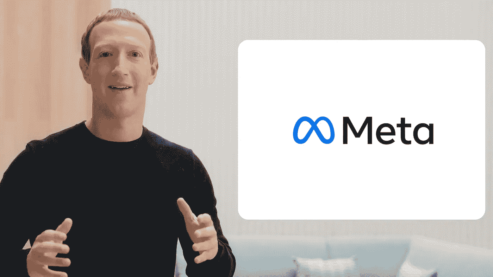
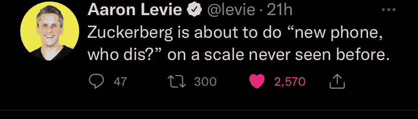

# 一号选手准备就绪，脸书带头冲锋

> 原文：<https://medium.com/codex/ready-player-one-is-here-and-facebook-is-leading-the-charge-4829ab5c6638?source=collection_archive---------7----------------------->

一张元宇宙想要的照片

在脸书连接主题演讲期间，马克·扎克伯格为我们展示了一个只有在科幻电影和书籍中才能实现的新未来，并旨在建立在这个未来的基础上，将我们带到一个新的世界。他试图重新想象连通性的下一步。于是，他带来了一个新名字，meta。

在他的主题演讲中，他谈到了元宇宙如何将我们从社交媒体时代带到一个新的时代，在这个时代，我们可以超越网络和移动应用的限制。一个我们确实可以在远方相聚的时期。为什么没有异地恋，为什么我们可以通过一个虚拟现实设备与几英里之外的亲人保持联系。在元宇宙，他谈到了沉浸式学习是如何超越教科书的黑白。一个地方，你可以超越你的想象，旅行到光年以外，看到遥远的星球，旅行到数百年前，看看希腊人如何使用特洛伊木马入侵特洛伊土地。这确实将是教育领域的一大突破。他还谈到了 NFT 的(不可替代的代币)将如何被购买并保存在他们的数字空间中，并在元宇宙安全地交易。

他还谈到了工作中的突破，以及你如何不必长途通勤就能亲自出现在工作场所，以及你的工作场所可以在元宇宙，随着新冠肺炎和新 WFH(在家工作)时代的到来，这对我们来说是一个巨大的发展。这个想法对许多人来说可能是非常雄心勃勃和妄想的，因为这需要大量的工作和时间来接近我们未来的现实，我相信马克·扎克伯格意识到了这一点。对他来说，这次更名只是将我们的手机连接到元宇宙的一步。脸书改名为梅塔。新的控股公司 Meta 将在元宇宙旗下运营社交网络平台(脸书、Instagram、Facebook Messenger、WhatsApp)以及现实实验室 AR(增强现实)和 VR(虚拟现实)产品(Oculus 和脸书地平线)。

马克·扎克伯格在脸书互联主题演讲中。

元宇宙的目标是成为今天互联网的翻版——基于虚拟世界和增强现实，在这里你可以成为你想成为的任何人或任何事。随着目前脸书动态的变化，马克·扎克伯格想要元宇宙的大量股份。然而，他无法控制元宇宙，因为它将建立在去中心化的自治组织上，这将让用户对他们的内容负责，并有望保护隐私(一篇精彩的文章，解释了 Dao 是什么，作者是 [Teju Adeyinka](https://medium.com/u/840467137bce?source=post_page-----4829ab5c6638--------------------------------) : [对 Dao 的大惊小怪做出了解释)。建设这样的未来需要公司和开发者的大量合作，以分享他们的资源，这需要他们购买马克·扎克伯格提出的未来。脸书(现在的 Meta)不会拥有元宇宙，就像脸书不会拥有互联网一样。它的目标只是成为游戏中的一个大玩家，它已经公开表示，要想取得任何形式的成功，它需要元宇宙经济中尽可能多的玩家。然而，更名招致了一些人的批评，他们认为这是该公司逃避过去所有反弹的一种方式。](https://teju.mirror.xyz/)

马克·扎克伯格花了大量时间试图消除人们对该公司涉嫌垄断和反隐私的担忧。他还谈到他将如何与决策者合作，以确保元宇宙的适当监管和法律。描绘元宇宙的书籍和电影，如《冰雪奇缘》和《一号玩家》都是以反乌托邦的未来为背景，这也于事无补。这让许多人担心过多的连接是否是一件好事，并使我们远离真正的人类互动，这可能会导致许多我们现在无法看到的未来后果。