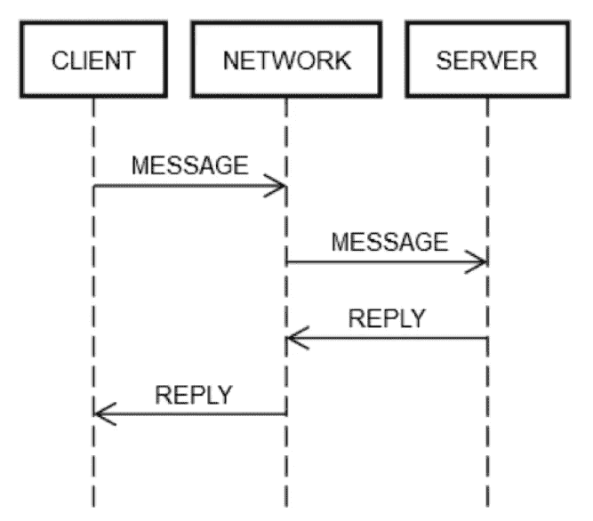

# 为什么分布式系统如此怪异？

> 原文：<https://medium.com/codex/real-time-distributed-systems-are-sometimes-weird-d3f04ea613f6?source=collection_archive---------14----------------------->

## 这些堆积如山的请求和回复无法自行管理


照片由 [imgix](https://unsplash.com/@imgix) 在 [Unsplash](http://unsplash.com/) 上拍摄

本文是分布式系统系列文章的一部分。在以前的文章中，我已经详细讨论了分布式系统中的体系结构的优点和挑战。我还详细讨论了客户机-服务器体系结构。如果您不熟悉分布式系统，我强烈推荐您阅读这两篇文章。

[](/codex/introduction-to-distributed-systems-66502ac8289) [## 分布式系统中的架构

### 分布式系统已经流行了一段时间了。每个人都想构建一个系统或应用程序…

medium.com](/codex/introduction-to-distributed-systems-66502ac8289) [](/codex/client-server-architecture-5e103aa0106d) [## 客户机-服务器体系结构

### 这篇文章与我之前关于分布式系统架构的文章相关。通过这篇文章…

medium.com](/codex/client-server-architecture-5e103aa0106d) 

在这里，我想分享一下分布式系统如此难以维护的原因——以及开发人员需要考虑什么样的错误场景，以便高效地处理系统。最近，我看到了各种发现和研究论文，它们详细讨论了这些场景。硬实时分布式系统是本文的重点。

硬实时分布式系统开发的独特之处在于一个原因:请求/应答网络。让这变得困难的是，网络能够将消息从一个故障域发送到另一个故障域。发送信息可能看起来无害。事实上，发送信息是一切变得比正常情况更复杂的地方。


[Sei](https://unsplash.com/@itssecondkaki?utm_source=medium&utm_medium=referral) 在 [Unsplash](https://unsplash.com?utm_source=medium&utm_medium=referral) 上拍照

举个简单的例子，看看下面来自 Pac-Man 实现的代码片段。它打算在一台机器上运行，不通过任何网络发送任何消息。

```
board.move(pacman, user.joystickDirection())
ghosts = board.findAll(":ghost")
for (ghost in ghosts)
  if board.overlaps(pacman, ghost)
    user.slayBy(":ghost")
    board.remove(pacman)
    return
```

现在，让我们设想开发这段代码的网络版本，其中 board 对象的状态在一个单独的服务器上维护。每次调用 board 对象，比如 findAll()，都会导致在两个服务器之间发送和接收消息。

每当在两个服务器之间发送请求/回复消息时，至少必须执行相同的八个步骤。为了理解网络化的 Pac-Man 代码，让我们回顾一下请求/回复消息传递的基础。

## 跨网络的请求/回复消息传递

一个往返请求/回复动作总是涉及相同的步骤。如下图所示，客户机通过网络向服务器发送请求消息，服务器也通过网络回复消息。



在一切顺利的情况下，会出现以下步骤:

1.  Post 请求:客户端将请求消息放到网络上。
2.  传送请求:网络向服务器传送消息。
3.  验证请求:服务器验证消息。
4.  更新服务器状态:如果需要，服务器根据消息更新其状态。
5.  发布回复:服务器将回复发送到网络上。
6.  传送回复:网络向客户端传送回复。
7.  验证回复:客户端验证回复。
8.  更新客户端状态:如果需要，客户端根据回复更新其状态。

对于一个小的往返行程来说，这些步骤太多了！尽管如此，这些步骤仍然是跨网络的请求/回复通信的定义；没有办法跳过任何一个。比如，不可能跳过第一步。客户端必须以某种方式将消息放到网络上。从物理上来说，这意味着通过网络适配器发送数据包，这使得电信号通过一系列路由器在电线上传播，这些路由器构成了客户端和服务器之间的网络。这与步骤 2 是分开的，因为步骤 2 可能由于独立的原因而失败，例如服务器突然断电，无法接受传入的数据包。同样的逻辑也可以应用于剩余的步骤。

因此，网络上的单个请求/回复将一个步骤(调用方法)分解为八个步骤。更糟糕的是，如上所述，客户端、服务器和网络可能会相互独立地发生故障。

## 在实时分布式系统中，处理故障模式是困难的

与单机情况不同，如果网络出现故障，客户机将继续工作。如果远程机器出现故障，客户机将继续工作，以此类推。

为了详尽地测试前面描述的请求/回复步骤的失败案例，我们必须假设每个步骤都可能失败。而且，我们必须确保代码(在客户端和服务器端)在这些失败的情况下总是正确运行。让我们来看一个不工作的往返请求/回复操作:

1.  Post 请求失败:网络未能传递消息(例如，中间路由器在错误的时刻崩溃)，或者服务器明确拒绝了它。
2.  传送请求失败:网络成功地将消息传送到服务器，但服务器在收到消息后立即崩溃。
3.  验证请求失败:服务器判定消息无效。原因可能是任何事情。例如，损坏的数据包、不兼容的软件版本或客户端或服务器上的错误。
4.  更新服务器状态失败:服务器试图更新其状态，但不起作用。
5.  发布回复失败:无论尝试回复成功还是失败，服务器都可能无法发布回复。例如，它的网卡可能会在错误的时间烧坏。
6.  传递回复失败:如前所述，网络可能无法向客户端传递回复，即使网络在前面的步骤中工作。
7.  验证回复失败:客户端判定回复无效。
8.  更新客户端状态失败:客户端可以接收消息回复，但无法更新自己的状态，无法理解消息(由于不兼容)，或由于其他原因而失败。

这些故障模式使得分布式计算如此困难。根据这些故障模式，让我们再次回顾一下 Pac-Man 代码中的这个表达式。

```
board.find("pacman")
```

这个表达式扩展到以下客户端活动:

1.  在网络上发布一条消息，如*{ action:“find”，name:“pacman”，userId:“8765309”}*，地址为板机。
2.  如果网络不可用，或者到板载计算机的连接被明确拒绝，则引发错误。
3.  等待回复。
4.  如果没有收到回复，则超时。在这一步中，超时意味着请求的结果是未知的。它可能发生，也可能没有发生。客户端必须正确处理未知。
5.  如果收到回复，请确定它是成功回复、错误回复还是不可理解/损坏的回复。
6.  如果不是错误，那么解组响应，并将其转换成代码可以理解的对象。
7.  如果是一个错误或不可理解的回复，抛出一个异常。
8.  无论处理异常的是谁，都必须决定是应该重试请求还是放弃并停止游戏。

该表达式还会启动以下服务器端活动:

1.  接收请求(这可能根本不会发生)。
2.  验证请求。
3.  查找用户以查看该用户是否仍然活着。(服务器可能已经放弃了用户，因为它太久没有收到他们的任何消息了。)
4.  更新用户的 keep-alive 表，以便服务器知道他们可能还在那里。
5.  查找用户的位置。
6.  发布一个类似于 *{xPos: 23，yPos: 92，clock: 23481984134}* 的回复。
7.  任何进一步的服务器逻辑必须正确处理客户端的未来影响。比如未能收到消息，收到但不理解，收到后崩溃，或者处理成功。

总之，普通代码中的一个表达式变成了硬实时分布式系统代码中的十五个额外步骤。这种扩展是由于客户端和服务器之间的每个往返通信可能失败的八个不同点。任何表示网络往返行程的表达式，如 board.find("pacman ")，都会产生以下结果。

```
(error, reply) = network.send(remote, actionData)
switch error
  case POST_FAILED:
    // handle case where you know server didn't get it
  case RETRYABLE:
    // handle case where server got it but reported transient failure
  case FATAL:
    // handle case where server got it and definitely doesn't like it
  case UNKNOWN: // i.e., time out
    // handle case where the *only* thing you know is that the server received
    // the message; it may have been trying to report SUCCESS, FATAL, or RETRYABLE
  case SUCCESS:
    if validate(reply)
      // do something with reply object
    else
      // handle case where reply is corrupt/incompatible
```

这种复杂性是不可避免的。如果代码不能正确处理所有情况，服务最终会以奇怪的方式失败。想象一下，试图为客户机/服务器系统(如 Pac-Man 示例)可能遇到的所有故障模式编写测试！

## 处理未知的未知

也许最难处理的是前一节中概述的未知错误类型。这种事情应该怎么处理？这很难，因为我们习惯于这样看代码:

```
bool isEven(number)
  switch number % 2
    case 0
      return true
    case 1
      return false
```

我们理解这段代码，因为它做的和它看起来做的一样。我们与代码的分布式版本斗争，它将一些工作分配给一个服务。

```
bool distributedIsEven(number)
  switch mathServer.mod(number, 2)
    case 0
      return true
    case 1
      return false
    case UNKNOWN
      return WHAT?
```

几乎不可能想出正确处理未知的方法。未知到底是什么意思？代码应该重试吗？如果有，是多少次？重试之间应该等待多长时间？当代码有副作用时，情况会变得更糟。

简而言之，分布式系统很难，因为:

*   我们不能合并错误条件。相反，我们必须考虑许多失败的排列。大多数错误可能在任何时候发生，与任何其他错误条件无关(因此，可能与任何其他错误条件相结合)。
*   任何网络操作的结果都可能是未知的，在这种情况下，请求可能已成功、失败或已收到但未处理。
*   分布式问题发生在分布式系统的所有逻辑层，而不仅仅是底层的物理机器。
*   由于递归，分布式问题在系统的高层变得更糟。
*   分布式 bug 通常在部署到系统后很久才会出现。
*   分布式错误可以在整个系统中传播。

仅仅因为分布式计算既困难又怪异，并不意味着我们不能解决这些问题。我只想列出我们在分布式系统环境设置中遇到的一些细微差别。这些发现来自各种经过核实的资源。请随时检查或纠正这篇文章中提到的细节。敬请关注。快乐学习！:)