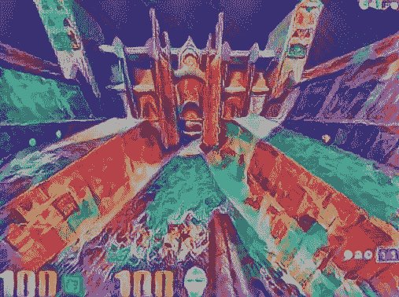
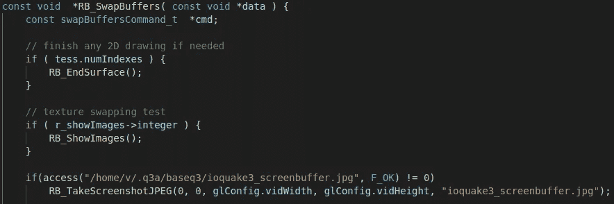
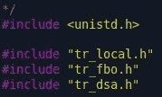
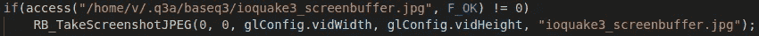
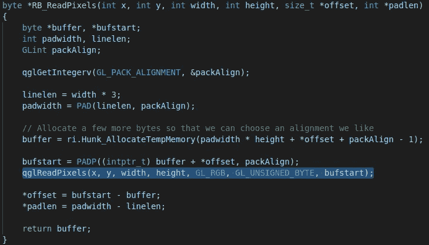
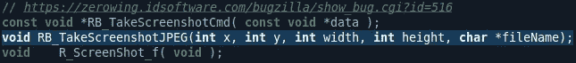
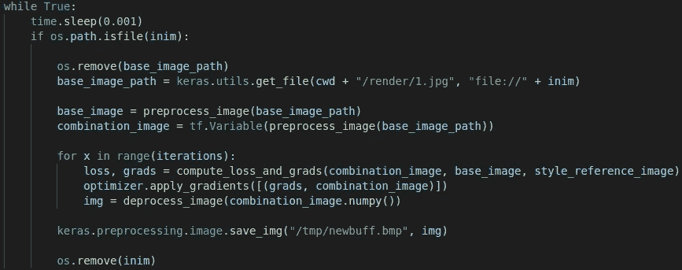
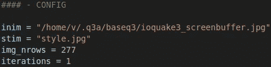

# 地震中的实时神经类型转移 3

> 原文：<https://medium.com/codex/real-time-neural-style-transfer-in-quake3-71cd5f6c3e4?source=collection_archive---------16----------------------->



在本文中，我将演示如何使用 Ubuntu 操作系统在开源游戏 ioQuake3 上设置实时神经风格传输(NST)管道。这取决于你有多少计算能力，但如果我们这样说，我们可以做一个关于单个 RTX 2060 的幻灯片。

我们需要做的第一件事是按需导出屏幕缓冲区，幸运的是，这对于使用 OpenGL 渲染的开源视频游戏来说相对简单。我们将使用 [glReadPixels()](https://www.khronos.org/registry/OpenGL-Refpages/gl4/html/glReadPixels.xhtml) 以极快的速度导出 JPEGs，然后使用 python 中的 Tensorflow Keras 来设置一个守护程序，该守护程序将读取这些导出的屏幕缓冲区，并尽可能快地将它们转换为 NST 帧。

首先是克隆 ioQuake3 存储库，将目录更改为它，安装 SDL2 Dev，然后像这样编译项目；

```
git clone [https://github.com/ioquake/ioq3](https://github.com/ioquake/ioq3)
cd ioq3
sudo apt install libsdl2-dev
make
```

希望你已经顺利通过这个过程，没有任何错误，如果没有，你可以加入我们的官方 [ioQuake3 discord](https://discord.com/invite/Gt4zqNcU) 并寻求一些帮助。

现在的下一步是修改 ioQuake3 源代码，按需导出 JPEG 屏幕缓冲区。为此，您需要导航到`ioq3/code/renderergl2/tr_backend.c`这是因为 ioQuake3 默认使用 GL2 渲染器。在适当的文本编辑器中打开这个文件，例如 [Visual Studio Code](https://code.visualstudio.com/) 或 [Gedit](https://help.gnome.org/users/gedit/stable/) ，这是 Ubuntu 正式发行版预装的。

在这个文件中，我们需要做的是导航到处理交换屏幕缓冲区的那段代码，这段代码叫做`RB_SwapBuffers`，目前，在 2021 年 7 月 29 日，这段代码从[行 1346](https://github.com/ioquake/ioq3/blob/main/code/renderergl2/tr_backend.c#L1346) 开始。你需要在纹理交换测试后添加两行代码，就像这样；



因为我们正在使用 C 函数 [access()](https://linux.die.net/man/2/access) ，所以您还需要在文件的开头第[行第 21](https://github.com/ioquake/ioq3/blob/main/code/renderergl2/tr_backend.c#L21) 之后包含 [unistd 头文件](https://en.wikipedia.org/wiki/Unistd.h)，如下所示:



所以回到我们添加的两行代码，让我们解释一下它是如何工作的；



我们在这里做的是一个简单的检查文件是否存在，如果文件不存在，我们将截图导出为 JPEG 格式。这允许我们在每次删除旧的屏幕截图时触发 ioQuake3 游戏生成新的屏幕截图！尽管记住`RB_TakeScreenshotJPEG()`函数会根据载入的 mod 保存到一个相对目录，但默认情况下，在一个没有 mod 的普通 Quake3 游戏中，这个目录将是你主文件夹中的`ioq3/baseq3`目录。因此，您需要将`access()`功能中的用户名“v”修改为您自己的用户名。

`RB_TakeScreenshotJPEG()`函数使用`glReadPixels()`函数读取屏幕缓冲区，正如你在`RB_ReadPixels()`函数中看到的；



请记住，如果使用 glReadPixels()将原始缓冲区导出为训练数据的 GL_FLOAT，如果您不打算对缓冲区进行均值/样本标准化，则数据已经为您进行了 0–1 标准化。

你还需要做一件事，我们现在还不能从`tr_backend.c`文件中访问`RB_TakeScreenshotJPEG()`函数。我们将需要在适当的头文件中暴露它，指向`ioq3/code/renderergl2/tr_local.h`，并在[行 1974](https://github.com/ioquake/ioq3/blob/main/code/renderergl2/tr_local.h#L1974) 之后弹出我们的函数原型，就像这样；



太棒了。我们完成了，现在您可以在控制台中键入`make`并编译我们的更改。

现在是创建 Python 守护进程的时候了，它将尽可能快地运行*(在 1 毫秒的无限循环上)*读取输出 jpg，对其运行 NST 神经网络，然后将结果输出到我们的 tmp 文件夹，作为`/tmp/newbuff.bmp`或您想要的任何图像类型。为此，我们将使用 [Keras.io 代码示例页面](https://keras.io/examples/generative/neural_style_transfer/)中的 NST 神经网络。这段代码只需要最小的修改，这样无限循环只做它需要做的事情，这样算法就可以在 ioQuake3 游戏的输出截图上尽可能快地实时运行。

我们最终希望我们的循环看起来像这样；



完整的脚本文件可从这里获得:[https://pastebin.com/WF6aasEz](https://pastebin.com/WF6aasEz)

最后，我们将 NST 修改后的图像作为`/tmp/newbuff.bmp`输出到 tmp 目录，并移除/删除触发 ioQuake3 游戏输出新图像的旧截图，然后重复该过程。默认的 Ubuntu 图像查看器是 gnome 之眼，但是在 Xubuntu 上我使用 Ristretto 图像查看器，它会自动实时加载对图像文件的修改，基本上允许你在游戏窗口旁边有第二个屏幕。侏儒之眼也应该这样做，但包住它你不知道该怎么办。

假设您已经为自己节省了一点时间，并从[这里](https://pastebin.com/WF6aasEz)获取了修改前的脚本，那么您只需要修改开头附近的配置变量:



您需要像以前一样用您的用户主目录更新`inim`路径，方法是用您的用户名替换“v”。你需要输入一个你想要用作`stim`变量的样式图像的路径，它不一定是 JPEG。`img_nrows`变量将改变你的输出图像的大小，`iterations`变量定义 NST 神经网络*最终结果的“深度”*(我个人倾向于使用 6 次迭代，但如果你能以 10–33 次迭代运行，那就更好了】。这也是决定网络输出新图像速度的主要因素，数字越高，输出质量越好，但生成图像所需的时间越长。

现在你需要做的就是运行 ioQuake3 游戏，在一个单独的控制台窗口中运行 Python NST 脚本，然后在你选择的图像查看器中打开`/tmp/newbuff.bmp`文件，如果你已经正确地完成了所有这些，你应该会得到这样的结果；

这是我的 RTX 2060 OC 在 6 次迭代中的渲染速度，最后稍微高一点。

基本优化注释；你可能想要使用[TF . keras . preprocessing . image . load _ img](https://www.tensorflow.org/api_docs/python/tf/keras/preprocessing/image/load_img)而不是 [tf.keras.utils.get_file](https://www.tensorflow.org/api_docs/python/tf/keras/utils/get_file) ，因为后者在技术上是用于从网络下载图像的，所以不使用该函数在本地加载文件可能会有一些性能优势。此外，考虑从 ioQuake3 游戏中导出图像的格式，将它们作为导入 python，然后将新图像作为输出。保存和加载不同类型的图像文件都有自己的开销。如果您可以将原始像素从 ioQuake3 导出为 GL_FLOAT，并将其作为 numpy 数组加载到 Python 中，您将节省多余的 JPEG save &加载。

如果你不想从视频游戏中抓取屏幕缓冲区，比如你可能想抓取一个闭源游戏的屏幕缓冲区，那么你可以看看[这个 stackoverflow 答案](https://stackoverflow.com/a/38298349)，它展示了在 Linux 上抓取整个屏幕截图的最快方法*(记住这段代码最慢的部分是* `*savepng()*` *函数)*我的基准测试显示这段代码在没有对抓取的图像进行处理的情况下以 3000+FPS 的速度运行，或者用`savepng()`以 6 FPS 的速度运行 [*(此处检查基准)*](https://pastebin.com/DvDHa4gK)

您还可以尝试[将这个 Keras 模型转换为 TFLite 模型](https://www.tensorflow.org/lite/convert)，并使用 [TFLite Micro](https://github.com/tensorflow/tflite-micro) 将 TFLite 直接集成到 ioQuake3 源代码中。我不确定那会有多好，但也许值得一查。

编辑:这里有一个是实时运行的。