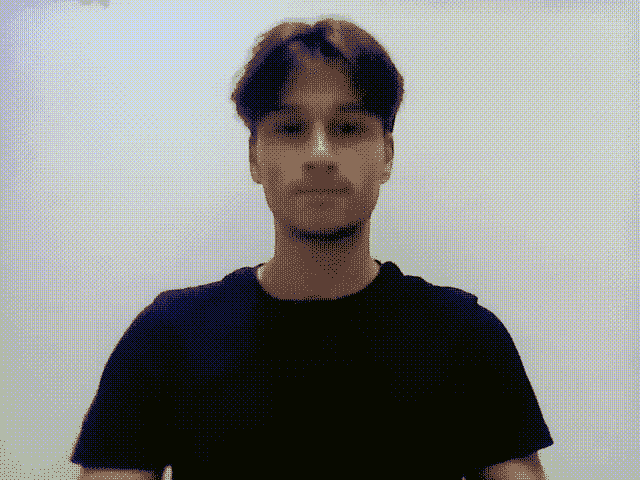
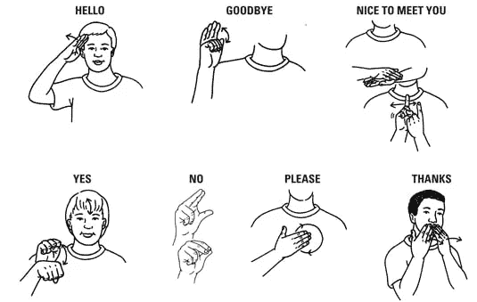

# 如何使用相机检测手语

> 原文：<https://medium.com/codex/real-time-sign-language-with-tensorflow-2-0-4e09ff1c491e?source=collection_archive---------9----------------------->



这一切都是从我问自己的一个问题开始的:*“我能帮助聋人和那些不懂手语的人交流吗？”*

先说一个前提:我不是该领域的专家，但我学习和尝试新冒险的欲望真的很大。

此外，由于之前没有专业经验，我决定建立一个能够反映我技能的投资组合。

所以我决定做一个关于手语的项目。

这个项目的第一个版本是在 T2 手语字母上完成的，但是只有当它完成后，我才对自己说:

*“如果人们每个单词都必须一个字母一个字母地做手势，他们就无法相互交流”，一次对话可能要花上几个小时。*

想想吧。

想象一下，如果说一个简单的“你好”，你必须一个字母一个字母地交流。

那将是一场灾难！

我就是这样决定的，“安东尼奥，我们需要建立一个识别单词的算法。”

事实也的确如此。

# 我的研究

我立即着手寻找手语数据集，但不幸的是没有结果。

我找到的每个手语数据集都是关于字母表的。

仅此而已！

这就是为什么在几个小时的搜索后，我开始变得沮丧，我什么也没找到。

所以我做了一个决定。

我要做一些我以前从未做过的事情(终于到时间了):

**我打算建立自己的数据集！**

不懂手语，第一件事就是做一个探索性的谷歌搜索。

我会解释的。

可以想象，即使是手语，也有很多词语需要用不同的符号来解读。

就我自己而言，我不可能为成千上万的单词创建一个数据集。所以我决定只在我认为手语中最常见的单词上建立我的数据集。

# 过程

在继续之前，我所做的是确定我必须采取的步骤，直到检测到手语。

因此，我已经草拟了一套要遵循的步骤，并且我将在本文的其余部分使用它，解释我所做的事情:

1.  决定将哪些单词翻译成手语
2.  捕捉每个标志的图像
3.  给我收集的所有图片贴上标签
4.  用预先训练好的网络训练我的模型。
5.  使用网络摄像头识别标志

如果你准备好了，让我们开始吧！

# 1.决定将哪些单词翻译成手语

我前面提到过，手语是一种有很多单词的语言。

由于资源有限，我无法创建一个包含手语中所有单词的数据集。因此，我决定只选择 6 个单词供我的算法识别。

的确，这样的话，我永远也不可能建立一个真正的应用程序来帮助人们更好地相互交流。但目标过去和现在都是别的东西。

在这个项目中，除了将我自己置于危险之中并锻炼我在计算机视觉方面的技能，**我还想激励其他人去做这种类型的项目**。以帮助有困难的人为目的的项目。

*【包容】*可以说是项目。

**但是说回我们，我选择了哪个标志？**

我决定使用对我来说最常见的标志。这些是:

*   你好
*   谢谢你
*   我爱你
*   请
*   是
*   不

完成后，我可以进入下一步:

# 2.捕捉每个标志的图像

好了，在我决定了用什么词之后，我需要进入下一步。

捕捉构建数据集所需的图像！

在我能做到这一点之前，我需要用手语模仿那些被选中的单词。

他们在这里:



在学会如何做出选择的标记后，我开始从手机摄像头捕捉图像，然后将相同的图像传输到电脑上。

如果你是这一领域的专家，你可能会奇怪*为什么我不从电脑的网络摄像头和 Python 脚本*来做这件事，对吗？

答案很简单。

我想捕捉高质量的图像(因为我的网络摄像头不是最好的)，这样我提供给算法的数据也会很好。

因此，在为每个标记捕获了 **30 张图像后，我需要给它们加标签。**

# 3.标记图像

在这里，我必须承认，我发现自己陷入了困境。

我从来没有做过这种工作，直到现在，但我没有泄气。事实上，在网上做了一些研究后，我发现了两种给图像中的物体加标签的工具。

*   第一个工具是经典的 [labelImg](https://github.com/tzutalin/labelImg) ，需要在 PC 上安装并通过命令启动(参见官方资源库以了解安装过程)。
*   相反，第二个工具是 [makesense.ai](https://www.makesense.ai/) 。这是一个完全在线的工具，不需要注册，用它你可以非常容易地给图像加标签。它的缺点是，如果你不小心关闭了窗口或失去了连接，你也会失去你的进展。

为了简化工作并且不做太多的安装，我决定使用我上面提到的第二个选项。这是因为除了简单之外，我的数据集也不是很大。

当我标记完所有的图片后，我下载了所有的。xml 文件，并将它们移动到我收集原始图像的文件夹中。

# 4.训练手语模型

这里是最有趣的部分:**模型的训练阶段**。

在这种情况下，为了得到好的结果，**我决定使用一个预先训练好的算法**。也因为收集的图像很少。

我是这么做的。

首先，我导入了我需要做的所有库。

```
import os
import cv2
import numpy as np
from sklearn.feature_extraction import image
from tensorflow.keras import utils
from tensorflow.keras.optimizers import Adam
from tensorflow.keras.models import Sequential
from tensorflow.keras.layers import Dense, Flatten, Conv2D, MaxPool2D, BatchNormalization
from tensorflow.keras.applications import VGG19
from sklearn.model_selection import train_test_split
from tensorflow.keras.utils import to_categorical
from tensorflow.keras.preprocessing.image import ImageDataGenerator
import xml.etree.ElementTree as ET
import h5py
```

然后在导入库之后，我开始创建变量。

第一个用于定义我正在处理的文件夹的路径，第二个用于指示图像所在的位置，第三个用于指示图像的大小，以适合为训练选择的模型，最后，使用最后一个，我创建了一个包含标签名称及其 id 的字典。

```
BASE_DIR = '../6 Language/'
IMAGE_DIR = BASE_DIR + 'images'
IMAGE_SIZE = 224label = {'Hello': 0, 'Yes': 1, 'No': 2, 'Thank you': 3, 'I love you': 4, 'Please': 5}
```

下一步是定义一个函数让计算机加载并读取图像。

使用一个函数来区分包含标签的文件和包含图像的文件。因此将它们放在两个列表中，我称之为*“标签”*和*“图像”*。

列出该函数将返回给我的。

```
def load_data(path):
    images = []
    labels = [] for filename in os.listdir(path):
        if filename.endswith('.png'):
            img = cv2.imread(os.path.join(path, filename))
            img = cv2.resize(img, (IMAGE_SIZE, IMAGE_SIZE))
            img = cv2.cvtColor(img, cv2.COLOR_BGR2RGB)
            images.append(img)
            label_file = os.path.join(path, filename[:-4] + '.xml')
            tree = ET.parse(label_file)
            root = tree.getroot()
            label_text = root.find('object').find('name').text
            labels.append(label[label_text]) return images, labels
```

一旦完成，我必须调用函数将我的列表转换成数组，并将“标签”转换成分类。

```
images, labels = load_data(IMAGE_DIR)
images = np.array(images)
labels = np.array(labels)
labels = to_categorical(labels)
```

## 图像数据生成器

我能从中受益吗？

ImageDataGenerator。这将使我从我建立的数据集中获得更多的图像。

因此，我没有浪费时间，从之前捕获的图像中，我生成了更多的图像，这些图像被分为用于我的训练集的图像和用于我的测试集的图像。

```
#using image augmentation and generate more data
datagen = ImageDataGenerator(
    rotation_range=2,
    shear_range=0.2,
    zoom_range=0.1,
    fill_mode='nearest')TRAIN_AUG_DIR = BASE_DIR +'train'
TEST_AUG_DIR = BASE_DIR +'test'train_gen = datagen.flow(images, labels, batch_size=32, save_to_dir=TRAIN_AUG_DIR, save_prefix='train', save_format='png')
test_gen = datagen.flow(images, labels, batch_size=32, save_to_dir=TEST_AUG_DIR, save_prefix='test', save_format='png')
```

## 最后部分:VGG19 模型的定义和训练

正如你之前看到的，我决定在这个项目中使用一个预先训练好的网络。

我选择了 VGG19，因为尽管它不是最新的算法，但我认为它适合我必须做的那种识别。

在进入训练阶段之前，我定义了权重，并给模型输入了图像，最后添加了另外三层的激活函数。

之后，我开始了培训和模型的评估。

```
#define model
vgg = VGG19(weights='imagenet', include_top=False, input_shape=(IMAGE_SIZE, IMAGE_SIZE, 3))
vgg.trainable = False
model = Sequential()
model.add(vgg)
model.add(Flatten())
model.add(Dense(256, activation='relu'))
model.add(Dense(6, activation='softmax'))
#model.summary()
model.compile(loss='categorical_crossentropy', optimizer=Adam(lr=0.001), metrics=['accuracy'])
model.fit(train_gen, steps_per_epoch=len(images) / 32, epochs=8, validation_data=test_gen, validation_steps=len(images) / 32)
model.save('7lang')#evaluate model
scores = model.evaluate(images, labels)
print("\n%s: %.2f%%" % (model.metrics_names[1], scores[1]*100))
```

# 5.基于 OpenCV 的手语检测

在验证了我有好的度量标准之后，我只需要再做一步。

通过电脑上的网络摄像头检测我选择的单词。

一旦我下载了保存的模型:

```
model.save('7lang')
```

我可以打开一个新文件，写下完成这个项目所需的最后一部分。

多亏了几行字，我才能够使用网络摄像头来预测所选手语的单词。

在我决定调用 detection.py 的文件中，我使用 mediapipe 来跟踪我的手的位置，然后对它们进行预测并显示相应的标签。

# 结论

这个模型可以改进，不仅是在图像层面，因此检测到的单词数量，而且在准确性层面。

正如我之前告诉你的，我做这个项目是为了激励和让尽可能多的人参与到这种“包容性”的项目中来。

我希望这对你有所启发，如果你想知道我在另一个文件中使用的代码，请不要犹豫，通过电子邮件联系我。

下次见，

安东尼奥。