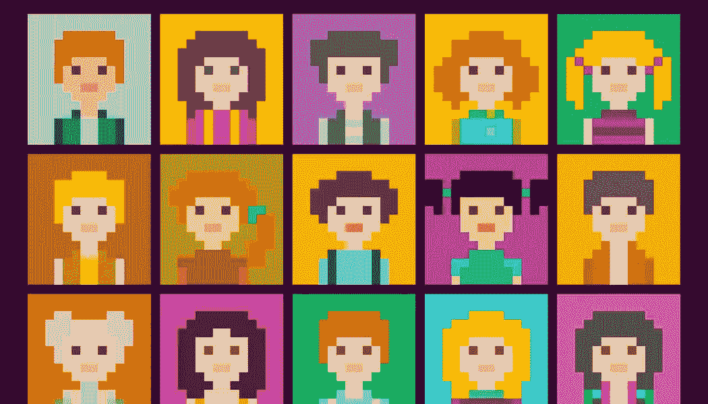

# 现实的化身创造者:虚拟世界中的真实的你

> 原文：<https://medium.com/codex/realistic-avatar-creator-f50a19fa47e9?source=collection_archive---------5----------------------->

## 如何给客户提供沉浸式交互？让用户成为逼真的头像创作者。本文将教你如何一步一步地建立逼真的头像系统。

如今，我们可以通过制作逼真的虚拟形象来重塑我们的世界，与数字版本的我们进行实验，跨越广阔的网络视野。我们已经了解了个性化和多功能性是化身的特征。自定义头像有不同的特点:一些是现实的，另一些非常有想象力和卡通。但是用户最喜欢什么呢？

## 制作头像:用户想要什么？

## 1)逼真的头像


逼真的头像让用户在互联网上体验自己的实际生活存在。一个人可以通过强大的人工智能算法和面部识别技术忠实地复制自己。尽管如此，逼真的虚拟形象可能会让用户觉得不得不在网上携带他们的图像和现实，从而失去万维网所允许的自由。

## 2)逼真的卡通头像


逼真的卡通化身允许用户在互联网上拥有他们栩栩如生的化身，同时享受定制他们的数字自我带来的乐趣和创造力。卡通人物倾向于传递数字世界允许的自由感和对现实的逃避。

## 3)像素头像



当今互联网用户最关心的问题之一是隐私。区块链技术的扩散有助于克服这个问题，像素头像的使用非常普遍。像素头像维护隐私；然而，由于其抽象的外观，用户失去了逼真和定制的触摸体验。
所以，每种类型的头像都有自己的优缺点。我们应该选择什么样的头像？

现在的主要趋势是成为一个现实的头像创作者。当务之急是让我们的头像就像社交媒体简介一样！

## 如何成为一个现实的头像制作者

ZEGOCLOUD 推出的虚拟化身 SDK 允许您的用户上传一张照片来制作一个逼真的化身。
此内容仅在百灵鸟文档中受支持

## 用照片制作头像

虚拟头像 SDK 可以快速分析照片中的头像特征。

```
// Extract facial features based on the introduced image.
ZegoFaceFeature faceFeature = ZegoAvatarService.getInteractEngine().detectFaceFeature(bitmap);

// Create a ZegoCharacterHelper class to simply the implementation process for API call.
// The absolute path of basic resources.
mCharacterHelper = new ZegoCharacterHelper(getFilesDir().getAbsolutePath() + "/assets/base.bundle"); 

// Set the avatar creation coefficient.
mCharacterHelper.applyFaceFeature(faceFeature);

// Get display view
mZegoAvatarView = findViewById(R.id.zego_avatar_view);

// Display the avatar on the screen and call the API on a UI thread.
mCharacterHelper.setCharacterView(mZegoAvatarView);
```

## 美化和定制你的头像

获得初始头像模型后，我们可以通过界面设置各种特征
值来美化头像。
我们可以调整肤色、眉毛、眼睛、鼻子、嘴巴、嘴唇、嘴角、下巴、脸颊等等。有关详细参数，请参考开发文档。

```
// Set the avatar creation coefficient. For the value of faceshapeID, see the following table. Constants defined in ZegoCharacterHelper can be used directly.
mCharacterHelper.setFaceShape(ZegoCharacterHelper.FACESHAPE_EYE_SIZE, 0.5f)
```

## 服装和风格

虚拟化身 SDK 提供各种化妆和配件，如眉毛、纹身、胡须、化妆隐形眼镜、眼镜、耳机、耳环、头发、衣服、裤子、鞋子等。
用户可以在自己的头像上实时渲染和替换这些素材，构建符合自己喜好的专属图像。
请参考开发文档。

```
// Ensure that the external directory of Packages is set before the API is called.
mCharacterHelper.setExtendPackagePath(getFilesDir().getAbsolutePath() + "/assets/Packages"); // Set the directory where the makeup, hair, glass, and other resource packages are stored.

// Set the glass. Ensure that the resource already exists in the path specified by setExtendPackagePath.
String packageID = "earphone7"; // earphone7 is the directory name of an earphone resource. Use the directory name under Packages provided by the ZegoAvatar SDK.
mCharacterHelper.setPackage(packageID);
```

## 语音模拟

当我们在现实世界中与其他人互动时，我们会看到眼睛和嘴唇的运动。这同样适用于元宇宙。
zego cloud 的虚拟化身 SDK 基于语音的声波支持声音驱动的嘴部运动。这一功能驱动虚拟化身实时改变其嘴形。

```
// Start voice detection.
ZegoAvatarService.getInteractEngine().startDetectExpression(ZegoExpressionDetectMode.Audio,expression -> {
    // Drive mouth shape changes of the virtual avatar.
    mCharacterHelper.setExpression(expression);
});
```

## 面部表情镜像

非语言交流是人类交流的重要组成部分。根据身体语言研究者 Albert Mehrabian 的分析，超过 55%的交流是非语言的。数字化身应该能够实时模仿面部表情，并进行自然的眼神交流。

通过实时显示人们的表情，我们允许用户在虚拟环境中更自然地互动。

虚拟化身 SDK 提供面部表情镜像功能。这项技术基于对面部关键点和 52 个基本面部表情维度的准确识别，捕捉用户面部的面部表情，包括面部、舌头和眼球。它实时地将它们还原并呈现在虚拟化身上。

```
// Start facial expression detection.
ZegoAvatarService.getInteractEngine().startDetectExpression(ZegoExpressionDetectMode.Camera, expression -> {
     // Ensure that mCharacterHelper is created, AvatarView is set, and a default avatar is set by running setDefaultAvatar or setAvatarJson.
    // Drive facial expression changes of the virtual avatar.
     mCharacterHelper.setExpression(expression);
});
```

> [立即加入我们](https://www.zegocloud.com/talk?_source=medium&article=30)的行列，**使用 ZEGOAvatar SDK 从照片**中创建您的头像！

[注册 zego cloud](https://console.zegocloud.com/account/signup?_source=medium&article=30)，每月免费获得**10000 分钟**。

# 你知道吗？👏

```
You can give up to **50 Claps** for an article?**Tap and hold the clap button** for a few seconds.**Follow me** to learn more technical knowledge.Thank you for reading :)
```

## 了解更多信息

这是现场技术文章之一。欢迎阅读其他文章:

[](https://faun.pub/create-avatar-from-photo-c62fa6aaae64) [## 如何从照片创建头像

### 本文介绍了如何快速建立从照片创建头像的功能，以便给你的用户一个更好的体验

faun.pub](https://faun.pub/create-avatar-from-photo-c62fa6aaae64) [](/codex/video-call-api-c3e3a71d4ff1) [## 如何使用视频通话 API 搭建视频通话直播 app

### 本文将介绍如何使用 ZEGOCLOUD 的视频通话 API 和 firebase 来构建一个视频通话直播 app

medium.com](/codex/video-call-api-c3e3a71d4ff1) [](/codex/build-a-live-streaming-app-91de942d266e) [## 如何搭建流媒体直播 app？

medium.com](/codex/build-a-live-streaming-app-91de942d266e) [](https://faun.pub/video-api-fcd2bcbe24f7) [## 你了解视频 API 吗？

### 这篇文章描述了什么是视频 API？视频 API 如何保证音视频的流畅传输？

faun.pub](https://faun.pub/video-api-fcd2bcbe24f7) [](https://faun.pub/how-to-build-a-clubhouse-clone-app-with-android-and-zegocloud-a-social-audio-app-development-cb4059e361b0) [## 如何用 Android 和 ZEGOCLOUD 构建一个俱乐部会所克隆应用——一个社交音频应用开发

### 本文解释了如何使用 ZEGOCLOUD ZEGOLiveAudioRoom SDK 快速克隆一个俱乐部应用程序

faun.pub](https://faun.pub/how-to-build-a-clubhouse-clone-app-with-android-and-zegocloud-a-social-audio-app-development-cb4059e361b0)