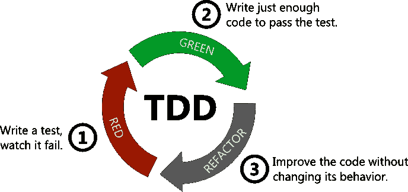
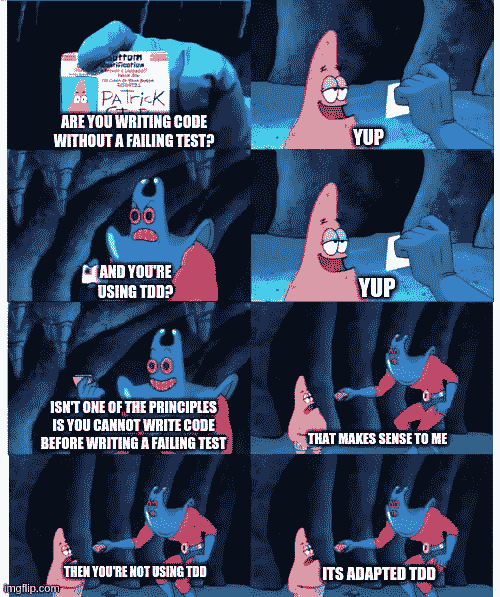
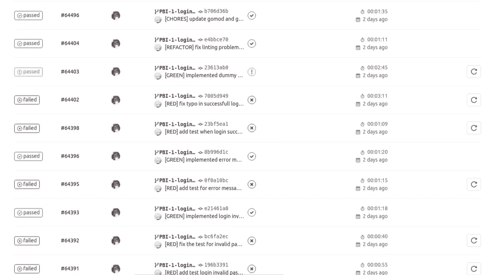

# 现实的 TDD:我如何为我的项目适应测试驱动的开发

> 原文：<https://medium.com/codex/realistic-tdd-how-i-adapt-test-driven-development-for-my-projects-964fed9014e4?source=collection_archive---------6----------------------->

## [法典](http://medium.com/codex)

测试驱动开发(TDD)一直是我的大学课程中涉及软件开发的首选软件开发过程(例如，用 Django 进行 web 编程，用 Java Springboot 进行微服务)，所以术语红绿重构现在可能已经在我的每个朋友中根深蒂固了。我班上的任何人都可以轻松地解释 TDD 的哲学和方法论。

**但是你实际上如何使用 TDD 编码呢？**

什么…你是什么意思？

在这篇文章中，我将讨论我作为一个年轻的软件开发人员尝试刚性 TDD 时遇到的问题，以及我如何做出一些调整，使 TDD 实际上比普通编码更快、更安全。

# TDD 快速回顾

测试驱动开发是一个进化的软件开发过程，由 Kent Beck 在 90 年代后期开发。本质上，你是一点一点地构建你的软件，每一部分都有三个阶段:

*   **红色**:为你的下一个作品创建测试。当然，现在运行测试会报告一个错误(又名红色)，因为您没有这个测试的实现。
*   **绿色**:对之前测试的实现进行编码，直到通过为止。现在，运行测试将不会报告错误(绿色)。
*   **重构**:重构刚刚实现的代码，使其结构良好。



TDD 周期

根据我的理解，TDD 的目标是:

*   测试对于你编写的每一个代码都是可用的，减少了错误的可能性。
*   软件代码最终是结构良好的，程序流易于阅读和理解。
*   减少创建测试的时间。在运行中创建许多简单的测试是很累的，无论是身体上还是精神上，然后查看一个大的代码库并找出下一步要测试什么。

TDD 在理论上听起来真的很好，而且确实如此！它提供了一个框架，可以缓慢但稳定地开发大型结构化软件，否则会导致十亿个 bug。

# TDD 示例

目前，我正在使用 Golang 为我的软件项目开发登录功能。其中一个重要的功能是散列密码，因为在某些国家存储纯文本密码是非法的。

假设我已经得到了散列函数。酷！现在让我们编写验证散列的代码。由于它的 TDD，让我们先做测试:

```
// Positive test
func **TestHashVerifyIsCorrect**(t *testing.T) { hashedString, _ := Hash("fragrance in thaw") assert.Equal(t, true, Verify(hashedString, "fragrance in thaw"))
} // Negative test
func **TestHashVerifyIsWrong**(t *testing.T) {
  hashedString, _ := Hash("fragrance in thaw") assert.Equal(t, false, Verify(hashedString, "Fragrance in thaw"))
}
```

非常简单。第一个测试检查它是否可以验证相同的字符串，第二个测试检查它是否可以捕获不同的字符串(否则，我可以对代码“返回 true”)。

测试完成了！现在我们创建实现

```
func **Verify**(hashed string, actual string) bool **{** err := bcrypt.CompareHashAndPassword([]byte(hashed), []byte(actual)) return err == nil}
```

实现变得非常简单。当哈希与密码不匹配时，我使用的库函数(bcrypt)会返回一个错误。所以我们检查误差是否为零。

就是这样！这就是你如何使用 TDD 开发代码。那么，为什么这篇文章的滚动条仍然在顶部附近呢？

# 棘手的

当你意识到这一原则是由专业编码人员创建的，而我最大的“项目”是一个简单的照片存储网站。当测试已经很简单的功能时，TDD 可以无缝地工作。当您按照 TDD 原则进行开发时，迷惑就开始出现了:

## 1.测试是错误的

在软件开发课程中，你需要对你制定的每个 TDD 原则做出承诺。即:创建测试->提交**【红色】** - >创建代码- >提交**【绿色】** - >重构- >提交**【重构】**。那么，当您提交 red，编写实现代码，然后仍然是 RED 时会发生什么呢？

这是我在项目中实际遇到的一个案例。还记得之前的测试吗？这是 **TestHashVerifyIsCorrect** 的原始实现

```
func **TestHashVerifyIsCorrect**(t *testing.T) { hashedString, _ := Hash("fragrance in thaw") assert.Equal(t, true, Verify(hashedString, "fragrances in thaw"))
}
```

我创建了这个，提交，编码实现，运行测试，然后…测试失败了。在我的实现中经过大量的调试打印语句后，我意识到大约 15 分钟后测试中出现了错误。

所以这意味着我要修改测试，对吗？

"**不**，红色之后必须提交绿色> :(" — TDD 古鲁，大概

有些人可能会说，我需要像开发源代码一样关注创建测试。很公平，上面的错误是我的。那另一个案子呢。

下面是我在为登录系统开发 JWT 令牌生成时所做的测试。

```
func **TestCreateTokenShouldGiveCorrectPayload**(t *testing.T) { token := GetToken(12, 6, 5) payloadBase64 := strings.Split(token, ".")[1] payloadBytes, _ := base64.StdEncoding.DecodeString(payloadBase64)
  var payload map[string]interface{} err := json.Unmarshal(payloadBytes, &payload)
  assert.Nil(t, err, "unmarshall must not be error") payloadUID := payload["uid"].(int64)
  payloadRole := payload["role"].(int64)
  assert.Equal(t, 12, payloadUID, "payload UID must be equal")
  assert.Equal(t, 6, payloadRole, "payload role must be equal")
}
```

基本上，我的测试创建了一个令牌，并验证令牌的有效负载部分是否与预期的有效负载相匹配。Go 程序员应该很快就会在这个测试中看到几个错误，但这个问题真的很棒。

我的代码成功地生成了令牌。但是，`payload`的字符串值缺少右花括号语句。例如:

```
{uid: 12, role:6, iss: 123456
```

我尝试打印整个令牌，并通过在 [jwt.io](http://jwt.io) 和[www.base64decode.org](https://www.base64decode.org/)解码来验证有效载荷。两者都用结束括号正确解码。然而，不知何故，我的测试总是漏掉它。我断定 Go 的 base64 解码器可能是罪魁祸首，翻了翻文件，什么也没找到。

随机地，我意识到 base64 不应该以' = '结尾吗？我试图在`payloadBase64`的末尾添加一个等号，它成功地解码成我想要的方式。这种行为真的很奇特，我想很多人在创建类似的测试时都会被难倒。

哦，是的，这个 JWT 的演讲把我们带到了下一个棘手的问题。

## 2.使用不熟悉的实体

我对 JWT 的了解仍然不多，因为我没有和 JWT 一起工作过。事实上，在开发登录系统的前几天，我才知道 JWT 没有用秘密密钥签署有效载荷(谢谢，队友阿克巴)。

这个问题变得更加严重，因为在我看来，Go 上可用的 JWT 库是反直觉的。我发现的最发达的库是 jwt-go，天哪，它太复杂了。

我**可以**马上**做一个测试，假设我的 GetToken()会返回一个完整的 JWT 令牌，但是在看到生成 JWT 令牌的代码片段后，我发现了很多组件，比如:**

*   JWT 标准索赔公司
*   JWT 海关索赔
*   JWT 令牌回拨
*   JWT 签名

既然 TDD 必须是一部分一部分的，我应该首先为这些组件中的每一个创建测试吗？但我不确定他们的行为:(。如果这些只是内部组件，我不需要对它们进行测试怎么办？AAAA 很不确定:“(

# 有些人是如何适应的

这些是我大约两年前第一次开始使用 TDD 时遇到的问题。我询问了我的同事如何处理这些问题，他们中的大多数人似乎都有相同的黄金解决方案:

> 首先编码实现，但是首先提交和推送测试


当一个大型软件是用 TDD 或者这种阴暗面方法构建的时候，很容易判断出来。

希望你现在知道我在说什么了。我们不断地提倡要**做** TDD。然而，要真正遵循这个原则是相当困难的。当 TDD 应该是一个简化软件开发的过程时，它却成了一个障碍。

# 我如何适应这一点

大约一年前，当我使用 springboot 开发一个 LINE chatbot 时，我第一次认真对待 TDD。这个项目非常大，有大量相互关联的组件。起初，我计划走正常路线，在最后编写测试。然而，我可以看到我的应用程序的走向，并说:“嘿，为什么不是 TDD？”

因为这个项目更加自由，并没有规定你必须进行严格的 TDD，所以我在尊重 TDD 意图的同时，对这个原则做了**小小的修改**。结果棒极了。尽管我每周做 50 多个小单元测试，我的开发实际上加速了因为**我吸取了两个世界的精华**:

*   TDD 的行为指导:创建小的行为测试来指导我开发大型软件。当编码时，我仍然不确定整体逻辑将会如何，但是使用 TDD，我只是不断地创建小组件，这些组件粘在一起，直到有一天:“嗯？app 做好了？”
*   DDT 的确定性和速度(与 TDD 相反):TDD 的主要弱点是与不熟悉的实体一起工作时的不确定性。我的修改去掉了这个。有时候，你只需要一点点速度就够了。

免责声明:我绝不声明我的改编是革命性的。我也没有说它是原创的，因为这些天似乎一切都被发现了。事实上，这是一个**简单的**改编。但是，它将 TDD 变成了一个实际上更快更容易的软件开发原则。

我将通过回答我在文章开头提出的问题来展示我的改编。

## 1.测试是错误的

这个很简单:

*   修复测试
*   运行测试。现在所有的测试都应该成功了，因为我们对实现进行了编码。
*   在**测试中再次提交红色。**
*   承诺绿色实施。
*   忽略我头脑中所有的声音，因为还有软件要编码，那些声音不会帮助你编码:(

我有点倾向于黑暗的一面。我觉得这是必要的恶。当我创建了一个错误的测试时，我真的无能为力。

## 2.使用不熟悉的实体

这是一个大的。在进行测试之前，我通过在我想要开发的方法**上写一些测试驱动代码来处理这个问题。**



写这篇文章的时候，我已经可以听到警笛声了。

测试驱动程序通常是“部分”实现，并且通常充满了日志打印语句。它的工作是让我感受那个实体。

好吧，我就跳到一个例子。

让我们回到以前讨论过的 JWT 问题。

所以我尝试用一个不熟悉的库(jwt-go)创建一个方法 GetToken。所以，在写测试之前，我在 GetToken()上写了这样的东西

```
func **GetToken**(uid int, role int, expiresInHour int) string {
  privateKey := "privatekey" claims := JwtClaim{
    uid,
    role,
    jwt.StandardClaims{
     ExpiresAt: time.Now().Local().Add(time.Hour *      time.Duration(expiresInHour)).Unix(),
     Issuer:    "xxx",
  },
 }

 fmt.Println(claims) token := jwt.NewWithClaims(jwt.SigningMethodHS256, claims)
 fmt.Println(token) jwtToken, _ := token.SignedString(privateKey)
 fmt.Println(jwtToken) return jwtToken}
```

这只是我从文档中获取的[令牌生成的**最小修改**。我添加了许多打印语句来感受每个组件。](https://pkg.go.dev/github.com/dgrijalva/jwt-go)

然后，我创建一个测试代码来运行这个方法:

```
func **TestCreateTokenShouldGiveCorrectPayload**(t *testing.T) { token := GetToken(12, 6, 5) fmt.Println(token)
}
```

运行这个应该会给出很多打印语句。从这里，我知道:

*   JWT 库上的组件非常轻，不需要进行单独的测试。
*   token.signString()返回整个令牌，而不仅仅是签名的部分。
*   我不需要复杂的回调，只需要签署一个令牌。所以还是那句话，没必要先开发回调。

就这样，不确定性消失了。现在，我知道我不需要创建单独的组件。现在，我可以为这个方法编写实际的测试了。最终产品是这样的:

```
func TestCreateTokenShouldGiveCorrectPayload(t *testing.T) { token := GetToken(12, 6, 5) payloadBase64 := strings.Split(token, ".")[1]
  payloadBase64 += "=" //Go's base64 decoder needs = at the end payloadBytes, _ := base64.StdEncoding.DecodeString(payloadBase64)
  var payload map[string]interface{} err := json.Unmarshal(payloadBytes, &payload)
  assert.Nil(t, err, "unmarshall must not be error")

  payloadUID := payload["uid"].(float64)
  payloadRole := payload["role"].(float64) assert.Equal(t, 12, int(payloadUID), "payload UID must be equal")
  assert.Equal(t, 6, int(payloadRole), "payload role must be equal")
}
```

很简单，对吧？生成令牌，获取有效负载部分，解码它，最后检查它是否与预期的有效负载匹配。总的来说，我花了大约 20 分钟来实现所有这些(从编写测试驱动，到编写实际测试，再到编写实际实现)。

也就这样了！那是我对 TDD 的简单适应。每当我与不熟悉的实体一起工作时，我只是写一些测试代码来获得感觉，然后回到 TDD。

# 我的 TDD 在行动

澄清一下，我**很少**做我之前说过的事情，只有在我处理不熟悉的东西的时候。但是，有这样做的选择真的很好。

当我不这样做的时候，就是教科书红绿重构。创建测试->实现代码->重构。下面是我当前项目中的一个示例管道，我在这个项目中使用 TDD 来开发整个登录服务:



首先要注意几件事:

*   注意底部有两个红色标签。那就像我说的，测试有 bug 就犯双红。
*   顶部的杂务标签是用于更改配置文件的特殊标签(在 go 中是 go.mod)

消息被截断，因此开发顺序如下:

1.  当在数据库中找不到用户的电子邮件时，创建测试
2.  实施它
3.  为用户输入无效密码时创建测试
4.  实施它
5.  为用户成功登录时创建测试
6.  实施它

像一二三一样简单。

# 结论

我无法想象在没有 TDD 的情况下构建我的大型项目。TDD 是一个令人惊叹的框架，但是它的僵化让一些人感到害怕。每当我感到不确定时，通过编写一个简单的测试驱动程序，我可以无缝地开发应用程序，同时仍然实现 TDD 的原则:

*   每个开发的代码都有一个测试。
*   软件是由小的增量部分组成的，每一部分都经过了很好的测试。

仅此而已。希望通过阅读这篇文章，你会看到过去的僵化，并尝试 TDD。

> 对我来说，TDD 不是一个规则，而是一个指南。

# 参考

*   [https://www . oreilly . com/library/view/modern-c-programming/9781941222423/f _ 0055 . html](https://www.oreilly.com/library/view/modern-c-programming/9781941222423/f_0055.html)
*   【https://github.com/janke-learning/tdd (TDD 图像)