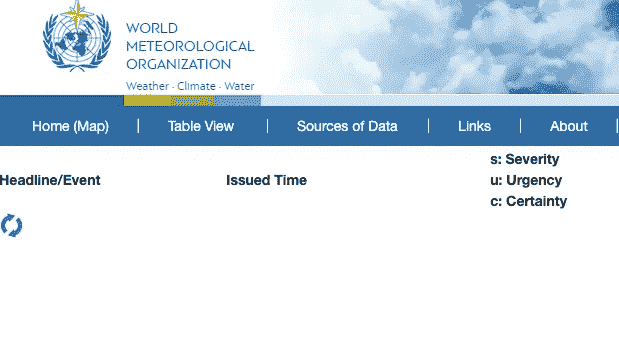
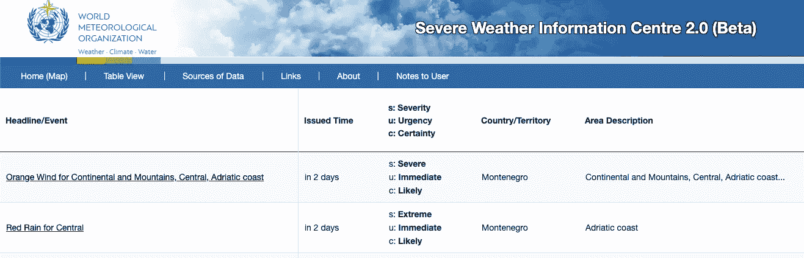
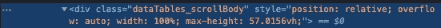
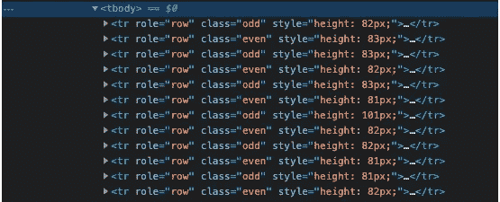
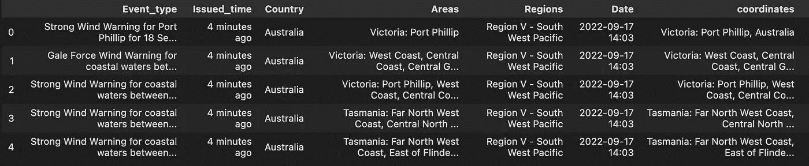

# 使用 Python 进行实时数据采集

> 原文：<https://medium.com/codex/realtime-data-scraping-with-python-517bf5a5eb84?source=collection_archive---------0----------------------->

## 利用 Selenium 和 Beautifulsoup 进行实时更新


在 [Unsplash](https://unsplash.com?utm_source=medium&utm_medium=referral) 上由 [Aron 视觉](https://unsplash.com/@aronvisuals?utm_source=medium&utm_medium=referral)拍摄的照片

## 语境

供应链弹性对于那些依靠供应链来生产商品的公司来说是一个重要的话题。想象一下这样一种情况，你的供应链经理要求实时更新世界某些地方的当前天气状况，以及可能的气候警告和警报，可在[这里](https://severeweather.wmo.int/v2/list.html)获得。你决定通过实时抓取网站来解决这个问题。为此，您将创建一个 Python 脚本来收集所有需要的数据，然后安排它每 30 分钟运行一次来接收实时更新。

> 本文最适合熟悉 Python 的程序员。

## 擦

1.  我们需要做的第一件事是安装必要的库，比如 BeautifulSoup 和 Selenium

```
pip install bs4
pip install selenium
```

为了给出一个简单的区别，我们将需要 *Selenium* 去一个网站，通过点击按钮与浏览器交互，并等待元素出现。然后， *BeautifulSoup* 用于迭代 HTML 并提取实际数据(即您所看到的)。

2.我们现在探索[网站](https://severeweather.wmo.int/v2/list.html)。正如您在下图中看到的，在数据被正确加载之前，需要大约 5 秒的等待时间。



数据正在加载(图标)



HTML 格式的加载数据

因此，直接用 BeautifulSoup 开始抓取将导致没有条目，因为我们需要等待数据出现在 HTML 中。我们通过在获取数据后创建的元素上设置监听器来解决这个问题。

右键点击网站上的“Inspect Element”按钮，我们在检查界面中看到需要等待的元素是带有类 *dataTables_scrollBody* 的

。

检查元素结果

要抓取一个网站，库 *Selenium* 需要我们有谷歌 Chrome 浏览器(你也可以用别的浏览器)。因此，我们告诉 Selenium 启动 Google Chrome

```
from selenium import webdriverdriver = webdriver.Chrome(ChromeDriverManager().install())
```

并通过传递网址告诉司机我们的网站在哪里

```
driver.get("https://severeweather.wmo.int/v2/list.html")
```

现在，我们可以设置上面提到的监听器，让驱动程序等待带有*dataTables _ scroll body***类**的

元素出现在 HTML 中

```
try:        
  **elem = WebDriverWait(driver, 30).until(    EC.presence_of_element_located((By.CLASS_NAME, "dataTables_scrollBody")))**
 finally:        
  print('loaded')
```

我们将我们的抓取函数定义为 *scrapeWeather* ，此时我们的代码应该如下所示:

```
### imports
import pandas as pdfrom bs4 import BeautifulSoupfrom selenium import webdriver
from selenium.webdriver.common.by import By
from selenium.webdriver.support.ui import WebDriverWait
from selenium.webdriver.support import expected_conditions as EC
from webdriver_manager.chrome import ChromeDriverManager###def scrapeWeather(): # Our function for scraping   
 driver = webdriver.Chrome(ChromeDriverManager().install()) #url request
driver.get("https://severeweather.wmo.int/v2/list.html") try:        
  elem = WebDriverWait(driver, 30).until(    EC.presence_of_element_located((By.CLASS_NAME, "dataTables_scrollBody")))
 finally:        
  print('loaded')
```

3.现在数据已经在 HTML 中了，我们可以选择想要用 BeautifulSoup 抓取的条目。



从检查中我们可以看到，所有的数据都在标签中。每个标签在表格中包含一个条目(行)。因此，我们必须找到正确的，并开始循环所有的标签。我们用函数 **findAll，**来完成这项工作，它查找一个 HTML 标签的所有条目。

```
soup = BeautifulSoup(driver.page_source, 'html.parser') """Scraper getting each row"""    
all = soup.**findAll**("tbody")[2] #the <tbody> we want is the third one
row = all.**findAll**('tr')
```

由于我们将条目保存到一个 CSV 文件中，我们将:

*   创建一个空数组，我们将用表中每一行的数据填充它，
*   迭代每一行(I)，迭代行(I)的每一列(j)，以及
*   将信息保存到正确的变量中。

代码将如下所示:

```
rest_info = [] # empty array populated with the info of each rowfor i in rows: #i is a row
        infos_row = i.findAll('td')   # get the info of a single row
        for index, j in enumerate(infos_row): #j is a col of row i 
            info = None
            if index == 0: #in this case the first col has the event information
                info = j.find('span') #the info is within a *span*
                event = info.text #we extract the text from the *span* if index == 4:
                info = j.find('span')
                areas = info.text if index == 1:
                issued_time = j.text
            if index == 3:
                country = j.text if index == 5:
                regions = j.text if index == 2:
                continue
        #finally we append the infos to the list (for each row) 
        rest_info.append([event,issued_time,country,areas,regions)])
```

现在我们已经将信息保存在列表中，让我们将它推送到一个 CSV 中。

```
df = pd.DataFrame(rest_info, columns=
 ['Event_type','Issued_time','Country','Areas','Regions','Date'])**df.to_csv**("scraped_weather.csv",mode='a', index=False,header=False)
```

CSV 文件应该如下所示:



从网站上搜集的数据

恭喜你！你已经抓取了网站。现在让我们看看如何自动化这个过程。

## 2.实时自动化

为了安排每 **X** 分钟进行一次抓取(取决于您的需要)，我们需要使用一个调度程序。这里我们有许多选项中的两个:

*   GitHub 操作
*   谷歌云调度程序

对于本教程，我们将使用 GitHub Actions，因为我认为它是最简单易懂的。

1.  首先，我们需要稍微修改一下代码，以便能够通过 GitHub 上的 **Selenium 打开谷歌 Chrome。**我们需要安装模块 *pyvisualdisplay* 作为

```
pip install PyVirtualDisplay
```

然后，我们需要对现有代码进行以下更改:

```
import pandas as pdfrom bs4 import BeautifulSoupfrom selenium import webdriver
from selenium.webdriver.common.by import By
from selenium.webdriver.support.ui import WebDriverWait
from selenium.webdriver.support import expected_conditions as EC
from webdriver_manager.chrome import ChromeDriverManager**from selenium.webdriver.chrome.options import Options
from selenium.webdriver.chrome.service import Service
import chromedriver_autoinstaller****from pyvirtualdisplay import Display**
**display = Display(visible=0, size=(800, 800))  
display.start()****chromedriver_autoinstaller.install(**)  # Check if the current version of chromedriver exists**chrome_options = webdriver.ChromeOptions() **     
**options = [
  # Define window size here
   "--window-size=1200,1200",
    "--ignore-certificate-errors"
]****for option in options:
    chrome_options.add_argument(option)****driver = webdriver.Chrome(options = chrome_options)**
```

在 *scrapeWeather* 类中，我们不再需要调用 ChromeDriver 安装程序

```
def scrapeWeather():    
 **#**driver = webdriver.Chrome(ChromeDriverManager().install()) **#not needed anymore!** driver.get("https://severeweather.wmo.int/v2/list.html")
 ....
```

2.我们已经准备好将代码部署到 GitHub 并对其进行调度。为此，我们需要:

*   创建存储库
*   推送 python 脚本
*   创建并推送一个 *requirements.txt* 文件(`pip install pipreqs`并在您的脚本所在的终端文件夹中运行`pipreqs`
*   创建一个工作流:在你的 GitHub 仓库->动作->新建工作流。在工作流中，我们需要添加以下代码(复制粘贴并根据您的设置进行更改):

```
name: scrap3on:
  **schedule:
    - cron: '*/30 * * * *' #the schedule, in this case every 30 mins, in cron time (URL CRON)**jobs:
  build:
    runs-on: ubuntu-latest
    steps:- name: checkout repo content
        uses: actions/checkout@v2- name: setup python
        uses: actions/setup-python@v2
        with:
          python-version: '3.7.7' # install the python version needed

      - name: install python packages
        run: |
          python -m pip install --upgrade pip
          pip install -r requirements.txt

      - name: execute py script
        **run: python scrape.py #NAME OF YOUR FILE HERE!!**

      - name: commit files
        run: |
          git config --local user.email "[action@github.com](mailto:action@github.com)"
          git config --local user.name "GitHub Action"
          git add -A
          git commit -m "update data" -a

      - name: push changes
        uses: ad-m/github-push-action@v0.6.0
        with:
          github_token: ${{ secrets.GITHUB_TOKEN }}
          branch: main
```

完美。现在，您的脚本将每 30 分钟运行一次，并将数据添加到 CSV 中。您现在可以从另一个端点调用 GitHub 上托管的这个 CSV 文件，并获得实时天气更新！

这是一个使用 BeautifulSoup、Selenium 和 GitHub 动作从 web 上抓取数据的例子。我在上周末参加的 [HackZurich](https://hackzurich.com/) 项目中使用了这个脚本。它是欧洲最大的黑客马拉松，在 48 小时内，我们建立了一个供应链预警应用程序，这使我们赢得了挑战。你可以在这里看到我们的[应用](https://app.creatorspace.dev/monopoli/projects/fxdQWIJCum3gfqUx)和包含所有代码[的 GitHub 库](https://github.com/HackZurichDreamTeam/scraping-repo)。

感谢您花宝贵的时间阅读本文。记得在媒体上**关注**我，如果有任何问题，请在 [LinkedIn](https://www.linkedin.com/in/gioele-monopoli/) 上**联系**我。下次见！