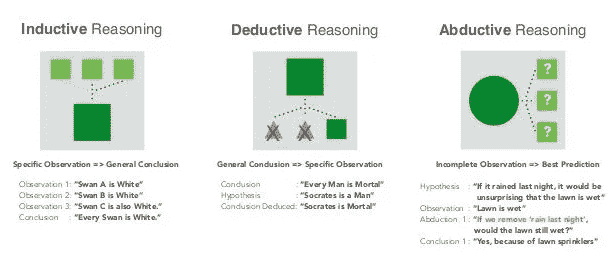
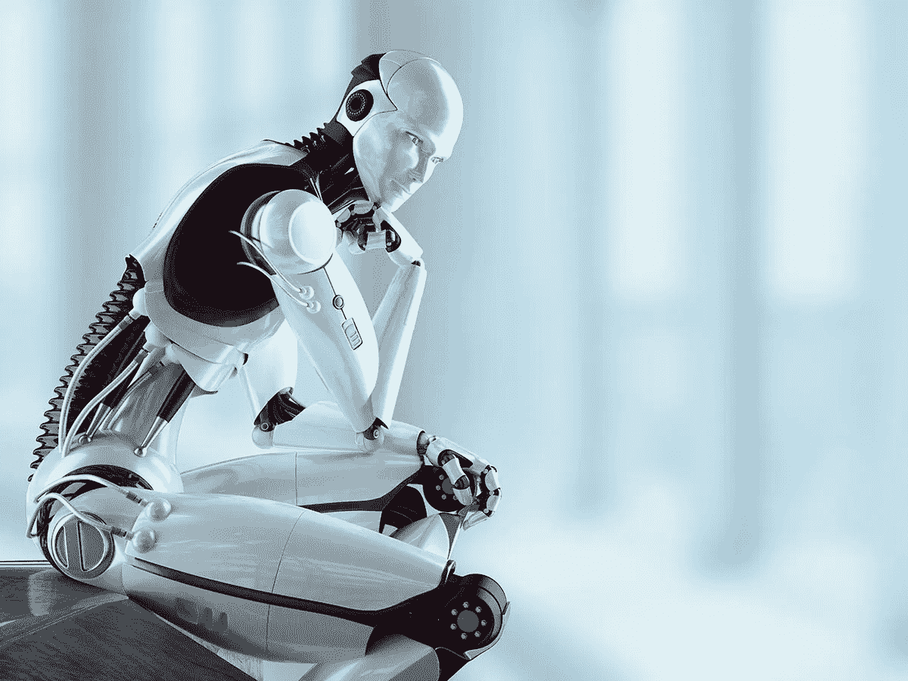
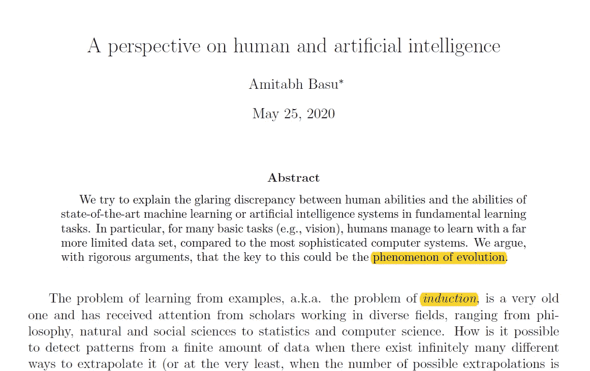
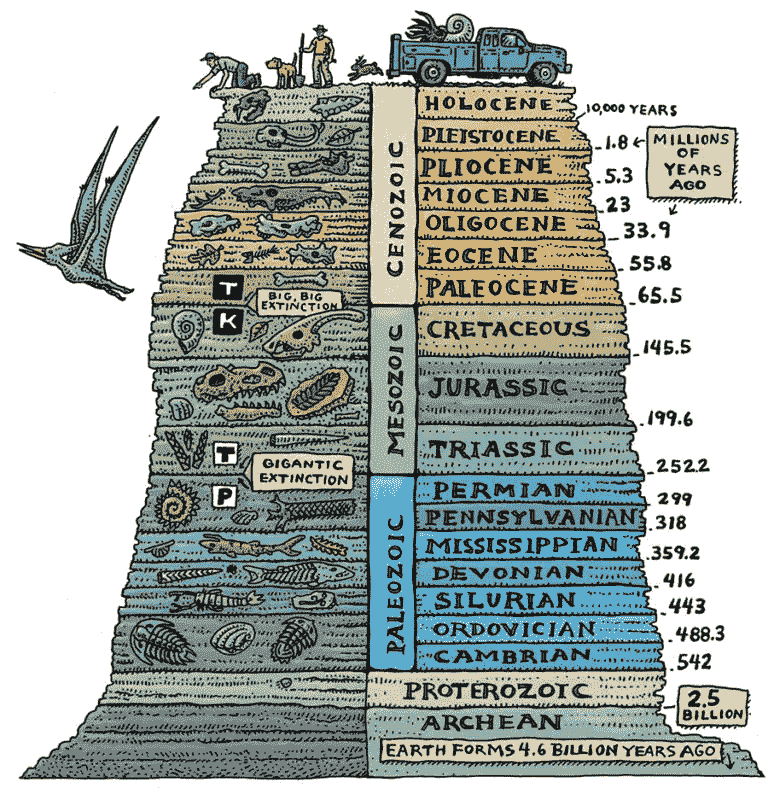

# 人类和机器之间的推理

> 原文：<https://medium.com/codex/reasoning-between-humans-machines-aba4602f32e8?source=collection_archive---------16----------------------->

自从人工智能(AI)和机器学习(ML)的兴起，反思我们的技能变得极其令人兴奋，尤其是在推理方面。后者直接关系到是否有一天，机器可以完全取代人类，就像我们经常在科幻电影中看到的那样。

> "如果没有习俗的影响，除了立即呈现在记忆和感官中的事实之外，我们将对每一件事实一无所知。"—大卫·休谟

由于对当前的进展非常着迷，我在这篇文章中讨论了推理的不同形式。其目的是强调，尽管机器有了显著的进化，但人类仍然处于领先地位，而且可能会保持至少几十年，如果不是永远的话。

# 历史

思考的能力可以推断出我们人类在地球上的早期就已经使用推理了。那时候可能已经用来做决策了。尽管如此，一些研究人员认为，这可能是历史上的一个转折点，当时我们从用神话来解释一切，转向试图以不同的方式对世界进行推理。据许多人所知，亚里士多德是第一个为人类推理提供书面见解的人。他介绍了两种方法:分析和综合。前者，我们通过观察来理解一个实体。在后者中，我们通过集群中每个实体的相似模式来理解一个实体集群。

# 推理形式

时至今日，许多人认为有三种推理形式:演绎、归纳和溯因推理。虽然不清楚归纳，演绎和归纳似乎是亚里士多德分别提到的分析和综合。

演绎可以定义为**从一般想法到具体结论的逻辑进展**。归纳法可以被定义为**,一种通过从具体观察到一般规则得出结论的方法。**溯因可以定义为**从我们所知道的**中做出一个可能的结论。例如，如果你看到桌子上有一碗被丢弃的热汤，你可以使用诱拐来推断汤的主人可能很快就会回来。

值得一提的是，一些研究人员认为还有其他形式的推理，如类比推理、因果推理、批判性思维、分解推理等。

# 人类对抗机器

当观察人类和机器时，我们可能会比较我们在上面定义的三种推理形式中的能力。

在演绎方面，它允许机器在像国际象棋和围棋这样的几场比赛中击败人类。电影 [AlphaGo](https://www.youtube.com/watch?v=WXuK6gekU1Y&t=24s) 可以在这个背景下看。在这个精彩的故事中，当李·塞多尔(Lee Sedol)开始与 AlphaGo 的比赛时，他输掉了前三局。第四局他下了一个传奇的棋 78，战胜了机器。这一损失被添加到机器的历史中，它从中学到了很多东西。然后，在第五场比赛中，机器犯了一些在许多职业球员看来像是错误的错误。尽管如此，最终它还是以 1.5 分的差距赢得了比赛，也就是说，这台机器并没有寻求获得尽可能大的区域，而是仅仅为了获胜。对它来说，只要它赢了，无论是以大还是小的分差都无所谓。

对于归纳法来说，神经网络等新方法的出现打开了归纳推理(大数据)的大门。然而，在没有“规则”的情况下(比如在围棋中)，机器无法有效地决定积累的数据和历史中的哪一部分是信息。一个很好的例子是医疗保健，在这一领域仍然有许多挑战需要克服(参见医药行业的 [IBM Watson](https://mindmatters.ai/2019/08/why-was-ibm-watson-a-flop-in-medicine/) 的案例)。

在溯因推理中，事情变得更加复杂，我们做出*式的猜测*。在这种情况下，我们选择最简单的解释(在众多解释中)来解释所有的事实，同时牢记如果新的证据出现，我们有可能改变我们的观点。这使得人类在很大程度上优于机器，因为这种推理需要创造力、创新和批判性思维。

可以看出，在推理的三种形式上，机器似乎只在其中一种形式上超越了人类，那就是演绎。

# 有趣的视角

我最近在归纳的背景下阅读了一篇有趣的论文，其中 Amitabh Basu 认为，与最发达的计算机相比，人类能够利用有限得多的数据进行学习的关键可能是进化的*现象*。

形式上，从一个*实例空间* ***X*** (例如，苹果和橙子的图像)和所有具有标签 0 或 1 的实例的“真实”标记(“苹果”对“橙子”)，目的是从对 X 中有限子集 ***S 的观察中找到一个“真实”标记函数*******。***挑战来自于这样一个事实，即 ***X*** 通常是作者接着问道，如何通过观察 ***S*** 上的值来计算出 ***f**** 是什么？所有可能的函数类 ***f*** 为*。*

*作者认为，进化的过程已经提炼出了一个小类*，其中包含了函数***【f ****。由于进化已经花费了数百万年来提炼出一个可管理的 H 类，包括我们寻找的***【f ****，如果这样的假设是正确的，人工智能系统可能需要经历数百万年才能达到我们的水平。**

****

**虽然进化是我们迄今为止达成的最简单的解释，但这种观点可能会鼓励思考许多其他观点，这些观点也可能解释(或给出提示)为什么我们人类在归纳和绑架方面非常强大。视角的美妙之处在于这样一个事实，即一个人必须去不同于数学或计算的领域去尝试解释和理解学习和概括的复杂性。这突出表明，在未来，我们可能必须同时研究更多的主题(不仅仅是数学和计算)，以便掌握一点人工智能和人工智能的进展。**

**这是一个非常刺激的话题，我们所有人都直接或间接地参与其中。对吗？期待听到大家的想法和意见:-)。**