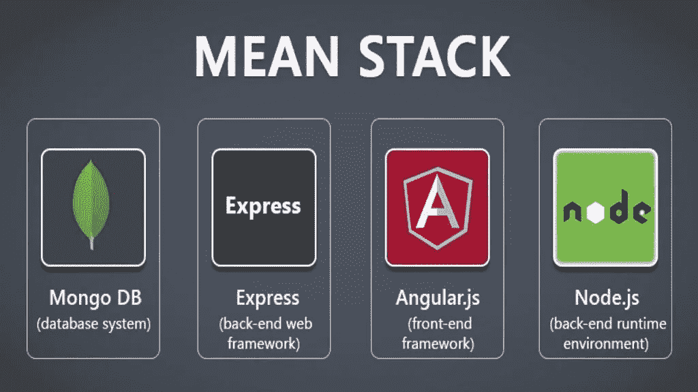

# 为您的下一个项目选择 MEAN Stack 开发的原因？

> 原文：<https://medium.com/codex/reasons-to-choose-mean-stack-development-for-your-next-project-65c520b140aa?source=collection_archive---------11----------------------->

开发 web 应用程序时，拥有一个可靠而高效的软件堆栈至关重要。今天的开发人员使用各种各样的创新工具以更高的质量完成他们的任务。这种进步的一个很好的例子是平均堆栈技术。

# **什么是均值叠加开发？**

数百万个人使用 [**MEAN Stack 开发框架**](https://jumpgrowth.com/top-benefits-of-mean-stack-for-web-app-development/) ，一个基于 JavaScript 的网络和应用程序开发平台。它是一套用来建立网站和程序的工具。MEAN stack 是“MongoDB，Express.js，AngularJS，Node.js”的首字母缩写，被几家 Web 应用程序开发公司使用。它是一个开源的堆栈，用于快速、系统地创建基于均值的 web 应用。换句话说，MEAN 就是可以在所有系统阶段使用的 JavaScript，从客户端到数据库再到服务器。借助 MEAN Stack，您可以根据各种参数管理您的产品。数据层也可以更新和革新，而不需要任何迁移。

如果你知道你想从项目中得到什么，并且对 MEAN stack 开发的优势有一个牢固的把握，你将更有能力决定是雇佣一个 MEAN stack 开发公司还是雇佣 Mean Stack 开发人员。

此外，如果你是一名开发人员，你可以学习 MEAN stack，因为 Mean Stack 开发人员有很大的发展空间。

# **mean . js 栈的关键方面**

MEAN stack 框架是功能性的，因为每个部分都完成了自己的工作。所有这些解决方案都依赖于脚本语言 JavaScript。

## **MongoDB**

在构建后端应用程序时，开发人员通常会求助于 MongoDB，这是一个文档数据库，用于在 JavaScript 对象概念(JSON)文档中存储数据。因此，应用程序的数据保存在 MongoDB 中。

由于应用程序和数据库都使用 JavaScript，因此在两者之间移动对象时不需要翻译。由于 MongoDB 在速度和容量上都可以很容易地升级，所以它被广泛使用。此外，用户可以向数据库添加新字段，而不必重新加载整个表。MongoDB 可用于在服务器和客户机之间轻松、廉价地传输数据。

此外，MongoDB 被认为是创建 react-native 应用程序的四大数据库之一。

## **快递 JS**

后端 web 应用框架叫做 Express JS。这是一台重量不重的服务器。利用节点。JS 支持 API(应用编程接口)开发，同时创建必要的 web 应用。同理，快递。JS 正在与节点合并。随着开发过程变得更加简单。

快递。JS 控制后端数据库和前端应用程序之间的通信，考虑到了速度和安全性。Express 会停止并避免覆盖变量，以避免无意中的重定义，这种重定义既昂贵又耗时。

## **角度**

今天，Angular 是使用最广泛的框架之一，到 2022 年，它有望成为用 JavaScript 编程语言构建的 11 个最常见的框架之一。谷歌创建并维护了这个系统。借助于平均堆栈中的 AngularJS，可以快速构建单页面、动态的 web 应用程序。由于其突出的使用水平和超卓越的性能，它被认为是一个完美的前端框架。此外，Angular 允许同时开发桌面和移动应用程序。

## **节点。JS**

为了创建高度可伸缩的服务器端应用程序，开发人员转向 Node.JS。它是创建 web 和移动应用程序的首选后端。该框架通过提供一组 JavaScript 模块简化了创建网站的过程。节点。JS 也充当主干，而 Express JS 在其上运行。最重要的是，Angular JS 与 Node JS 集成，使得快速提供数据变得更加容易。节点的可扩展性。JS 是它最强的卖点。

# **为你的梦想项目选择 MEAN Stack 开发的理由**

MEAN 提供了一个完整的解决方案，通过整合各个部分的优点来构建网站。MEAN stack 及其组件对于 web 应用程序开发的优势包括:

## **意味着堆栈开发省钱**

当您的团队中有一个全栈开发人员时，就没有必要引入额外的开发人员来处理前端、后端和数据库管理。正因为如此，开发一个 web app 的价格降低了，因为需要的人更少了。MEAN stack 是一个免费的开源软件集合，可以减少开发费用。

## **JavaScript 让整个开发过程更加精简和全面。**

程序设计语言广泛应用于平均堆栈中。因为客户端和服务器语言是相同的，所以使用 MEAN stack 时会出现较少的错误。Agular 的众多好处之一是它鼓励代码重用，这加快了开发速度。

## **保持长期健康需要一个积极参与的社区。**

JavaScript 是一种广泛使用的编程语言。因此，它有一个蓬勃发展的程序员社区，他们互相帮助解决使用 JavaScript 时出现的常见问题。如果遇到困难，相信 JavaScript 社区会帮你摆脱困境。

## **MEAN stack 允许代码重用和移植。**

有了 MEAN stack，开发者有了很多的 leeways，因为在不同的编程语言之间转换很简单。您可以在两种语言之间快速转换，而不会给项目带来额外的复杂性；例如，如果您开始在 Node.js 中编码，但意识到 AngularJS 可能是更好的选择。

## **简单考试**

另外，MEAN stack 及其组成部分使得基于云的应用程序测试变得简单。由于完全的集群支持和云中的自动复制，MongoDB 就是为这种场景而设计的，允许您添加任何需要的额外数据。

## **均值堆栈是减少开发时间的有效工具。**

由于其非阻塞设计，MEAN stack 是一个快速框架。Agular 的亚稳定性和易维护性增强了平均堆栈。

# **结论**

现在已经检查了 MEAN stack 框架的基础，公司领导对该平台未来的功能有了更好的了解。MEAN stack 架构由基于 JavaScript 的组件 MongoDB、Express JS、Angular JS 和 Node.js 组成，是 web 和应用程序开发的绝佳选择，尤其是对于中小规模的云解决方案。

然而，你的项目的成功完全取决于你带来的专业人员的技能。你应该 [**雇佣那些在 mean stack 开发领域有名气的 MEAN stack 开发者**](https://jumpgrowth.com/hire-mean-stack-developers/) 。