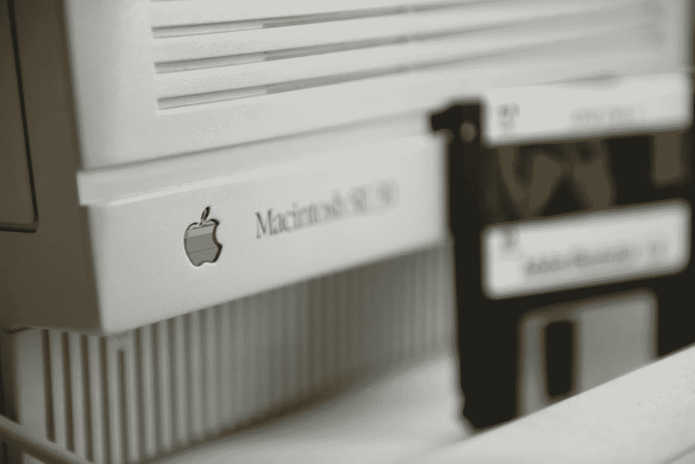

# 停止憎恨苹果的理由

> 原文：<https://medium.com/codex/reasons-to-stop-hating-apple-338fb4053f61?source=collection_archive---------20----------------------->

## 保持好奇，而不是批判

沃尔特·惠特曼曾说过一句有趣的话:“保持好奇，而不是批判。”这些语录与苹果的憎恨者有关，因为他们评判它的设计，评判它的价格，评判一切，但他们从不好奇。因为如果他们好奇，他们会问问题的。类似“苹果产品到底有多好”这样的问题或者“苹果赋予……