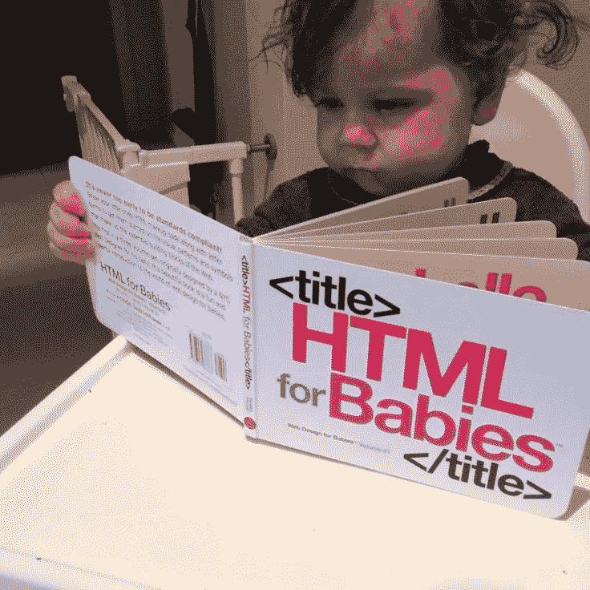

# 不应该从 Kotlin 开始编码的原因

> 原文：<https://medium.com/codex/reasons-why-should-not-start-coding-with-kotlin-dd89654d8280?source=collection_archive---------0----------------------->

## Kotlin 是怎样一种现代编程语言



[来源](https://www.google.com/url?sa=i&url=https%3A%2F%2Fwww.pinterest.com%2Fpin%2F302726406175963480%2F&psig=AOvVaw0Bpj4uWKQoSXCWpLWddik1&ust=1653219981741000&source=images&cd=vfe&ved=0CA4Q3YkBahcKEwj4_fvEwvD3AhUAAAAAHQAAAAAQAw)

如果你开始学习如何编码，学习另一种语言，如 Java、JavaScript 或 C/C++。不要开始学习如何用 Kotlin 编码。作为全世界开发人员的普遍观点，

> 科特林**改进了 Java 的弱点**，它非常死板，很难编码，导致生产率低下。Kotlin 和 Scala 有着相同的目的，它**引入了许多模式来减少代码**，从而提高了程序员的生产率。Kotlin 还引入了函数式编程，受到许多程序员的喜爱。

用我的话来说，创建 Kotlin 的目的是减少大量 Java 的样板代码，并添加 Java 因其构建方式而无法包含的额外功能。

我是 Schoolhouse.world 的一名教师，在那里我主持了一个课程，教那些想学习科特林语的学生。我的一些学生不知道编程，而其他学生知道基本知识。我开始意识到，那些不知道如何编程的学生发现 Kotlin 非常复杂，而那些知道的学生却喜欢这门语言的整体。

让我来说明这是如何发生的:

# 创建类

Java 中的 POJO 类

这是一个你必须用 Java 编写的类，用来创建一个人模型。在科特林，你问？在科特林，你只需要写:

现在，从一个**学习者**的角度来看:他/她没有接触到在引擎盖下*发生的事情*。他/她不知道生成的函数或者不太理解`toString()`方法或`equals()`方法。

从一个**导师**的角度来看:如果学习者没有一些编程的背景知识，那么很难解释数据类的想法到底来自哪里。

# 主要和次要构造函数

我的学生发现最令人困惑的话题是 Kotlin 中的主构造函数和次构造函数。那些对编程知之甚少或一无所知的人不太理解多重构造函数的需要和程序的流程，尤其是当它包括继承时。

> 与 Java 相反，主构造函数和次构造函数以及`init`块的使用——何时以及何时不在构造函数参数中声明`var/val`—很复杂，因为很难可视化幕后的过程。

# 功能的多样性

在 Java 中，我们有简单的函数。但是科特林来了，

1.中缀函数。

2.扩展功能。

3.操作员功能。

4.Tailrec 函数。

5.内嵌函数。

每个功能都有不同的含义和用法。对于一个没有任何经验的人来说，学习这些可能会让人不知所措。

# 可空类型和不可空类型

Kotlin 是少数几种流行的语言之一，其中每种类型都分为可空类型和不可空类型。这提高了程序员的生产力，并保持程序的零安全，但同样，一开始学习它会令人望而生畏，因为你需要做额外的工作。

# 范围函数

这个话题是我们认为不需要的，但我们很高兴它的存在——在我看来。作用域函数允许轻松操作变量数据，并绕过空性问题。这也给程序员提供了使用这些函数来形成自己独特的代码风格的机会。

```
Intent(this, SecondActivity::class.java).***apply*** {
  putExtra("key_count", count)
  flags = Intent.FLAG_ACTIVITY_NEW_TASK
}.***also*** {
  startActivity(it)
}
```

# 支持面向对象和函数式编程

Kotlin 是一种非常聪明地使用面向对象编程和函数式编程特性的语言，通常在同一个文件中。对于一个编程新手来说，以传统的方式编写函数并把它们作为变量可能会令人望而生畏。

这是我在 Kotlin 中用来解决竞争性编程问题的一个程序的例子。高阶函数的使用对于初学者来说是复杂的，并且由于其难度而导致许多人放弃编程。

# 杂项提及

Kotlin 并没有停止改进 Java 的弱点。科特林还提出了许多其他概念。

1.`lateinit`属性——这些属性没有初始值或默认值，必须在使用前进行初始化。

2.属性/类委托——一种将功能委托给类或属性的现代方法。

3.`lazy`加载——通过`lazy`声明变量意味着它们只会在第一次需要时被初始化。

4.`if`和`when`表达式——用`if`和`when`表达式缩短和改进你的代码。

这个列表还没有结束！

# 结论

Kotlin 是目前最好的语言之一。Kotlin 目前可以用来创建跨平台的应用程序、网站和服务器。

你可以开始学习如何用 Kotlin 编程，但是这将会很难，并且需要更长的时间来适应编程。在我看来，像 Java 或 JavaScript 这样的语言是最好的开始，然后转移到像 Kotlin 这样的语言。

有了编程的初步知识，学习 Kotlin 并不是一个很大的飞跃。

我希望你喜欢我的文章。感谢您的阅读！✌️

```
**Want to connect?**[https://github.com/cybercoder-naj](https://github.com/cybercoder-naj)
[https://www.linkedin.com/in/nishant-a-jalan](https://www.linkedin.com/in/nishant-a-jalan)
```