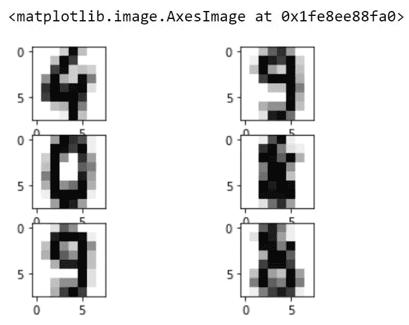

# 用 Scikit-learn 识别手写数字

> 原文：<https://medium.com/codex/recognizing-handwritten-digits-with-scikit-learn-90ca6e2471ed?source=collection_archive---------1----------------------->


识别手写文本是一个问题，可以追溯到需要识别手写文档中的单个字符的第一台自动机器。例如，想想邮局信件上的邮政编码以及识别这五个数字所需的自动化。为了自动有效地分拣邮件，对这些代码的准确识别是必要的。可能想到的其他应用包括 OCR(光学字符识别)软件。OCR 软件必须读取手写文本或印刷书籍的页面，用于每个字符都有明确定义的普通电子文档

> **假设:**

Scikit-learn 库的 Digits 数据集提供了许多数据集，可用于测试数据分析和结果预测的许多问题。一些科学家声称它 95%的时候都能准确预测数字。进行数据分析来接受或拒绝这个假设。

> **先决条件:**

Sklearn

Matplotlib

机器学习基础

> **数据集:**

在这个项目中，我们使用 sklearn 库中已经准备好的手写数字数据集。我们可以使用下面的代码导入数据集。

```
from sklearn import datasets
digits = datasets.load_digits()
```

Digits 数据集是一个字典，包含数据、目标、图像、特征名称、数据集描述、目标名称等。

我们主要关注数据和目标。我们在不同的变量上提取两者。

```
main_data = digits['data']
targets = digits['target']
```

现在我们可以看到我们的数据。

```
def view_digit(index):
    plt.imshow(digits.images[index] , cmap = plt.cm.gray_r , interpolation = 'nearest')
    plt.title('Orignal it is: '+ str(digits.target[index]))
    plt.show()view_digit(17)
```


手写数字数据集

> **模型规划:**

为了了解不同的模型如何处理不同的数据量，我们使用了 3 种模型:支持向量分类器、决策树分类器和随机森林分类器。

1.  **支持向量分类器:**

支持向量机算法的目标是在 N 维空间(N-特征的数量)中找到一个超平面，该超平面清楚地分类数据点。[更多…](https://towardsdatascience.com/support-vector-machine-introduction-to-machine-learning-algorithms-934a444fca47)


学分:-[https://towards data science . com/support-vector-machine-introduction-to-machine-learning-algorithms-934 a 444 FCA 47](https://towardsdatascience.com/support-vector-machine-introduction-to-machine-learning-algorithms-934a444fca47)

***代码:***

```
# import the SVC
from sklearn import svm
svc = svm.SVC(gamma=0.001 , C = 100.) 
# gamma and C are hyperparameters# Training data = 1790 , Validation data = 6
svc.fit(main_data[:1790] , targets[:1790])# predict on test data
predictions = svc.predict(main_data[1791:])# check the result 
predictions , targets[1791:] 
```


SVC 输出

正如我们可以看到的，我们使用非常多的数据进行训练，使用非常少的数据进行训练，支持向量分类器在数据方面做得非常好，我们在测试数据上获得了 100 %的准确性。



**2。决策树分类器:**

决策树分类器是一种简单而广泛使用的分类技术。它应用一种简单的思想来解决分类问题。决策树分类器提出了一系列关于测试记录属性的精心制作的问题。每次它收到一个回答，都会询问后续问题，直到得出关于记录的类标签的结论。

[关于决策树的更多详细信息…](http://mines.humanoriented.com/classes/2010/fall/csci568/portfolio_exports/lguo/decisionTree.html)


演职员表:-[http://mines . human oriented . com/classes/2010/fall/csci 568/portfolio _ exports/lguo/decision tree . html](http://mines.humanoriented.com/classes/2010/fall/csci568/portfolio_exports/lguo/decisionTree.html)

***代号:***

```
# import the Classifier
from sklearn.tree import DecisionTreeClassifier# Instanciate Model
# we can also use criterion = 'entropy' both lead us to nearly same 
# resultdt = DecisionTreeClassifier(criterion = 'gini') # fit the data on model
# Training Set = 1600 , Validation Set = 197
dt.fit(main_data[:1600] , targets[:1600])# prediction on test data
predictions2 = dt.predict(main_data[1601:])# We use classification materics as accuracy_score
# import accuracy_score
from sklearn.metrics import accuracy_scoreaccuracy_score(targets[1601:] , predictions2)
```


决策树分类器的准确性

现在，这一次，我们使用不同大小的训练数据和验证数据。正如我们所看到的，决策树分类器在数据上表现不佳。我们可以通过微调 DTC 的超参数来提高精度。

[决策树分类器的超参数](https://scikit-learn.org/stable/modules/generated/sklearn.tree.DecisionTreeClassifier.html)

**3。随机森林分类器:**

随机森林是一种监督学习算法。它既可以用于分类，也可以用于回归。也是最灵活易用的算法。森林是由树木组成的。据说树越多，森林就越健壮。随机森林在随机选择的数据样本上创建决策树，从每棵树中获得一个预测，并通过投票的方式选择最佳解决方案。它也为特性的重要性提供了一个很好的指示器。

[更多关于随机森林…](https://www.datacamp.com/community/tutorials/random-forests-classifier-python)


演职员表:-[https://www . data camp . com/community/tutorials/random-forests-classifier-python](https://www.datacamp.com/community/tutorials/random-forests-classifier-python)

***代码:***

```
from sklearn.ensemble import RandomForestClassifier# n_estimators hyperparameters( default 100 )
rc = RandomForestClassifier(n_estimators = 150)# Training Data = 1500 , Validation data = 297
rc.fit(main_data[:1500] , targets[:1500])predictions3 = rc.predict(main_data[1501:])accuracy_score(targets[1501:] , predictions3)
```


准确度分数随机森林

正如我们所看到的，与决策树和支持向量相比，随机森林在使用较少数据的情况下表现出色。我们用随机森林分类器得到了 92 %的准确率。

> **结论:**

根据我们的假设，我们可以说，通过使用不同的机器学习模型或使用更多的数据来调整超参数，我们可以在手写数据集上实现近 95%的准确率。但要确保我们也有大量的测试数据，否则模型会过拟合。

> **代码:**

[](https://github.com/manthan89-py/Recognizing-Handwritten-Digits-with-scikit-learn) [## man than 89-py/识别-手写数字-带 scikit-learn

### 用 Scikit Learn 预测手写数字。有助于…

github.com](https://github.com/manthan89-py/Recognizing-Handwritten-Digits-with-scikit-learn) 

> **联系我:**

**Github:**

[](https://github.com/manthan89-py) [## manthan89-py -概述

### 对 AI、深度学习、机器学习、计算机视觉、区块链、Flutter 感兴趣😇。做一些竞争性的…

github.com](https://github.com/manthan89-py) 

***博客:***

[](https://manthan-bhikadiya.medium.com/) [## 曼丹·比卡第亚·🖋-中等

### 机器学习、深度学习、人工智能是未来。我们几乎在每个领域都使用这些技术…

manthan-bhikadiya.medium.com](https://manthan-bhikadiya.medium.com/) 

***领英:***

 [## 印度古吉拉特邦苏拉特曼丹·比卡第亚-查罗特科技大学|…

### 查看 Manthan Bhikadiya 在世界上最大的职业社区 LinkedIn 上的个人资料。Manthan 有一份工作列在…

www.linkedin.com](https://www.linkedin.com/in/manthanbhikadiya) 

> **最终注释:**

**感谢阅读！如果你喜欢这篇文章，请点击**👏尽可能多次按下按钮。这将意味着很多，并鼓励我继续分享我的知识。