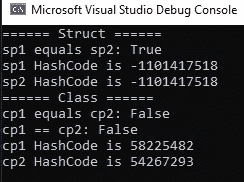
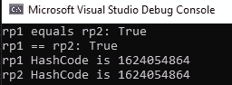
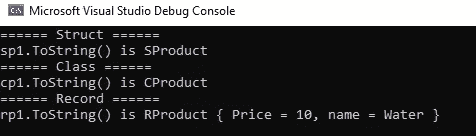

# 记录对类对结构等等，C# 9

> 原文：<https://medium.com/codex/record-vs-class-vs-struct-and-more-c-9-ff0b7b8265bc?source=collection_archive---------1----------------------->

[值类型](https://learn.microsoft.com/en-us/dotnet/csharp/language-reference/builtin-types/value-types?source=recommendations)和[引用类型](https://learn.microsoft.com/en-us/dotnet/csharp/language-reference/keywords/reference-types)是 C#类型的两个主要类别。A ***类*** 是 C#中声明引用类型的关键字之一。 ***Struct*** 是一种可以封装数据和相关功能的值类型。

我不会开始深入解释值类型和引用类型之间的区别，但是其中一个区别是关于**值相等。**

## **值相等**

> 值相等意味着两个对象包含相同的值。

**类**

当谈到`Class`时，我们可以使用方法`Object.Equals`来确定两个对象实例是否相等。`Equals`的默认实现支持引用类型的**引用相等。**引用相等意味着被比较的对象引用指向同一个对象，也就是说它们指向堆上的同一个地址。

**结构**

当涉及到一个`Struct`时，我们可以使用`ValueType.Equals(object? obj)`方法，如果`obj`和这个实例是相同的类型并且表示相同的值，则返回`true`。这个实现使用反射来检查所有的字段和属性。

在下面的例子中，我们有一个`CProduct class`和一个`SProduct struct`都有相同的属性。

当我们创建两个相同的(通过属性值)实例时，我们可以看到`Equals`为`struct`实例返回`true`，为`class`实例返回`false`，正如我们解释的那样。



您应该注意的另外两件事是:

1.  两个相同(按属性值)实例的 ***hashCode*** 值对于`struct`是相同的，而对于`class`是不同的。
2.  **接线员:** ==还有！=运算符不能在`struct`上运算，除非该结构显式重载它们。

## 记录

> C# 9.0 引入了*记录类型*

在 C# 9 中，我们引入了一个新的类型:`record`。它是一个引用类型，提供了一些特性，比如[不变性](/codex/immutable-objects-in-c-9-4b934e7755a7)。

我们可以这样声明一个记录:

```
public record RProduct(int Price, string name);
```

当涉及到**值相等**时，记录的行为类似于值类型:



你可以看到，不仅方法`Equals`的行为与`struct`相同，而且我们还可以选择使用== and！=运算符。

另外， ***hashCode*** 值对于两个相同的(按属性值)实例是相同的。

**用于显示的内置格式**

与`classes`和`structs`中`ToString()`的默认实现相反，它只返回以下内容:

`namespae.object-type`

记录类型有一个编译器生成的`ToString()`，它显示公共属性和字段的名称和值。`ToString()`返回以下格式的字符串:

`<record type name> { <property name> = <value>, <property name> = <value>, …}`



**解构方法**

创建记录时，编译器为记录声明中提供的每个位置参数创建一个带有`out`参数的`Deconstruct`方法。

这是该方法的外观:

正如你所看到的,`record`是一个非常好的特性，可能并不总是正确的选择，但它绝对是 C#的一个亮点。它使我们能够拥有一个“值类型”对象，它实际上是一个引用类型，作为其不变性的一部分，它也是线程安全的。