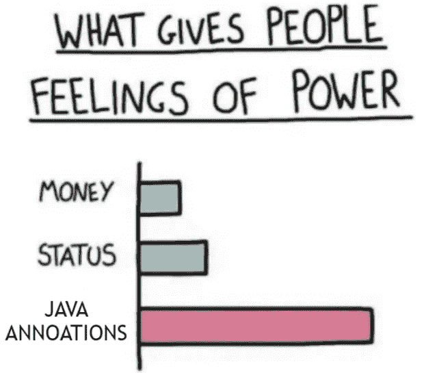

# 记录在这里！我们可以移除龙目岛了吗？

> 原文：<https://medium.com/codex/records-are-here-can-we-remove-lombok-already-63161f8d0f87?source=collection_archive---------0----------------------->

在本文中，我们将讨论 Java 17 的记录，看看我们是否可以利用这个新关键字来完全取代 Lombok 的用法。

*图像生成于*【imgflip.com】

## *1.记录与 Lombok 的@Value*

*Lombok 提供了 *@Value* 注释来帮助我们生成不可变的“*值对象*”。尽管这在某些情况下会派上用场，但我很少看到这个特性被使用。*