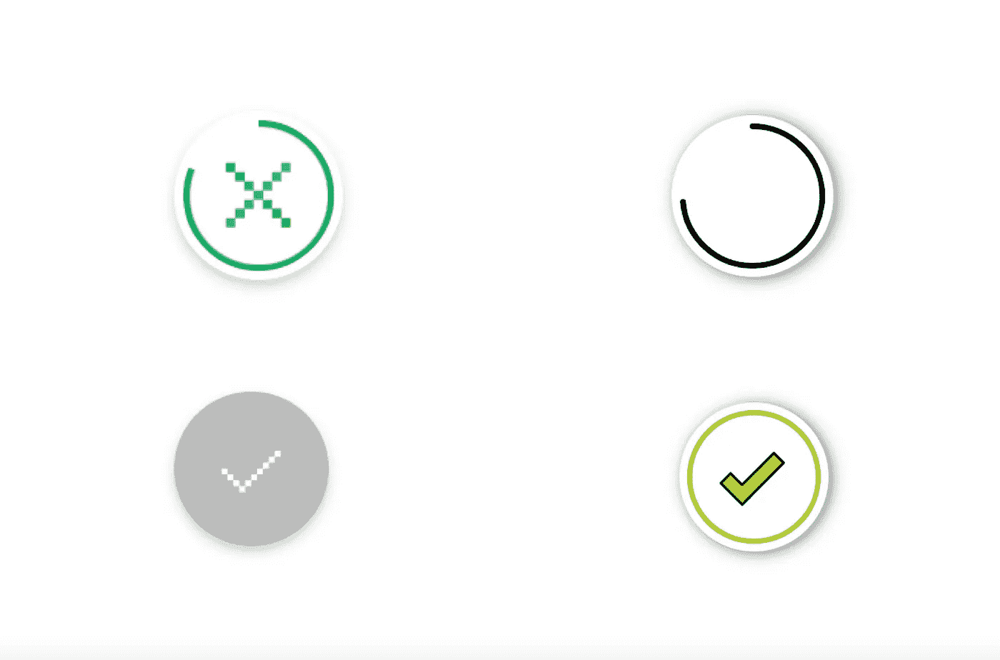

# 重现 TechCrunch 的勾号滚动跟踪器

> 原文：<https://medium.com/codex/recreating-techcrunchs-checkmark-scroll-tracker-3b863e263aaf?source=collection_archive---------24----------------------->

左边是 TechCrunch，右边是我的

如果你曾经读过 TechCrunch 上的一篇文章，你会注意到右上角的小圆圈在追踪你已经阅读了多远。当您到达文章底部时，圆圈完成，并出现一个小勾号。

这是他们文章中的一个例子。