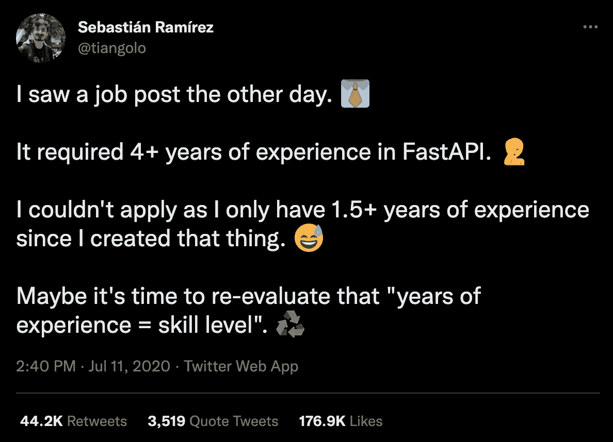

# 以下是技术招聘人员的要求。

> 原文：<https://medium.com/codex/recruiters-are-not-your-friends-86700c223312?source=collection_archive---------11----------------------->

我是如何在 4 年内加薪 254.997%的

在 [Unsplash](https://unsplash.com?utm_source=medium&utm_medium=referral) 上[猎人赛跑](https://unsplash.com/@huntersrace?utm_source=medium&utm_medium=referral)的照片

周一上午 11 点，总部 IRecruit。股份有限公司

“嗨，杰弗里，

我刚和一个新客户开完会，看起来我们需要为他们雇佣一个初级 PHP 开发人员。

你能领导这个项目吗？";

“嗯嗯，你说初级 PHP？我从来没有雇用过 PHP 开发人员，但当然！我会处理的”。

—谷歌搜索 PHP 和补充技能。

> 我们正在寻找一个准备好面对新挑战的有抱负的人。
> 
> 1-2 年 PHP、Javascript 经验(我们使用 VueJs，但最好熟悉 React 和 Angular)
> 
> 一年多了。NET 和 C#
> 
> 理解 WordPress 的向导。
> 
> 优秀的 HTML 和 CSS 知识让你可以调整 WordPress 插件，主题等。
> 
> 电子邮件设置和配置的一般事务
> 
> 理解自动化软件的大师
> 
> 大师在自定义帖子类型，古腾堡和先进的自定义字段插件。
> 
> 对基于 GIT 的工作流有深入的了解。
> 
> 具有响应性和适应性设计的经验。
> 
> 对 SEO 原理的理解。
> 
> 测试自动化和 PHPUnit 专家
> 
> 合意的:
> 
> 拥有至少 5 个以下数据库的权限:Oracle、MySQL、Microsoft SQL Server、PostgreSQL、Redis 和 MongoDB。

我们见过多少次这样的招聘广告？

招聘人员寻找大师，奇才甚至入门级的职位。

这是软件工程领域每个人都要经历的现实。

在这篇文章中，我将分享一些建议。

# 另一边找工作怎么样？

作为一名程序员，找工作非常简单，

假设你已经确定了你想成为什么类型的程序员(或者你已经是了)，以下是步骤。

你上一家公司的网站，通常是在求职页面，然后寻找与你想要的职位相匹配的空缺职位。

另一种赢得工作的方法是在 Linkedin 等网站上查看公司的人力资源经理。

然后直接给他们发一封邮件，附上你的简历。

还有第三种选择:

中间人！

这个媒介可以有一个人的形状，甚至可以是一个网站。

事实上，这里列出了最受欢迎的网站:

*   [录用](https://hired.com/)
*   [CVLibrary](https://www.cv-library.co.uk/)
*   [总工作量](https://www.totaljobs.com/)
*   [的确](https://uk.indeed.com/?r=us)

通常，企业不想为入职而烦恼，所以他们雇佣专业人士来完成这些任务。

[推特](https://twitter.com/tiangolo/status/1281946592459853830?lang=en)

然后招聘人员调查这个职位需要什么技能。

在网上发布几则广告，等待候选人出现。

但是，

这个神秘人物是谁，他会在一天中荒谬的时候打电话给你，仅仅是建议你应该把微软 Word 添加到你的简历中？

# 谁是招聘人员？

招聘人员是被付钱来提供候选人的人

通常他们也会推荐哪个候选人可能是这个职位的最佳人选。

**招聘人员总是为发布职位的公司工作，而不是为候选人工作。**

发布职位的公司也是支付招聘人员工资的公司。

这就是为什么招聘人员关心的是公司的需求，而不是应聘者的需求。

> “人不是你最重要的资产。合适的人就是。”
> –吉姆·科林斯

这解释了招聘人员和潜在候选人之间发生的一些有趣的交流。

招聘人员有 HR 背景。

这就是他们上学的目的。

不管招聘广告是干什么的，他们都没有背景。

如果你有一个招聘人员发布了一个你必须是程序员才能申请的职位。

并不代表招聘者有计算机科学背景。

通常，他们不会。

所以把这些放在一起，

这是什么意思？

第一名:

招聘者关心的是要求，你符合工作要求吗？这才是他们关心的。

**数字二:**

当你试图将这一点传达给招聘人员时，你需要使用术语。

用原始招聘广告中使用的行话写出单词。

传达这一点，因为他们没有这方面的背景。

您需要通过使用他们已经使用的术语来清楚地表明您满足了需求，以便他们能够识别它。

# 我对招聘的问题

正如我们所见，招聘人员的报酬基于几个标准:他们安排了多少人，以及他们给应聘者安排的工作的薪水。

这就导致了一系列的‘黑幕’行为。

他们中的一些，记住我写的*一些*，会完全无视你的任何偏好。

这意味着招聘人员可以给你一份你不感兴趣的工作。

他们会努力让你相信这是你梦想中的工作。

例如，要求你提供一份 word 格式的简历是一种常见的做法。

这允许他们更新任何细节，并根据工作描述塑造你的体验。

如果成功了，你就勇往直前，如果失败了，你就成了幽灵，他们会为下一个候选人做好准备。

那是一个快节奏的行业，他们需要赚钱。

# 一切都不好吗？

简短的回答是**没有**。

我相信你听说过朋友或家人走进汽车经销商，一分钟后被贪婪的销售人员包围。

这种情况可能会发生，但大多数销售人员都是专业人士。

**他们值得信赖，会花时间问你相关问题，并为你找到最适合你的车。**

照片由[塞巴斯蒂安·赫尔曼](https://unsplash.com/@officestock?utm_source=medium&utm_medium=referral)在 [Unsplash](https://unsplash.com?utm_source=medium&utm_medium=referral) 上拍摄

他们中的大多数人不会在第一笔交易中赚到大部分的钱。

相反，如果客户很高兴，几年后他会回来买另一辆车，然后是另一辆。

这是一个漫长的游戏，但将佣金乘以客户，奖励将会相当高。

你可以在穆基姆·纳尔图斯的故事中读到一个明显的例子

 [## 世界上最伟大的推销员魔鬼成交之乔·吉拉德的 76 条黄金法则的成功公式

### 你不需要复杂的公式来获得成功

medium.com](/illumination/the-success-formula-of-joe-girard-the-worlds-greatest-salesman-b31434fd9270) 

[*你不需要复杂的公式就能获得成功*medium.com](/illumination/the-success-formula-of-joe-girard-the-worlds-greatest-salesman-b31434fd9270)

# 那你怎么找工作呢？

作为一名程序员，有很多事情你需要牢记在心。

在过去，我已经相当成功地找到了我喜欢的工作，做了我喜欢的事情，同时还赚了一大笔钱。

这并不容易，但这里有一些提示。

## #1:明白这是一个数字游戏

除非在特殊情况下，你不会和你约会的第一个女孩结婚。

相反，你应该把自己放在那里，尽可能多的遇见伴侣，选择一个最合适的。

你需要对招聘人员采取同样的方法。

发尽可能多的简历，和尽可能多的人交谈。

其中，有些会脱颖而出，成为真正的真品，并引起你的兴趣。

记下它们，下次你想换工作的时候给它们打电话。

## #2:寻求建议

以城里最好的工作为目标是一件很棒的事情，拿很多钱并据此生活。

在家办公，不在黑幕行业，做点有意义的事，都是很棒的点。

[Thea](https://unsplash.com/@theasophie?utm_source=medium&utm_medium=referral) 在 [Unsplash](https://unsplash.com?utm_source=medium&utm_medium=referral) 上拍照

但是，

到最后，你只想写代码。

那应该是你的专长。

> 当你做你喜欢的事情时，你不会感到压力。马努希·希拉勒

你不应该关心就业市场的情况，也不应该花时间在电子表格上分析你的职位的工资标准。

这是招聘专家的专长。

他们每天都计算数字，诚实的数字真的能帮你获得更大的回报。

## #3:知道你值多少钱

你仍然需要做你的研究。

上网，阅读描述你想得到的工作的职位空缺，记下你所缺乏的所有技能。

那就去看书。

如果你无论如何都不能通过技术测试，那么抱怨招聘人员是没有意义的。

# 结论

找工作从来都不是一件容易的事情。

对许多人来说，找到理想的工作听起来不可能。

然而，很多人每天都得这种病。

招聘人员是一种“工具”，可以让你比自己更快地到达目的地。

但是你必须学会如何正确使用它们。

希望这篇文章能帮助你更好地理解如何去做。

[*接收编程、web 开发、职业等方面的新文章更新*](http://eepurl.com/dIZqjf)