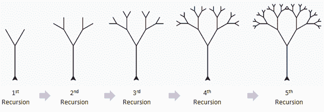
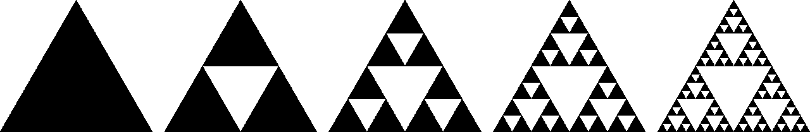
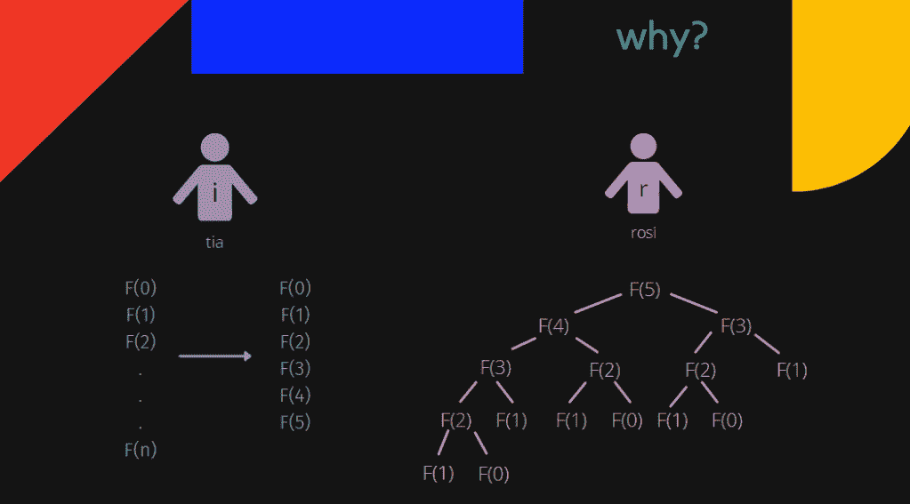

# 递归:一种通用方法

> 原文：<https://medium.com/codex/recursion-a-general-approach-ba2c2abbc7ff?source=collection_archive---------23----------------------->

基于[*【merriam-webster.com】*](https://www.merriam-webster.com/dictionary/recursion)，递归是一种计算机编程技术，涉及使用**一次或多次调用自己的过程、子例程、函数或算法，直到*满足指定条件*。执行粗体句子的函数称为递归函数。**

递归是如何工作的有很多可视化的表示，比如 Sierpiński 三角形和递归树，如下所示。



递归树。[https://www.101computing.net/recursive-tree-challenge/](https://www.101computing.net/recursive-tree-challenge/)



舍尔皮斯基三角。[https://commons . wikimedia . org/wiki/File:Sierpinski _ triangle _ evolution . SVG](https://commons.wikimedia.org/wiki/File:Sierpinski_triangle_evolution.svg)

递归是计算机编程中解决问题方法的一个很好的例子。分解确实在这个算法中发挥了作用。什么是分解？这里可以看[；)](https://medium.com/p/e5f211260134/edit)

为了解决我们的主要问题(在这种情况下进行第五次递归)，我们必须知道如何首先制作较小的三角形，这被归类为我们的子问题。

**递归函数有两种，直接和间接。**

这段代码被称为直接函数，因为它调用同一个函数 Fun。

```
void dirFun()
{
 // some code..
 dirFun();
 // some code..
}
```

这个如果调用另一个函数(比如 Fun_1)而 Fun_1 直接或间接调用 Fun 这个函数，就叫间接函数。

```
void indirFun1()
{
 // some code..
 indirFun2();
 // some code..
}void indirFun2()
{
 // some code..
 indirFun1();
 //
```

**我第一次说的定义中的‘特定条件’是什么意思？**

特定条件通常也被称为*。我们必须正确地创建一个基本条件来限制我们的程序，这样它就不会是一个无限循环。*

*我们如何确定它是否是正确的基本条件？*

```
*int fact(int n)
{
 if (n == 100) // <- wrong base case!
 return 1;else
 return n*fact(n-1);
}*
```

*上面的代码块是一个递归函数，用来计算一个数 n 的阶乘。你看出为什么它出错了吗？首先，让我把这段代码翻译成更人性化的语言。*

**嘿，我要做一个函数求 n 的阶乘，这些是要求。如果 n 等于 100，请给我 1。不管别的什么，请给我 n *阶乘(n-1)吧！**

*等等，什么？阶乘只有在为 0 或 1 时才等于 1，而不是 100。这就是为什么它是错误的基础案例。*

***如果用错误的基础条件运行函数会发生什么？***

*堆栈溢出！你可能对这个很熟悉。堆栈溢出是由于**过度使用内存**导致的计算机程序错误。此错误发生在调用堆栈中。我们可以把栈想象成我们代码的容器。堆栈可用的内存量有限。它的大小由[编程语言、](https://en.wikipedia.org/wiki/Programming_language) [架构](https://en.wikipedia.org/wiki/Computer_architecture)、CPU 上是否有[多线程](https://en.wikipedia.org/wiki/Multithreading_(computer_architecture))以及有多少内存可用来决定。当堆栈溢出发生时，通常会冻结或关闭程序。*

***说起无限循环，递归函数和迭代有关系吗？***

*是啊！递归通常被用作使代码看起来更干净、更简单的替代方法。这是一个使用迭代和递归的比较，以找到从数字 a 到数字 b 的总和。*

```
*// using iterationint main()
{
 int a,b;
 cout << “a= “;
 cin >> a;
 cout << “b= “;
 cin >> b;int sum = 0;
 for (int i=a; i<=b; i++)
 {
 sum += i;
 }

 cout << “total sum from “ << a << “ to “ << b << “ is “ << sum;
 return 0;
}// using recursionint recursion101(int a , int b)
{
 if (a == b)
 {
 return a;
 }
return a +recursion(a+1, b);
}int main()
{
 int a,b;
 cout << “a= “;
 cin >> a;
 cout << “b= “;
 cin >> b;cout << “total sum from “ << a << “ to “ << b << “ is “ << sum;
 return 0;
}*
```

*注意**I<= b**in for(int I = a；I<= b；i++)和 **if (a == b)** 功能相同！它们作为一个基本条件！*

*尽管递归比迭代代码更简洁，但并不总是需要使用递归。用迭代求解斐波那契比递归好。如果我们拒绝使用迭代，就会出现冗余。在此图中，Tia 希望通过迭代找到第 5 个斐波那契数，Rosi 希望使用递归来找到。当您使用迭代时，它保留每个先前的值，然后计算下一个值，而不将它们设置为输出。当你使用递归函数时，每次迭代，它都会设置为一个新值。在 Tia 方面，每个 F(n)只有一个值。但是在 Rosi 这边，F(3)和 F(0)有两个值，F(2)有三个值，F(1)有五个值。*

**

*我的演示幻灯片 XD*

*实际上，递归的实现并不像这篇文章那么简单，但我希望这篇文章能帮助你抓住一般概念来理解递归算法。祝你好运！*