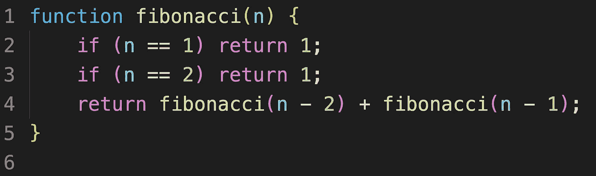
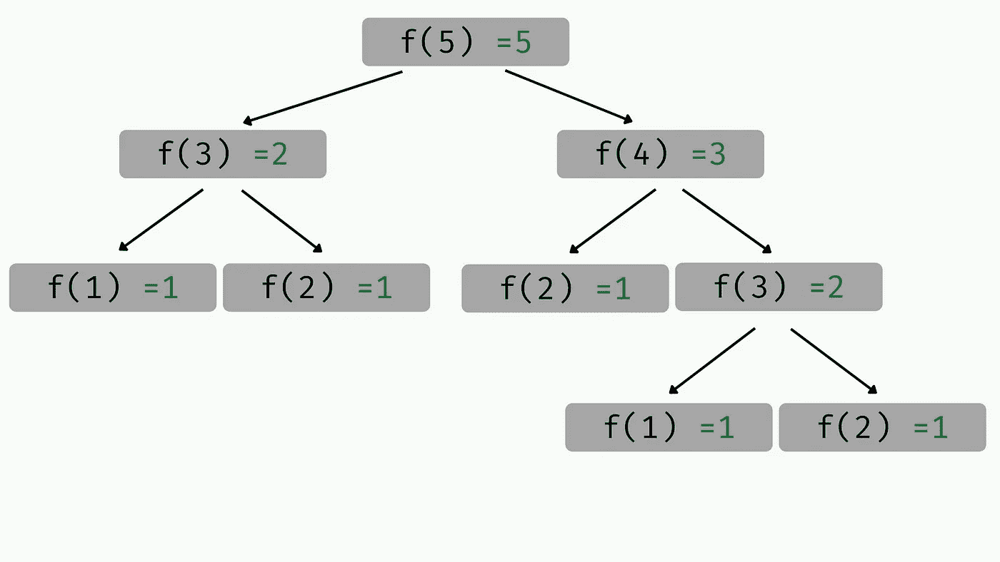

# 400 字的递归

> 原文：<https://medium.com/codex/recursion-cf362334c639?source=collection_archive---------7----------------------->

计算机编程中的递归是函数调用自身的过程。它可以通过将复杂的问题分解成更小、更易处理的问题来解决它们。

虽然这看起来很简单，但递归实际上很难理解，尤其是对 CS 初学者来说。但是当你真正能够掌握这个概念的内部运作时，你会发现**递归是一门艺术** *。*

让我们看一个例子。下面的代码是斐波那契数列的递归实现，这是一个从 1，1 开始的无限数学数列，其中后面的每个数字都等于前面两个数字的和。

斐波纳契数列(如果你想了解更多，可以嵌入维基百科链接): **1，1，2，3，5，8，13，21，34，…**

这个函数只有一个参数， *n* ，并返回斐波纳契数列中的第 n 个*元素。如果 *n* 等于 1 或 2(前两个元素)，该函数返回 1。否则，**函数将调用自身**并返回前两个斐波纳契数之和。*

如果递归对你来说还比较陌生，你可能很难理解如何让函数调用自己。我们习惯于在编程时给计算机具体、详细的指令，但在这种情况下，我们只是告诉计算机“自己想办法”。

为了更容易理解，下面是我们搜索 fibonacci(5)时该函数的图形表示:

因为初始的 *n* 不等于 1 或 2，所以函数返回 f(n-2)+ f(n-1)，所以 **f(5)变成 f(3) + f(4)** 。

然后函数在 f(3)调用自己。同样的过程下，因为 *n≠1，2* ，f(3)变成 f(2) + f(1)。整个方程就变成了 **f(2) + f(1) + f(4)** 。

这次 f(2)和 f(1)都会返回 1，所以 **f(3) = 1 + 1** 。用同样的逻辑，f(4)然后变成 f(2) + f(3) → f(2) + f(1) + f(2) → 1 + 1 + 1。于是， **f(5)等于 1 + 1 + 1 + 1 = 5。**

这个函数只需要三行代码，但是能够表示数学中最有趣的模式之一。这就是递归的美妙之处。

# 其他资源:

*   [Freecodecamp 递归视频](https://www.youtube.com/watch?v=IJDJ0kBx2LM)
*   [CS 道场递归视频](https://www.youtube.com/watch?v=B0NtAFf4bvU)
*   [GeeksforGeeks 递归文章](https://www.geeksforgeeks.org/recursion/)
*   [可汗学院递归课程](https://www.khanacademy.org/computing/computer-science/algorithms/recursive-algorithms/a/recursion)