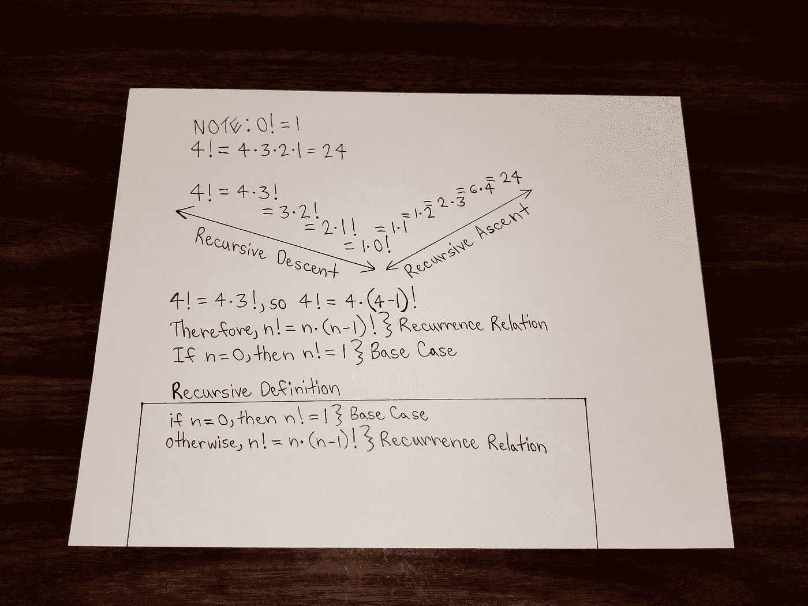
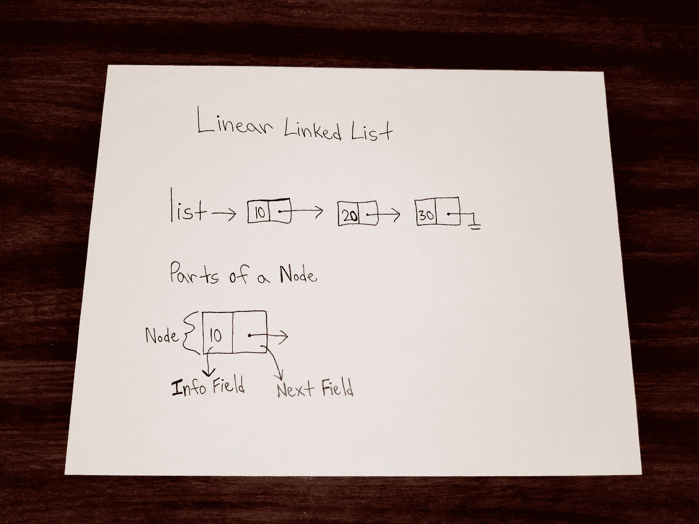
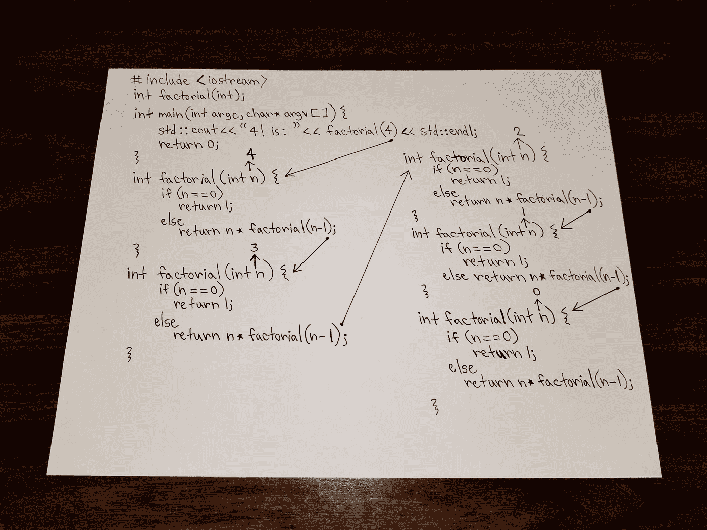

# 递归去神秘化

> 原文：<https://medium.com/codex/recursion-demystified-483ad9b1a36d?source=collection_archive---------9----------------------->

## [法典](https://medium.com/codex)

## 一个简化的令人麻木的概念

由[蒂姆·马歇尔](https://unsplash.com/@timmarshall?utm_source=medium&utm_medium=referral)在 [Unsplash](https://unsplash.com?utm_source=medium&utm_medium=referral) 上拍摄的照片

# 有什么大惊小怪的？

递归似乎是一个让每个初学计算机科学的学生头疼几个月的话题。这个概念可以通过各种不同的材料引入，然而，它最明显的是以递归函数的形式出现。一般来说，函数用于将执行特定任务的语句组合在一起，并消除重复的代码行。你调用一个函数来执行代码行。函数甚至可以调用其他函数来帮助完成手头的过程。调用自身的函数称为递归函数。

由[罗马法师](https://unsplash.com/@roman_lazygeek?utm_source=medium&utm_medium=referral)在 [Unsplash](https://unsplash.com?utm_source=medium&utm_medium=referral) 上拍摄的照片

# 需要了解的关键术语

*   基础案例
*   递推关系
*   递归定义
*   递归下降
*   递归上升

基本情况**本质上是问题的最简单形式。我们在递归实现中需要一个**基础用例**来防止函数无限地调用自己。**

**递归关系**是根据问题本身的更简单版本来定义问题。

**基础用例**和**递归关系**的组合给了我们**递归定义**。递归实现几乎总是直接来自**递归定义**。

**递归下降**是指一个函数不断调用自己，直到到达一个**基用例**为止。

**递归上升**是当到达**基本情况**时返回到每个递归函数调用。

# 通过数字的阶乘解释递归

作者图片

在上图中，您可以看到每个关键术语是如何与计算/实现一个数的阶乘的过程的某个部分相联系的。一个数的阶乘可以写成这个数乘以这个数的阶乘减一。展示了 4！= 4* 3!, 3!= 3 * 2!以此类推，导致**递归下降**。一次 0！被击中，用 1 代替它允许我们开始计算阶乘。完成每个因式分解的乘法所产生的连续计算导致了**递归上升**。0 的阶乘为 1 是我们的**基础案例**(问题的最简单形式)。4!等于 4 * (4 - 1)！是我们的**递归关系**(该问题根据其自身的更简单版本来定义)。任何数的阶乘的更一般的递推关系是 n！= n * (n - 1)！。对于任何递归实现，我们总是希望首先从编写基本用例开始。这样做，就保证了我们的函数不会无限地执行递归(假设我们的基本情况和递归关系是正确的)。从上图中可以看出，**基本用例**和**递归关系**一起构成了**递归定义**。**递归定义**将允许我们导出计算一个数的阶乘的实现。

# 递归阶乘实现

## 替代实现

注意:**基本情况**和**递归关系**是可变的。它们的值完全依赖于你试图递归解决的问题。在试图递归解决任何问题之前，你必须确定正确的**基础案例**和**递归关系**。然而，俗话说得好:“任何可以递归解决的问题都可以迭代解决。”因此，不要试图递归地解决所有问题。如果某些事情可以迭代解决，那么就迭代解决它(除非递归产生更快的运行速度)。

# 线性链表数据结构的基本解释

作者图片

现在，我在一篇关于递归的文章中提到线性链表的唯一原因是因为它与我帮助理解递归如何工作的方法有关。上图描述了一个线性链表是如何以一种绘制格式表示的。单词“list”是指向链表中第一个节点的指针。指针只是一个变量，它在内存中存储某个项目的地址。在这种情况下，列表存储列表中第一个节点的地址(在内存中)。每个盒子被称为节点。链接列表的节点由信息字段和文本字段组成。信息字段可以包含任何种类的项目。这些项目可以包括从整数到字符串，甚至对象的任何东西。下一个字段包含链表中下一个节点的地址。我们说下一个字段“指向”列表中的下一个节点。

注意:上图中的最后一个节点有一个奇怪的指针，以两个破折号结尾。该符号表示最后一个节点的 next 字段不包含任何到另一个节点的地址。因此，符号表示“列表的结尾”

# 我直观地看到递归如何工作的方法

作者图片

我如何应用线性链表的相关概念来理解递归？在上图中，你可以看到每个阶乘函数调用都有自己的指针。其思想是将每个函数调用视为可以访问它自己的函数实现。换句话说，每个函数调用都“指向”它自己的实现。以这种方式思考递归可以让你直观地看到**递归下降**和**递归上升**在起作用。当你跟随指针(或者箭头，如果这有助于你更好地理解它的话)，从一个函数实现到下一个函数实现，你正在执行**递归下降**。当您到达最后一个函数实现时(当 n = 0 时)，跟随指针返回到每个函数调用执行**递归上升**并最终计算 4！。

注意:为了节省空间，我将 else 语句写在了一行中(当 n = 1 时)。这确实使该方法工作得更好或更差。如果 else 语句写在另一行，无论如何都不会影响该方法的工作方式。

我直观地看到递归如何工作的方法可以应用于任何递归实现。我甚至用这种方法来看看斐波那契数列的递归实现是如何工作的。是的，像上面的图像一样写出这个过程可能并不适合每种情况，但最终，它有助于你理解递归。理解递归才是真正重要的。