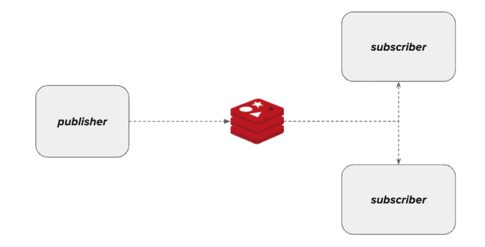
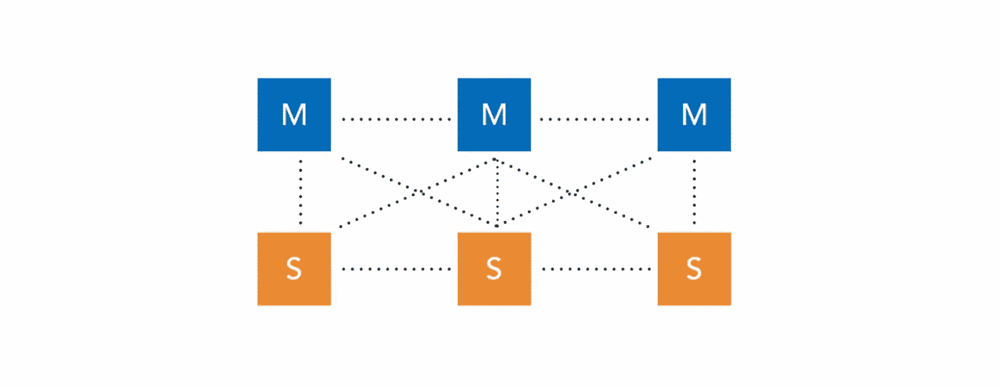
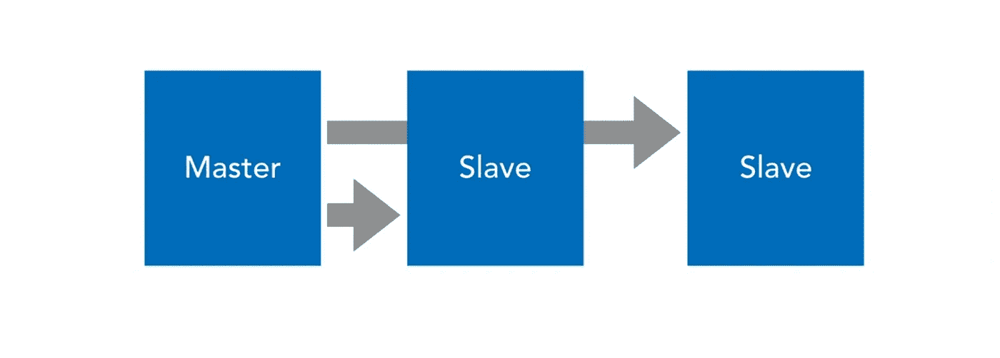

# 简而言之就是 Redis

> 原文：<https://medium.com/codex/redis-in-a-nutshell-d338463f1af6?source=collection_archive---------2----------------------->

## 雷迪斯

## 关于 Redis 你需要知道的


如果您正在寻找对 Redis 的基本和简化的理解，那么这篇文章正是您所需要的。

Redis 代表“*远程字典服务器”*，是一个键值、快速、开源的内存数据存储。单词 **in-memory** 的意思是，它将所有数据存储在主存储器(即 RAM)中。这使得 Redis 能够提供低延迟和高吞吐量的数据访问。

Redis 是一个 NoSQL 数据库。它被用作数据库、队列、缓存和消息代理。

**Redis 中支持的数据结构**

Redis 支持字符串、散列、集合、排序集合、列表、位图、位域、超级日志、地理空间索引和流

**访问 Redis**

您可以使用 [**Redis-CLI**](https://redis.io/docs/manual/cli/) 服务器轻松访问 Redis。它允许用户对所有可用的操作执行命令/查询。以下命令用于访问 redis-cli:

```
redis-cli -h <your host ip> -p <your host port>
redis-cli -h 127.0.0.1 -p 8999
```

**Redis 客户**

Redis 提供了使用不同客户端连接几乎任何编程语言的可扩展性。[点击此处](https://redis.io/docs/clients/)查看可用客户端列表。

> 此时，您一定想知道 Redis 作为内存数据库是如何提供持久性和复制选项的。
> 
> 现在让我们开始讨论可用的选项

# 坚持

Redis 中有两个[持久性](https://redis.io/docs/manual/persistence/)选项可用:

## 1- Redis 数据库文件(RDF)

RDF 是默认的持久性选项。这类似于拍摄快照(数据的时间点拷贝)。它提供了在特定持续时间或特定密钥更改后拍摄快照的灵活性。要配置 RDF，只需访问 **Redis.conf** 文件并使用以下命令:

```
save <seconds> <keychanged>
save 900 1 //after 900 seconds or atleast 1 key changed
```

## 2-仅附加文件(AOF)

AOF 不是默认的持久性选项。它在系统文件中记录每个操作。当 Redis 重新启动时，它从这个文件中重建数据集。要配置 AOF，只需访问 **Redis.conf** 文件并使用以下命令:

```
appendonly yes  //to enable AOF
appendfilename "appendonly.aof"  //AOF filename
```

# 分身术

在基本 Redis 复制中(*不包括 Redis 集群或 Redis Sentinel* 的高可用性特性)，有一个*主副本*复制机制。副本节点是其主节点的精确副本。要在一个从节点上配置复制，只需访问 **Redis.conf** 文件并使用以下命令:

```
replicaof <masterip> <masterport>
replicaof 127.0.0.1 8999
```

# Redis 发布/订阅

Redis 还提供了发布/订阅机制，俗称[发布-订阅模式](https://en.wikipedia.org/wiki/Publish%E2%80%93subscribe_pattern)。要订阅某个频道，例如`news`，订户将执行以下命令:

```
SUBSCRIBE news
```

要在通道`news`上发布任何信息，发布者需要执行以下命令:

```
PUBLISH news "Good Day!"
```



# Redis 高可用性

Redis 中有两种高可用性机制。让我们来看看两者的一些基本细节。

## Redis 集群

这是一个集群解决方案。它将您的数据分成几个服务器，并提供复制、故障转移和自动管理。它非常适合于高可用性的大规模实施，并具有很高的数据访问速度。



## 哨兵

Sentinel 至少需要 3 个实例才能运行。如果其中任何一个失败，那么您就有一个故障转移服务器可以接管。当你需要更好的保护并且速度不是你主要关心的问题时，使用 sentinel 是理想的。它非常适合具有高可用性的小型实施。



# 就是这样！

如果你喜欢这篇文章，那么请不要忘记关注我的[萨里姆汗](/@sarim_khan)。

享受乐趣，不断学习&永远编码！