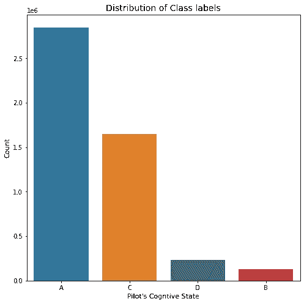
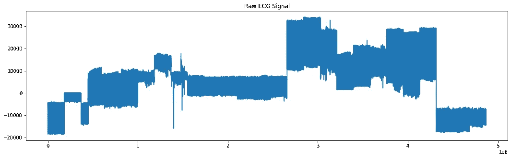
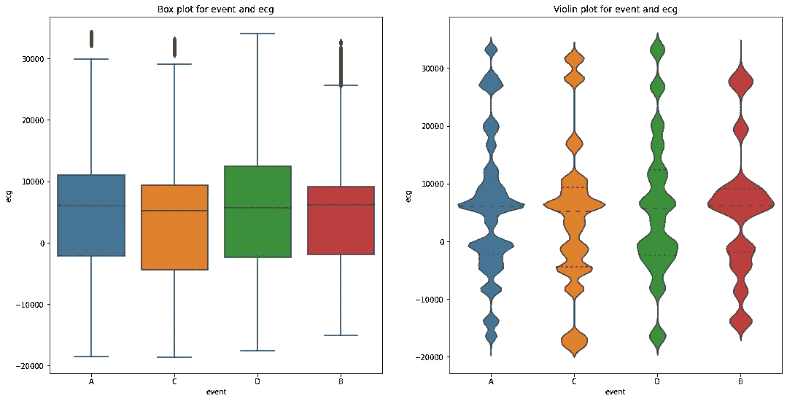
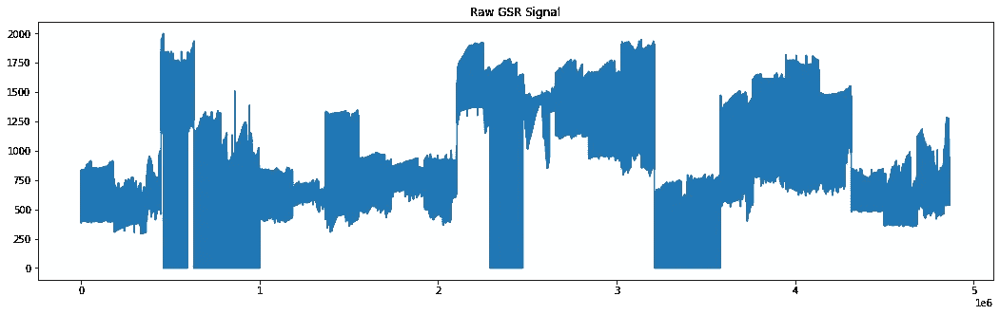
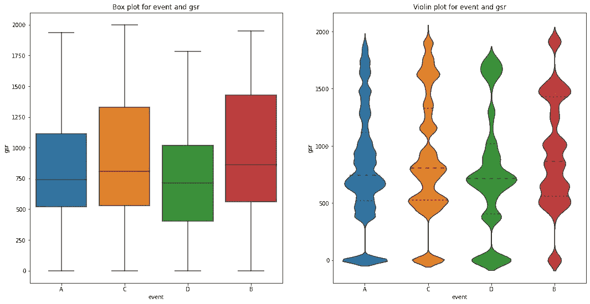
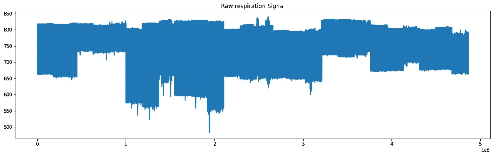
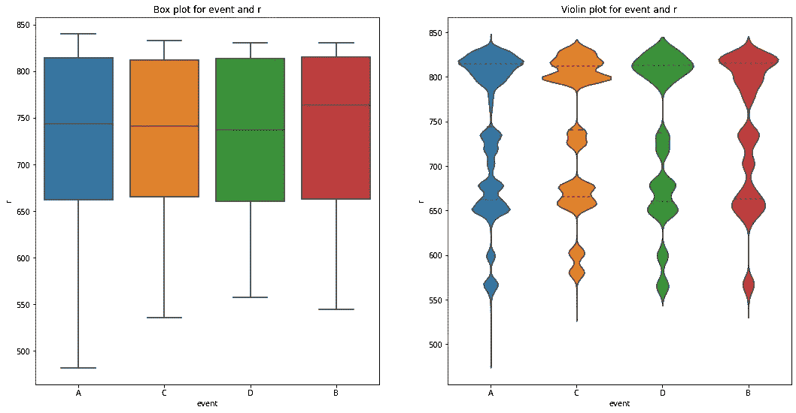
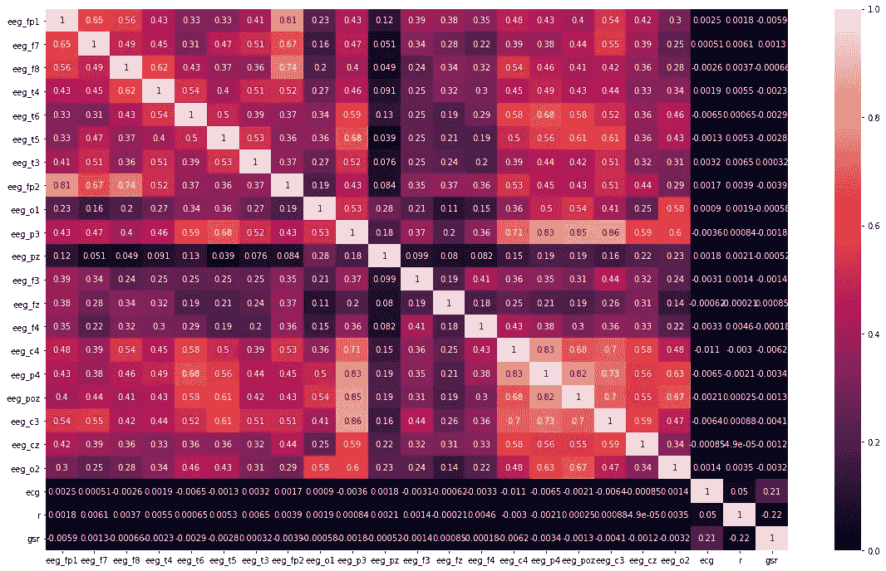
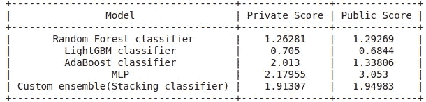
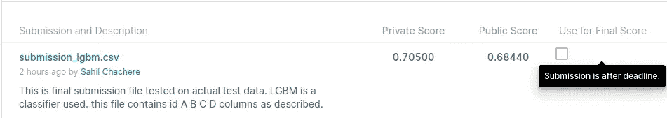

# 减少商业航空死亡事故

> 原文：<https://medium.com/codex/reducing-commercial-aviation-fatalities-86a6cacbb312?source=collection_archive---------6----------------------->

## **一个端到端的数据科学、机器学习、深度学习项目**

由[西蒙·菲塔尔](https://unsplash.com/@simonfitall?utm_source=medium&utm_medium=referral)在 [Unsplash](https://unsplash.com?utm_source=medium&utm_medium=referral) 上拍摄的照片

# 目录

*   商业问题
*   解决这个问题的统计方法
*   使用机器学习来解决问题
*   数据集概述
*   功能概述
*   绩效指标
*   探索性数据分析
*   首次切割方法
*   模型比较
*   Kaggle 结果
*   未来的工作
*   参考

# **商业问题**

减少商业航空死亡事故是 2019 年举行的 Kaggle 比赛。航空死亡事故/事故导致乘客、机组人员死亡，以及整车损坏等。大多数与飞行相关的死亡事故都源于“飞机状态意识”的丧失对于可能分心、困倦或处于其他危险认知状态的飞行员来说，这是无效的注意力管理。

# 解决这个问题的统计方法

考虑到分类问题，这个问题可以通过使用**线性判别分析(LDA)** 的统计建模方法来解决。

*   LDA 假设数据是正态分布的，并且每个特征具有相同的方差，并且每个特征的值在平均值附近不同。
*   有了这些假设，LDA 模型将估计训练数据中每个类别的平均值和方差。
*   每个类别的每个特征(x)的平均值(μ)可以定义为“特征的总和除以特征的总数”。

# 使用机器学习来解决问题

对于要解决的这个问题陈述，从测试情况下的实际飞行员那里获取数据，并且**任务是 ML 模型应该能够实时运行计算以监控飞行员的认知状态，并且基于观察预测飞行员的认知状态。当飞行员进入一个令人不安的状态时，他们可以得到提醒，防止事故发生并拯救生命。**

# 数据集概述

数据集由来自 18 名飞行员的真实生理数据组成，这些飞行员受到各种干扰事件的影响。Kaggle 提供了 3 个文件，即。培训、测试、样品提交均采用 CSV 格式。

**训练集**由一组在飞行模拟器之外的非飞行环境中收集的受控实验组成。

**测试装置**(缩写为 LOFT =面向航线的飞行训练)由飞行模拟器中的完整飞行(起飞、飞行和着陆)组成。

**样本提交**文件是最终上传的文件。

飞行员经历了旨在产生以下 **3 种认知状态**之一的分心:

通道化注意力 :-这是一种专注的精神状态，飞行员排除其他任务，只专注于一项任务。

**转移注意力** :-当飞行员同时处理多件事情，不能正确集中注意力，导致缺乏决策时，可以理解为多任务处理。

**惊吓/惊讶** :-这可以理解为飞行中突然发生的意外事件，事件可以是任何危险的事情，飞行员感到惊讶并开始专注于处理麻烦的事件。

# **功能概述**

*   **ID** —(仅测试集和样本提交文件)一个工作人员+时间组合的唯一标识符。
*   **crew**——一对飞行员的唯一 id。数据中有 9 个机组/飞行员。
*   **实验**—CA、DA、SS 或 LOFT 之一(仅出现在测试集中)。
*   **时间** —实验开始的秒数
*   **座位** —飞行员是在左边(0)还是右边(1)座位
*   **脑电图** —脑电图(EEG)是一种记录大脑电活动的电生理监测方法。
*   心电图——心电图是一种测量心脏电活动的测试。它也被称为心电图或 EKG。每一次心跳都是由电信号触发的，电信号从心脏的顶部开始，传播到底部。该传感器的分辨率为 0.012215 伏/位，范围为-100 毫伏至+100 毫伏。数据以微伏为单位。
*   **呼吸(r)** —呼吸，衡量胸部起伏的指标。该传感器的分辨率/位为. 2384186 V，范围为-2.0V 至+2.0V，数据以微伏为单位。
*   **GSR** —皮肤电反应，一种皮肤电活动的测量方法。该传感器的分辨率/位为. 2384186 V，范围为-2.0V 至+2.0V，数据以微伏为单位。
*   **事件** —飞行员在给定时间的状态。这是一个类别标签。

# 绩效指标

该 Kaggle 问题陈述是一个 4 级分类问题，使用预测概率和观察目标之间的**多级对数损失**进行评估。

**以下是要分类的 4 个类别标签:**

*   A =基线或无事件
*   B =惊吓/惊讶状态
*   C =通道化注意力
*   D =转移注意力

***为什么多类对数损失作为评价指标？***

*   在我们的例子中，我们正在解决一个分类问题，其中机器学习模型必须预测 4 个类别中的每个类别。
*   在这个问题中，从商业角度来看，预测分类错误是不可容忍的，使用多类测井损失将惩罚与实际输出的微小偏差，这非常有帮助。
*   当数据高度不平衡时，ROC 曲线不是一个好的选择。

# **探索性数据分析**

**分类标签分发**

分类标签的分布

可以清楚地看到，训练数据集是高度不平衡的。事件“A”出现的次数最多，这意味着飞行员不会分心，而且大多数时间都不会出现这种令人困扰的事件。事件“C”是最常见的分心状态，其次是事件“D”。事件“B”的数量最少，这意味着飞行员很少处于震惊/惊吓的认知状态。

**生理特征分析**

**1。心电图**

原始 ECG 信号数据

*   这是原始 ECG 信号数据，非常不清晰且有噪声。这个信号数据需要被过滤

心电图的方框图和小提琴图

*   对于基于事件的 ECG，事件 A、C 和 b 存在潜在的异常值。事件 D 没有异常值。
*   假设这些异常值可能是数据中的噪声，需要小心处理，因为 ECG 数据是一个重要的特征。
*   没有事件共享相似分布或它们的四分位数。对于该事件，A 和 B 中间值相当接近。
*   显然存在分布的重叠。没有一个事件是正态分布的。
*   在特征工程过程中，需要对值进行规范化。数据点没有对称的形状，这也意味着心电图特征不是正态分布的。

**2。** **GSR**

原始 GSR 信号数据

*   显而易见，GSR 数据非常嘈杂，不清晰。正常情况下 GSR 数据不是这样的。

GSR 的盒子和小提琴情节

*   GSR 特征中没有异常值，但是从 violin 图来看，在 100 到 300 的范围内，A、B 和 C 的值较少。对于事件 D，在 125 到 250 的范围内有更少的值。
*   在分布方面没有事件相似性，并且没有事件呈正态分布，这意味着在特征工程期间，标准化 GSRvalues 是一个好主意。
    很明显，数据是不对称的，所以它不是正态分布的。
*   根据箱线图，也没有异常值。
    根据小提琴图，在 100 到 350 的范围内似乎没有值。

**3。** **呼吸**

*   一般来说，当有压力事件发生时，呼吸频率会增加。此外，根据一般观察，呼吸与心跳高度相关，在这种情况下，心跳会影响心电图。呼吸是对胸部和腹部区域上升和下降的测量。在数据集中，如果呼吸率较高，则可以推断当前事件可能是紧张的。
*   从上面的图中，可以清楚地看到呼吸数据非常嘈杂和不清楚。通常呼吸数据不是这样的，而是非常类似于正弦波。

*   任何事件都没有异常值。事件 C 和 D 具有非常相似分布，具有几乎相似的中位数和四分位数间距。
*   数据中没有对称性，这意味着该特征不是正态分布的。此外，根据箱线图，没有潜在的异常值。一个成年人在休息时的正常呼吸频率范围是每分钟 12 到 16 次呼吸，但上述数字并没有提供清晰的见解。

**4。生理特征相关矩阵**

*   从相关图中可以看出，所有的 EEG 特征都是高度相关的，而 ECG、GSR、呼吸却不是。但是一般来说，所有的生理特征都有一些相互依赖的关系。
*   例如:在飞行过程中，如果有任何威胁和压力事件开始发生，那么飞行员的呼吸率肯定会发生变化，因此心跳也会发生同样的变化，这意味着心电图数据会自动显示更高的峰值。这也将导致脑电波节律的变化，这将被记录在脑电图数据中，这可能导致飞行员的精神状态从警觉到混合警觉和恐惧的变化。
*   此外，所有这些都会直接影响身体的皮肤活动和汗腺，通常当有恐惧的时候，身体细胞就会分泌更多的汗水，导致情绪状态的变化。

# 首次切割方法

**数据**

*   给定训练数据集，它具有大量特征较少的训练数据点。
*   在训练集和测试集中不存在空值问题。
*   为了处理数据中的不平衡问题，将使用 SMOTE 和成本敏感方法进行实验，并根据最终模型结果最终确定使用哪种方法。
*   SMOTE 将为少数类生成合成示例。
*   对于基于树的算法，成本敏感方法将使用参数“class_weight=balance”来平衡数据集。
*   **转换数据类型**以试验减少空间和内存。在 data 中，共有 3 种数据类型与列相关联:int64、float64 和 object

> *将 int64 转换为 int32*
> 
> *将 float64 转换为 float32*
> 
> *将对象类型转换为分类类型*

**特征工程**

*   考虑到训练数据集中的变化，需要执行列标准化。
*   根据电极连接和医学领域的一般实践，通过减法从现有的 EEG 特征中导出新的 EEG 特征。从给出的 6 个蒙太奇中，其中两个最适合这个问题陈述和 20 个脑电图特征。**【纵向-横向双极】****【周向双极】**非常适合特征工程实验。

*   从生理数据中去除噪声。

**型号选择方法**

*   应根据计算复杂性和数据集的性质来决定使用哪种模型。
*   基于数据集的不平衡性质，最好使用基于树的算法，如集合决策树-随机森林，lightGBM。

**造型**

*   使用 RandomSearch 交叉验证获得调优的超参数，这里我不考虑 GridSearchCv，因为它需要更长的时间来获得调优的超参数。

*   用最佳发现超参数训练 LightGBM 分类器模型。

# 模型比较

我已经训练了 5 个模型，其中 LightGBM 表现最好。

基于 Kaggle 评分的模型比较

# **Kaggle 成绩和排行榜排名**

*   LighGBM 分类器的 Kaggle 截图

LightGBM 模型的 Kaggle 分数

*   手动检查(因为比赛已经结束)排行榜后，我将排在第 43 位

# 未来的工作

*   从呼吸和 ECG 导出特征，并使用导出的特征来代替。
*   在两种合适的蒙太奇类型中，纵向-双极方法连接被使用，下一种类型是圆周方法也可以被使用。

# 参考

1.  [https://www . Applied ai course . com/course/11/Applied-Machine-learning-course](https://www.appliedaicourse.com/course/11/Applied-Machine-learning-course)
2.  [https://towards data science . com/getting-the-right-beat-e 18 ACD 48 b 8 c 1](https://towardsdatascience.com/getting-the-right-beat-e18acd48b8c1)
3.  [https://docs . scipy . org/doc/scipy/reference/generated/scipy . signal . SOS filt . html # scipy . signal . SOS filt](https://docs.scipy.org/doc/scipy/reference/generated/scipy.signal.sosfilt.html#scipy.signal.sosfilt)
4.  [https://arxiv.org/pdf/1801.02472.pdf](https://arxiv.org/pdf/1801.02472.pdf)
5.  [生理数据介绍](https://www.kaggle.com/stuartbman/introduction-to-physiological-data)
6.  [https://www.youtube.com/watch?v=WFnyLmL9t2I](https://www.youtube.com/watch?v=WFnyLmL9t2I)

# 与我联系

**Github 回购链接:**

 [## SahilChachere/减少商业航空死亡事故

### 减少商业航空死亡事故是 2019 年举行的 Kaggle 比赛。航空死亡事故/事故导致…

github.com](https://github.com/SahilChachere/Reducing-Commercial-Aviation-Fatalitites) 

**在 Youtube 上部署项目测试视频:**

**通过 Linkedin:**

 [## Sahil Chachere -印度马哈拉施特拉邦孟买|职业简介| LinkedIn

### 在深度学习、计算机视觉方面经验丰富，并有在 IT 和服务行业工作的经历…

www.linkedin.com](https://www.linkedin.com/in/sahil-chachere-6893b067/)