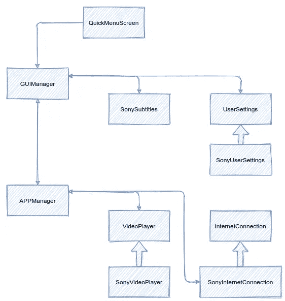
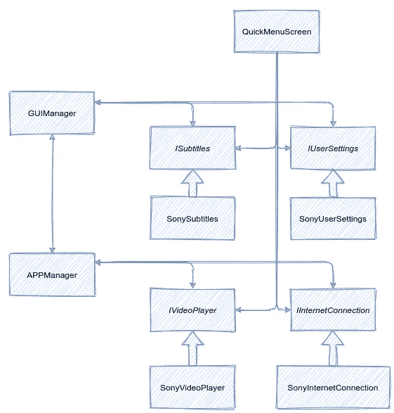
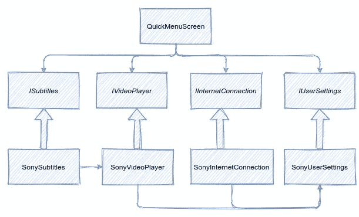
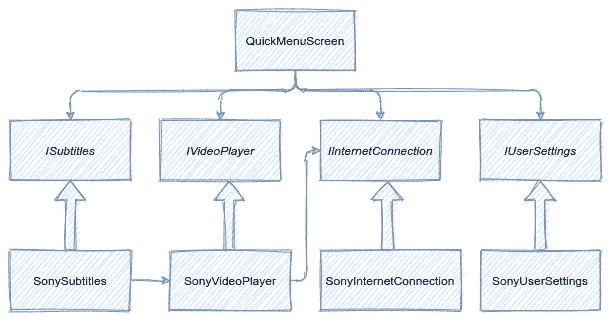
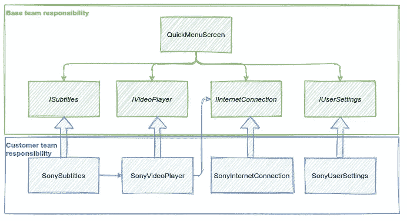

# 将传统应用重构为一个激动人心的机会

> 原文：<https://medium.com/codex/refactoring-a-legacy-app-into-an-exciting-opportunity-6dcc754b984c?source=collection_archive---------5----------------------->

来自 [unsplash](https://unsplash.com/photos/-I8lDurtfAo) 的图片，作者做了修改

在软件领域，产品经理和开发人员之间的斗争是很常见的。产品经理会说“我只想在现有的应用程序中添加 X 和 Y 特性，客户很快就会期待它们，所以这是项目的唯一优先事项”，而开发人员会回答“现有的代码是一个庞然大物，最好扔掉它，从一开始就考虑这些特性”。我将试着说明，在很多情况下，重构这条鲜为人知的道路是前进的方向。

根据我的经验，产品经理往往会赢得讨论。获胜的论点是，在实现了所述特性之后，代码不会被再次修改，所以增加更多的灵活性或使其更具可读性是浪费。这往往是错误的，因为在这个过程中会发现新的需求，客户会要求新的功能，以更差的起点重复最初的讨论。

开发者赢得战斗的次数越少，事情就越糟糕。代码确实会像手套一样适应新的特性，并且最突出的功能会得到正确的处理和测试。唉，不太突出的需求，如国际化或集成到不同的平台，将仍然没有被注意到，也没有做好准备，使预想的架构变得模糊不清，有时会使它变得和上一次迭代一样糟糕。

我倾向于认为，在大多数情况下，正确的答案是重构现有的代码，谢天谢地，我并不孤单。当重构时，你并没有改变系统的外部行为，所以你永远不会处于一个不如以前的状态。此外，您不需要来自管理层或客户的输入:需求在当前的软件化身中被完美地陈述了。即使代码不再扩展，正如产品所有者所期望的那样，新的特性也将更容易包含和测试，从而减少开发的总时间。

在本文中，我将分享我在处理这种情况时的经验，我定义了一个过程来帮助团队理解愿景并系统地改进软件的每个子系统。当然，我所采取的步骤并不适用于所有或大多数情况，但希望在参与类似的讨论或指导设计其他重构计划时起到启发作用。

# 具体的例子

不久前，我在一个团队中工作，该团队正在为一个特定的客户修改内部应用程序。为了这篇文章，让我们假设我在一家生产电视软件的公司工作。不同的团队将为索尼或三星的电视，甚至 DVD 播放器或机顶盒生产定制版本的基础软件。这个基础软件是很久以前创建的，并没有计划成为公司的未来；几年来，它一直处于“只为这个特定的新客户增加一个快速最后功能”的状态。没有人愿意改变它的任何重要部分，也没有人会完全理解它的内部运作。

绝对需要重构的最大迹象是，每个定制团队都需要制作项目的完整副本。通常需要在所有地方修改代码，而不是在一个假定的*客户相关区域*内。这尤其令人担忧，因为大多数与客户相关的变更只与一组处理硬件平台的子系统有关:视频播放、声音、互联网连接…

这些客户专用的副本是对时间的巨大浪费。如果基础软件得到了更新，将它应用到所有不同的版本将是一个巨大且容易出错的任务。在客户团队中工作的开发人员被迫处理所有代码，没有适当的文档或稳定的界面。核心团队不知道下游团队定制了哪些部分，所以他们总是互相踩着对方的脚趾。

我开始在一个这样的定制团队中工作，忍受着软件的所有问题。尽管如此，很明显这个应用程序有很多不错的特性，客户通常对此很满意。

我越来越相信，清楚地分离客户相关的代码并创建一些好的接口将会节省所有客户团队几个月的枯燥工作(甚至使他们变得多余)。更重要的是，所有这些都可以通过一种渐进的方式来完成，朝着一个看似遥远的目标迈出缓慢的步伐，在每一步之后获得一个更好的代码库。在我的业余时间，我做了这个想法的概念证明，提出了一种内部 SDK。

当我一听说公司正在成立一个团队来改进基础软件的代码时，我就欣然接受了加入的可能性，带来了我几个月前收集的想法。我必须说，我从一开始就没有提出一个明确的计划，相反，我确定了最大的代码味道，并启动了一个程序来逐个修复它们。这更像是一次精神旅行，不可能一开始就完全计划好，但每一步都让我们变得更好，并为下一步做什么提供了线索。

软件一小部分的原始状态

# 第一步:明确关系

新要求之一是重新排列和改进电视的快捷菜单，其中包括关于当前频道、字幕和音频选项的信息，并显示在视频内容的顶部。

类*quick menus screen*看起来像是编辑用户界面这一部分的合适地方，它的声明有很少的依赖性，没有显示出它真正的复杂性。一旦我们接触了代码，真正的乐趣就开始了。该类包含数百行代码，其中大部分用于设置视频回放，处理字幕边缘情况或互联网连接问题，没有人会想到这个用户界面相关类会承担这些责任。与绘制用户界面严格相关的代码分散在各处，很难识别和推理。以任何置信度更改 screen 类的任何一行都意味着理解这里涉及的其他系统的所有边缘情况。

一个用户界面类怎么可能处理如此多的低级系统并承担如此多不相关的责任呢？在我看来，这一切都归结于软件的不同部分是如何被引用的。有几个类有着无用的名字，如 *AppManager* 或 *GUIManager* ，它们包含了对所有主要组件的引用，是[“上帝类”](https://en.wikipedia.org/wiki/God_object)反模式的一个例子。

如果代码的任何部分，在本例中为*quick menus screen*想要读取当前的字幕菜单，它需要引用 *AppManager* 并从中获取字幕类。从这一点开始，*快速菜单屏幕*将可以不受限制地访问所有软件功能。在这样一个混乱的代码基础上，一个开发人员快速修复一个与视频播放相关的错误，当显示快捷菜单时不会识别它的来源并在需要的地方修复它，只会使用已经可用的接口在*Quick menus screen*中引入一个肮脏的黑客。当然，由于错误没有从根本上得到修复，它会在几周后出现在其他地方，并以类似的错误方式得到修复。

我们决定让每个模块声明它所拥有的不同的依赖关系，而不是仅仅引用一个“上帝类”。查看每个类声明，您应该看到它正在与哪些其他部分对话，以及在进行更改之前需要正确理解哪些内容。它还将提供一种方式来限制对系统中不相关部分的访问，限制引入错误的黑客行为。在这一变化结束时，考虑到未来，复杂性可以通过慢慢地移除不属于它们的地方的声明引用来管理。

实现这一点的简单方法是改变所有的构造函数，强迫调用者传递所需的对象。在我们的项目中，这实际上是不可行或不可取的。类嵌套太深，没有太多的结构，迫使调用者访问它的孩子将使用的所有模块，使现有的结构更难改变，这与目的相反。

我决定采用一种非常激进的方法，即引入一个[依赖注入](https://en.wikipedia.org/wiki/Dependency_injection)框架来消除对 God 类的需求。这样，如果*quick menus screen*想要访问*字幕*或*调谐器*，它将需要在类接口中指定其依赖关系。

这是一个繁琐的过程，开发人员需要改变从所有代码中访问所有内容的方式。当从 God 类中移除每个模块时，许多行被修改。然而，这不是一个冒险的变化；编译器会自动发现可能出现的错误。考虑到这种方法的系统性，所有的团队都可以有效地协作，并行地引入变更。

起初，团队不愿意实现这一步。这种抽象的想法会如何影响我们在编写新功能或执行维护任务时遇到的实际问题，目前还不清楚。然而，随着越来越多的类被转移到依赖注入系统，我们开始看到许多改进:

*   代码更容易阅读，了解从任何地方访问了什么
*   创建和修改单元测试变得更加简单，不再需要伪造整个 god 类的行为
*   需要将类作为指向接口的指针来引用，而不是实际的实现，从而简化测试和定制
*   由于不必包含 god 类中的所有内容，代码更改的编译时间大大减少了
*   定义任务以简化特定领域变得很容易。定义什么样的关系需要消失，这就足以对改进代码进行推理

QuickMenuScreen 直接访问界面

# 步骤 2:简化应用程序的启动和关闭

既然访问依赖项不再需要 God 类，那么将它们一起移除是合适的。然而，这并非易事。因为已经提到的所有事物访问其他事物的问题，启动过程变得越来越混乱。服务不是自动初始化的，甚至不是从一个地方初始化的，初始化是在应用程序启动的不可预知的点上从各种不相关的地方进行的。

几个 God 类中的每一个都开始初始化它们的一些子模块，然后调用另一个 God 类。下面的人会期望一些东西已经存在，从而产生依赖性。由于每个 God 类所包含的内容背后没有明确的推理，因此创建的依赖毫无意义，它们只是基于现有的假设。此外，给定子模块初始化的责任将由几个类分担，这使得代码流更加难以理解。

由于我们根据平台/客户有不同的实现，其中一些会有新的特定依赖关系。这是常见的，这些不匹配现有的流程，迫使各种黑客的方式。

这阻碍了软件进行良好的组件测试。例如，不可能将视频播放功能分离出来，因为它与软件的其他部分紧密相连。这也阻止了我们进行“一致性测试”,客户团队可以执行这些测试来确保他们的定制实现符合他们的期望。

软件的生命周期是它的一个基本部分，但这并不意味着它需要很复杂。在我们的例子中，它不同于代码流的其余部分，因为直到所有的子系统都创建好了，屏幕上才会显示任何内容，并且直到软件开始关闭，才会销毁任何子系统。

这种逻辑分离使得将启动过程移到程序执行的开始成为可能，并使其独立于业务逻辑和用户界面的其余部分，这只是它的一个先决条件。这种独立性最终将允许客户团队编写初始化子系统的代码，甚至不需要查看软件的其余部分。

与代码的其余部分不同，初始化代码的新位置是 final。很明显，不需要依赖注入框架提供的灵活性，所以决定在启动时禁用它；子系统拥有的所有依赖项都将通过构造函数传递。一旦创建，它们将被注册到依赖注入框架中，并且只有在启动结束时才被允许使用它。

神课现在已经不存在了

# 步骤 3:合理化子系统并移除隐藏的依赖关系

所有的基本系统现在都独立于软件的其余部分。可以单独创建并有适当的接口。然而，并不是所有的都有意义。这一步比前两步需要更多的思考，分析每个系统的目的是什么，以及其界面的信息量和有用性如何。

一些子系统被复制、分割或完全无用。在某些情况下，全新的元素被创造出来以取代一些半生不熟的元素。其他一些则被完全删除。整个系统中至少有 4 种不同的通信方式，这导致了难以跟踪的依赖性和问题。

痛苦的一个具体来源是环境。有几个子系统用于存储设置。最重要的是，它们包含了一旦有任何变化就通知其他人的信号。懒惰的开发人员开始使用这个设置系统来跨应用程序进行通信。

在当前示例中，互联网连接子系统将通过 *IUserSettings* 模块存储连接属性。这些信息并不真正符合用户设置，而是用户无法真正控制或看到的东西。当互联网连接建立时，其当前速度类别被存储为用户设置。视频播放器会将自己注册为用户设置的监听器，并在 *ConnectionCurSpe* ed 键更新时得到通知，并相应地修改视频流的质量。

我们一个接一个地找出这种传递信息的暗道，并把它们清除掉。对于这个具体的例子，我们只需要以最简单的方式公开 *IInternetConnection* 接口中的信息供外部使用。可以使用枚举返回连接的类型，而不是将不安全的字符串作为一个键存储在数据库中。

习惯于使用这个系统的开发人员不会注意到这些间接依赖曾经是多么有害。他们习惯了现有的获取信息的方式，甚至认为这样更好。信息将在重启后保存，接口将保持较小。通过查看现有的错误，这些争论很容易被解除:信息很容易没有被正确更新，或者从以前的连接中保持无效，并且键或值被错误键入是很常见的，因为编译器将无法检查它。

到目前为止，使用 *IVideoPlayer* 实现制作独立播放器需要一个假的 *IUserSettings* 来匹配现有的未记录的接口。将这一点添加到 *IInternetConnection* 接口使得模仿变得更加容易，提供了一个容易解析的定义，并允许编译器拾取类型或返回值中的任何打字错误。

# 步骤 4:代码组织匹配文件系统结构

现在不再有 god 类，初始化是独立的，易于定制，子系统有干净和有意义的接口。我们几乎走到了路的尽头。剩下的最大问题是源文件没有被正确地组织，并且与代码本身的组织方式完全不匹配。

在这个过程的最后，我们开始真正理解代码的不同部分是如何相互作用的，并且已经到了可以决定组织源代码的适当方式的时候了。这不仅是一个美学上的改变，它确实减少了程序员的认知负荷，但是最重要的是，它允许 makefiles 更精确地定义它们相关的代码的边界。

任何有经验的程序员都认为，我们正在开发的系统比本文或图表中显示的要复杂得多。这里只提到了两层:*模型*和*视图*，提供基本功能的类和利用它来显示用户界面的类。至少有一个包含业务逻辑的中间层是很重要的(MVC 或 MVVM 模式就是很好的例子)。我们现在可以引入的边界使得实现这种分离成为可能，并确保它不能被打破。

在仔细地移动源文件之后，创建一个单独的库的可能性出现了，这个库包含可以被任何客户团队链接的基础软件。客户团队现在知道他们可以在哪里进行代码更改，并且有稳定的界面可以遵循。基本代码中的测试不需要重复，因为可以提供已经编译过的基本库，并且可以附带适当的文档。

# 最后的话

这是一个漫长的过程，但不到一年就完成了，甚至在开发新功能的同时。开发人员在代码中工作多年，最初反对这些变化，他们对自己的工作越来越满意，能够将精力花在解决实际问题和添加功能上，而不是处理无用的集成和他们不理解的代码。

从一个没人想处理的注定要失败的项目开始，在所有描述的变化之后，它成为了如何在公司做好开发的一个例子。此外，由于基础现在已经非常清晰，并且对多个客户的适应已经到位，甚至考虑将未来的开发建立在重构软件的部分上。