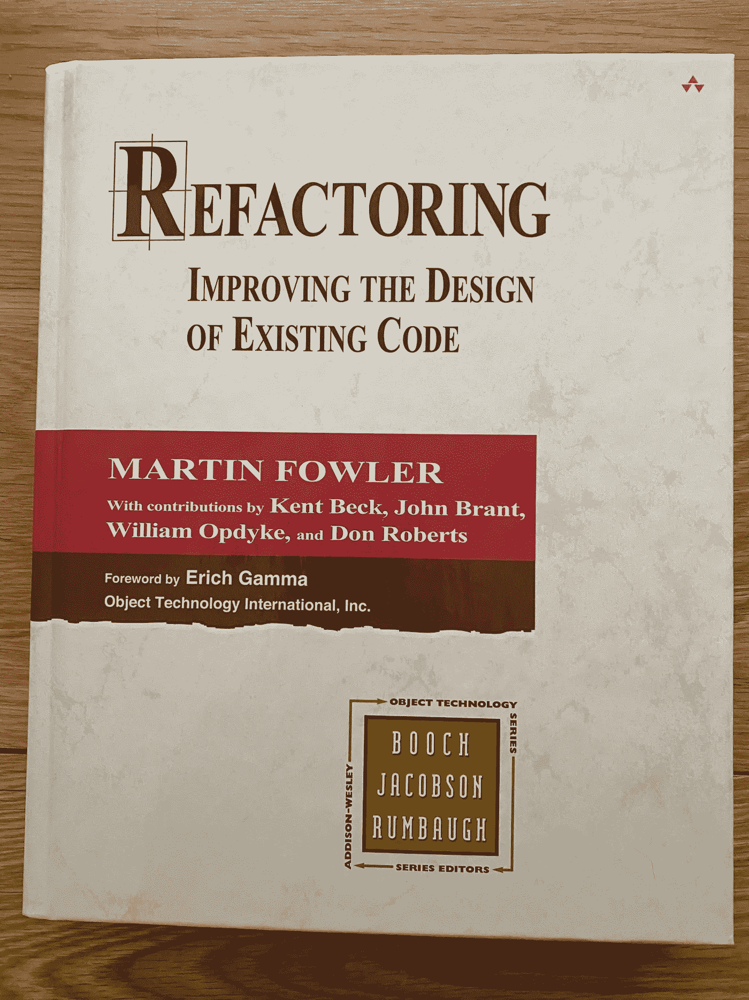

# Kotlin 中的重构代码味道

> 原文：<https://medium.com/codex/refactoring-code-smells-in-kotlin-db697ba980b2?source=collection_archive---------10----------------------->

马丁·福勒的经典著作《重构》已经在我的雷达上很长时间了，我终于抽出时间读了它。这是一本很好的书，它增加了一些关于重构代码的形式和结构，以清理现有的代码并避免代码腐烂。值得明确的是，现有代码不仅仅是已经存在了一段时间的代码。一旦你写了代码，它就存在了，所以你可能处于“重构”阶段…