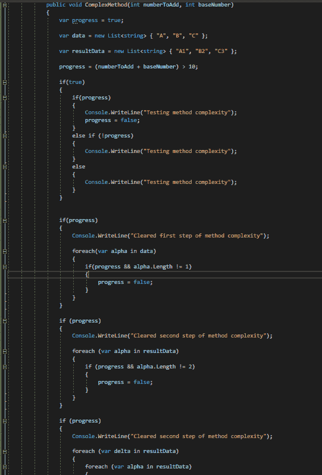

# C#中的重构

> 原文：<https://medium.com/codex/refactoring-in-c-531345065ade?source=collection_archive---------7----------------------->

为了实现应用程序中的任何功能，每个开发人员都有自己独特的风格。他们中的一些人编写有效且不复杂的代码，而一些人编写更复杂的代码。

但是，必须有一个需要维护的标准，以便代码足够灵活和易读，从而可以轻松地进行增强。但是，需要遵循的标准是在组织层面。

无论何时开发代码，都只能有两种情况——要么满足预期的标准，要么不满足。在后一种情况下，有必要修改代码，使其符合标准而不改变其功能。

此外，当开发人员遇到任何技术问题(如内存泄漏和处理速度慢)时，对他们来说，分析代码并重构代码以改进代码并确保问题得到解决是非常重要的。但是什么是重构，什么时候重构呢？这个博客为你解答了所有这样的问题。

**目录**

1.  什么是重构？
2.  什么时候重构？
3.  不同的重构方式
4.  结论

# 什么是重构？

重构是通过改变代码的内部结构和外部行为来提高代码的性能、可读性和复杂性的过程。换句话说，这是一种以受控方式清理代码的有效技术。

重构不是重写代码，因为代码的关键(即功能)保持不变。相反，它改变了为满足标准而实现它的方式。例如，一个简单的重构就是重命名一个变量，使其成为可读的格式。

这是一个持续的过程，就像开发任务一样。随着新功能的引入，代码有可能被重构。所以，当代码被检入时，有必要寻找代码气味并修复它们。

肉眼很难识别所有的代码气味。所以为了更简单，一些应用程序可以作为扩展安装在 Visual Studio 中。然后，这提供了可以重构的内容的建议。这使得开发人员和同行评审人员的工作更加容易。

现在让我们详细看看什么时候重构。

# 什么时候重构？

总是建议在每个开发任务完成后立即寻找代码的味道。这确保了工作被平均分配给开发人员。但是，当项目还没有准备好关注非功能性需求时，当一组新的主要特性发生变化时，执行重构是理想的。在清理代码的基础上开发产品将会很容易。

同样，也建议在代码投入生产后立即进行 NFR 更改。这再次确保了开发人员有一些喘息的空间，任务可以按时完成。

# 不同的重构方式

## 作为单独的方法提取

考虑一个已经存在并包含大量功能的方法。这使得程序员很难读懂，因为这个方法非常复杂。因此，有必要将方法分成不同的部分，以便功能保持不变，但同时，也便于程序员阅读。

这里有一个例子-

下图有一个复杂的方法。现在让我们看看如何从中单独提取方法。

*注意:下面的方法故意增加了许多不必要的功能而变得复杂。这个练习的目的是解释重构是如何减少代码中不必要的复杂性的。请忽略实际代码的逻辑。*

要单独提取方法，请选择需要作为单独方法提取的代码行。右键单击并在给出的选项中选择“快速操作和重构…”。

选择它时，Extract method 选项会显示如何创建新方法的预览。

## 删除未使用的指令

正如我们所看到的，我们引用多个内置和外部包来完成任务。通常情况下，代码在类文件的顶部有未使用的指令。

虽然只有当类内部使用指令中的特性时，才会加载指令，但是最好清除 Usings，这样文件看起来会更干净。

## 提取接口

接口有助于创建松散耦合的代码。当我们重构时，我们发现代码是紧密耦合的，需要重构为松散耦合的代码。

为此，必须创建一个将由该类继承的接口。因为这个类有很多方法，所以你必须使创建包含所有方法的接口变得更容易。为此，请导航到快速操作和重构…选择一个类后，会出现一个创建接口的选项。

## 重命名变量

假设一个全局变量存在于一个类中，并且在整个类中被使用。但是，变量的命名听起来不太对。因此，我们需要将变量重命名为一个合适的名称，以便它听起来有意义。

由于变量被多次使用，我们需要一种比逐个替换它更好的方法。换句话说，我们需要一种一次性替换变量名的方法。幸运的是，Visual studio 中有一个选项可以解决这个问题。

选择需要重命名的变量，然后按 Ctrl + R，Ctrl + R。这样就可以输入新变量了。

在我们应用更改后，重命名将应用于所有地方。

# 结论

记住，C#中有很多重构技术没有在本文中讨论。创建这篇文章只是为了向您展示什么是重构，以及它如何帮助代码达到设定的标准和更具可读性。

*原载于*[*https://www . partech . nl*](https://www.partech.nl/nl/publicaties/2021/06/refactoring---c-sharp)*。*