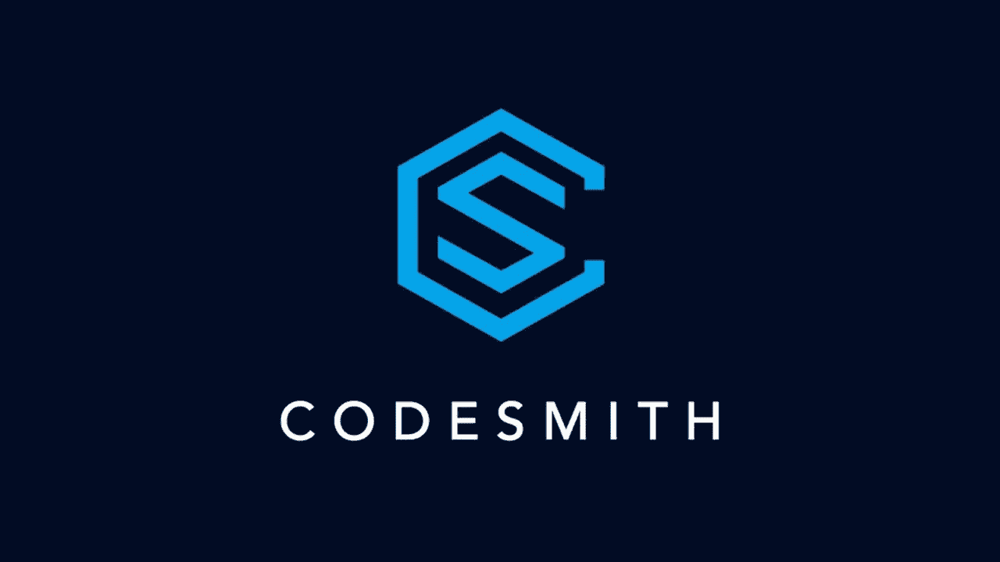

# 反思我的 Codesmith 之旅

> 原文：<https://medium.com/codex/reflecting-on-my-codesmith-journey-e8b45e51e832?source=collection_archive---------4----------------------->

## [法典](http://medium.com/codex)

我喜欢 Codesmith。

我已经正式从 Codesmith 的 3 个月强化课程毕业了。作为一名软件工程师，我的信心总是摇摆不定。当它达到顶峰时，冒名顶替综合症不知何故向我爬来，吞噬掉我为自己聚集的一点信心。如果你有同感或者想听更多我的经历，我在这里**写了一下！**