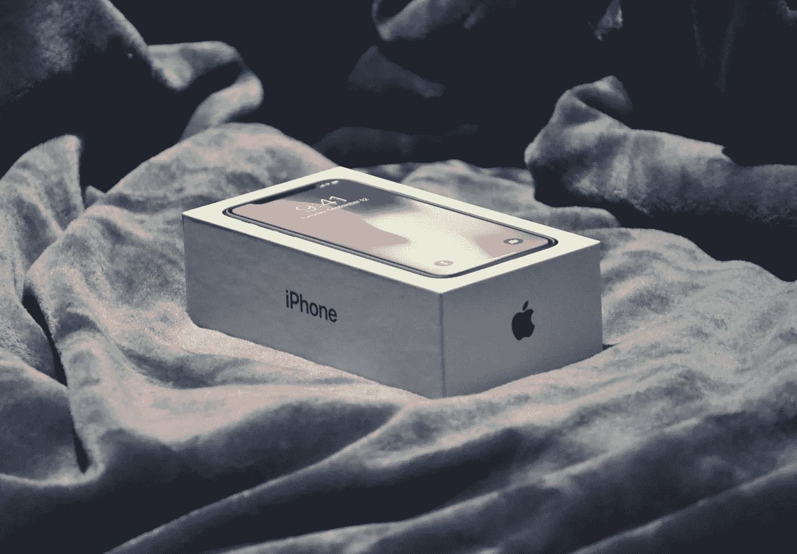

# 翻新的 iPhone

> 原文：<https://medium.com/codex/refurbished-iphone-893230932cda?source=collection_archive---------16----------------------->

## 好的，坏的，丑陋的

照片[尼古拉斯·桑蒂安尼](https://unsplash.com/@nsantoianni)在 [Unsplash](https://unsplash.com/photos/io0hJ3Bnc34)

一位智者曾经说过，省一便士就是赚一便士。但是，买一部翻新的 iPhone 算不算省钱，甚至是不是让你花更多的钱去服务中心。这篇文章将帮助潜在买家决定是否应该购买翻新的 iPhone。