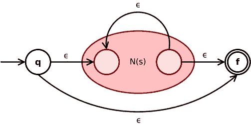

# 正则表达式、状态机和自动机——基础和理论

> 原文：<https://medium.com/codex/regex-state-machines-and-automata-basics-and-theory-4d4757db8bd5?source=collection_archive---------3----------------------->

## 一个专业程序员应该知道的关于正则表达式内部的东西，比如 DFA 和 NFA 状态机

克莱尼明星关闭由[维基共享](https://commons.wikimedia.org/wiki/File:Thompson-kleene-star.svg)提供

> **有些人，当遇到问题时，会想“我知道，我会用正则表达式。”现在他们有两个问题。——**[杰米·扎温斯基](http://regex.info/blog/2006-09-15/247)