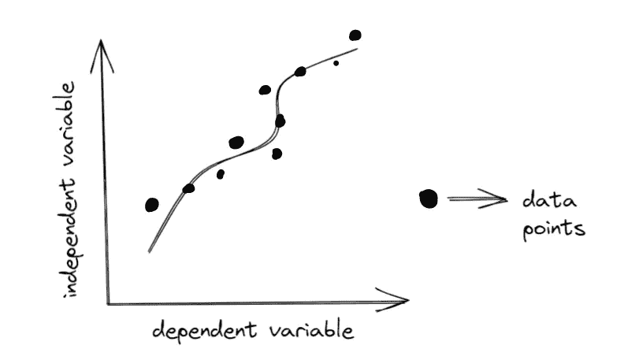
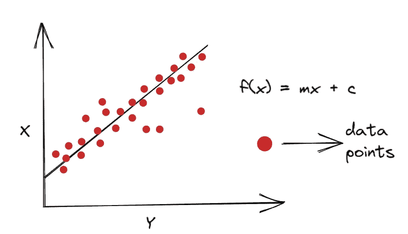
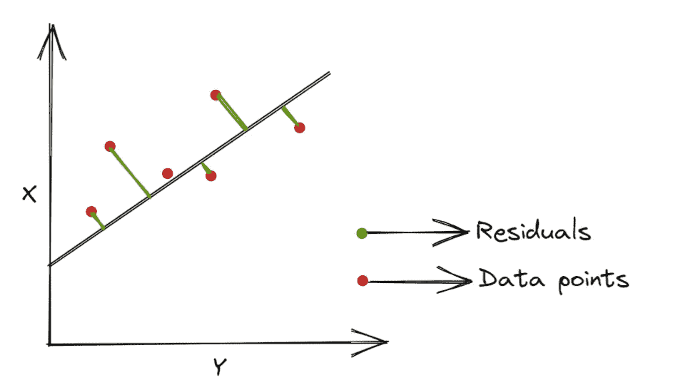

# 回归:线性回归

> 原文：<https://medium.com/codex/regression-linear-regression-ee499c699c8?source=collection_archive---------6----------------------->

## 在这篇博客中，我们将讨论我们的第一个机器学习模型，即回归。


穆罕默德·拉赫马尼在 [Unsplash](https://unsplash.com?utm_source=medium&utm_medium=referral) 上的照片

回归是一种监督学习技术，用于对特征(数据中的自变量)和目标(数据中的因变量)之间的关系进行建模。它有助于我们理解因变量的值是如何随着自变量而变化的。它预测连续值。

例如，我们需要预测温度，我们将采用过去的数据，这些数据具有独立变量，如海拔、位置、一年中的月份等。，和因变量温度，然后对它们之间的关系建模，并在给定新的一组独立变量时预测温度。

回归通过绘制因变量和自变量给我们一条直线或曲线，然后给我们一条拟合数据点的直线或曲线，我们利用这些数据点对数据进行预测。



回归

## 欠拟合

*   在这种情况下，模型无法找到给定的从属值和独立值之间的关系。出现这种情况是因为数据量很小

## 过度拟合

*   当模型试图拟合已知数据的每个数据点时，这是一种情况，因此它无法对看不见的数据或测试数据执行。

# 线性回归

线性回归是最简单和最常见的监督学习模型，顾名思义，它是一个回归模型，但在因变量(目标)和自变量(特征)之间找到线性关系。

当因变量和自变量绘制在笛卡尔平面上时，它绘制一条试图拟合数据点的线性线。

> **简单线性回归**

考虑这样一种情况，当只有一个独立变量(特征)并且我们需要预测一个值(目标)时，从数学上讲，如果我们想要线性地关联特征和目标，我们将按照 **f(x)=mx + c** 来做



这里我们将做一点操作，我可以写 **f(x1) = (w1)(x1) + (w0)** 其中 x1 是独立变量(特征)，w1 被称为特征的权重，w0 是当特征的值为零时获得的截距。

> **多元线性回归**

在这种情况下，有不止一个特征，并且模型将目标线性关联为

**f(x1，x2，x3，x4，…)= w0+(w1)(x1)+(w2)(x2)+(w3)(x3)+…**

这里 w1，w2，w3，… wn 是每个特征 x1，x2，x3，… xn 的权重。

## 价值函数

正如我们所知， **w** 的不同值将给出不同的线性关系，因此我们的任务是找出误差最小的最佳拟合线。

成本函数用于优化系数或权重(w ),并给出我们的模型如何对数据执行的度量。对于线性回归，我们将使用均方误差成本函数。

残差:实际值 **y** 与预测值 **f(x)之间的垂直距离。**

如果数据点远离回归线，那么残差会很高，误差也会很大，如果数据点离回归线更近，那么残差会更小，误差也会更小，这就是我们选择回归线的方式。



我们使用均方误差函数来了解模型绘制的线性关系的准确性。顾名思义，它是残差平方的平均值。

MSE=(残差平方和)/ N，其中 N 是数据点的总数。

均方误差较小的那条线将被视为最佳拟合线，我们的模型将最准确。

# 使用 PYTHON 进行线性回归

我们将使用 Scikit Learn 库，这是一个免费的机器学习库，具有各种分类、回归和聚类算法。

*   导入库和线性回归模型

```
from sklearn.linear_model import LinearRegression
```

*   导入用于操作数据集的工具

```
#import pandas and numpy to use and manipulate the dataset in your
#program
import pandas as pd
import numpy as np#this is a function that splits the data into two subsets i.e. #training data and test data
from sklearn.model_selection import train_test_split as tts#importing the mean squared error function
from sklearn.metrics import mean_squared_error as mse
```

*   例如，我们有 csv 文件

```
data=pd.read_csv(“<file_path>”)#assuming the data is already cleaned
y = data["<target_column>"]
x = data["<features_required>"]#splitting the data into test and train data
x_train,x_test,y_train,y_test=tts(x,y,test_size=0.2,random_state=42)#the parameter 'test_size' is used to define the size of test dataset, here it says 20 percent of original
#the parameter 'random_state' is used to shuffle the dataset in every execution, otherwise this function return the same split
```

*   训练模型

```
#creating a Linear Regression model named 'model'
model=LinearRegression()#training the model
model.fit(x_train,y_train)
```

*   预测目标值

```
prediction = model.predict(x_test)
```

*   寻找准确性

```
#finding the mean squared error between the correct and predicted
#values
error = mse(y_test,prediction)#find the square root of the mean squared error to get a more
#concrete idea about the accuracy
r_error = np.sqrt(error)
```

*   从均方根误差的值，我们可以确定我们的模型的准确性

> 我希望你们都明白什么是线性回归，以及我们如何衡量模型的准确性。
> 
> 并保持联系以了解更多关于机器学习模型的信息。