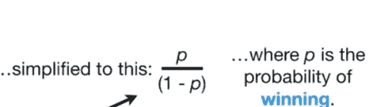
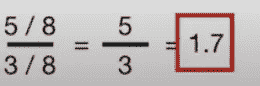
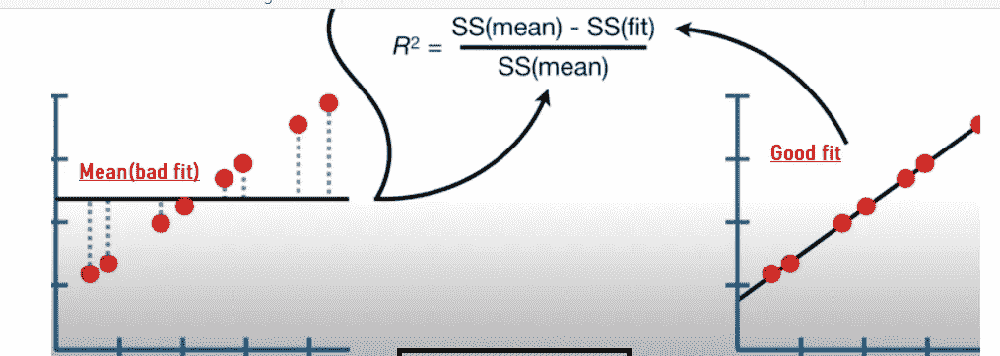

# 简化回归并直观呈现

> 原文：<https://medium.com/codex/regression-simplified-and-presented-visually-7ee71ef0051f?source=collection_archive---------10----------------------->

在我们今天生活的这个残酷的数字时代，设置正确的数据分析问题的重要性可以决定一个部门的整体成功。

这篇文章的目的是帮助每个人，从业务方面的房子，学生，实习生，任何人都想了解更多关于回归的基础知识。你们中的许多人可能知道如何使用一些自助工具为你做所有的工作，如果你是一个好奇的人，想知道用简单的语言展示的幕后工作，那么这篇文章将值得你花时间。

最后，你会知道回归数学中需要知道的一切。

我真的很感谢你的回复，所以请发送你的评论。

# **关于线性回归，即拟合直线，即最小二乘法**

在统计学中，**线性回归**通常用于预测分析。它实质上决定了因变量与一个或多个自变量之间的线性关系的程度。

我们有一些数据。然后我们给它加上一条线。使用这条线，我们可以做几件事。

1.  首先我们计算 R，看看重量和大小是否相关。数字大意味着相关性强。
2.  计算 p 值，看 R 是否有统计学意义
3.  根据重量，用直线预测尺寸

> ***输出****→总是会给出一组数据点之间绘制的趋势线。*
> 
> ***怎么用？****→如果您想根据花在在线广告上的成本预测一家公司的销售额，或者如果您想了解 GDP 的变化如何影响一家公司的股票价格等，您可以使用线性回归。*
> 
> **你可能经常听到或者会一直听到这句话。**

> **在量化关系的线性回归中，R 的平方需要很大&决定关系可靠程度的 p 值需要很小。**

在本帖中，我们将讨论什么、如何以及为什么。

> 让我们从头开始。当你看到那条趋势线时，你会想到什么？

## 这条线是如何成为地球上存在的所有不同线组合中的最佳线的，为什么它被称为最佳拟合？

> 这就是为什么线性回归也被称为最小二乘法。别担心，这里的一切都是由电脑完成的。我们在这里讨论它做了什么。

# **线性回归的最小二乘法:在寻找最优线中的作用**

1.  **旋转**→计算机只是用一堆旋转的线条(如上图)
2.  **残差平方和**→对于每条线(如下图)— - >您测量红色点(数据集中的观察值)到线 *(ax1+b，它猜测的 x1 处的线减去 x1 处的观察值)的距离。这个距离称为“剩余”。我们只是把它们平方，然后全部加起来，就这样。我们将它们平方，这样负值不会抵消正值。*
3.  **重复**→稍微旋转线条，然后旋转残差平方和，再旋转一些，然后旋转残差平方和，再次旋转，如此类推&等等。

4.接下来，计算机绘制每次旋转得到的答案*(上图)*，并选择最小平方值最小的答案。

这条线会是你最好的选择，我们的英雄。从数学上来说，对斜率和截距求导可以得到每一点的斜率。

*目测最底部灰点的斜率最小。我们的英雄就站在那里。*

***总结一下，最后一行最小化了它和真实数据之间的平方和。***

# **线性回归模型看起来&感觉起来**

> *所以在你的模型里*
> 
> y 值= y 截距+斜率* x 值…也就是说
> 
> 尺寸= y 截距+斜率* x 截距
> 
> 您的工具或程序实际上是计算 y 轴截距的最小二乘估计值&斜率。
> 
> 当您在中的汇总函数中看到残差时，它只是从红点数据到拟合线的距离。理想情况下，它们应该围绕直线对称分布，这意味着您希望最小值和最大值与 0 之间的距离相同。

所以现在我们有了一条最优线。见下文。太好了！！。它的 y 轴截距= 0.1，斜率为 0.78。

# **R 线性回归**

> 现在问题来了，这个猜测有多准确？如何量化我们的猜测有多棒？ **那是由 R 的平方决定的。r 告诉你体重和体型的关系有多密切。介于 1 到-1 之间的值意味着强相关，任何接近 0 的值都表示一个人不再关心。我们不想要 0…**

我要给你一个与 R 更好相关的故事。比方说，你正在努力减少销售工作中的背部疼痛，当你乘坐飞机时，疼痛程度会不断波动。你去看脊椎指压治疗师并完成你的治疗，你的脊椎指压治疗师告诉你他的技术有多棒。Lol。医生强调，通过接受他的治疗，你能够减少 60%的疼痛水平，他解释了你过去的走路方式，与现在相比，当你看起来平静时，用腿快速移动。他不会停止通过比较来推销自己。

那个医生是你的 R。在我们的例子中，它准确地告诉我们老鼠大小的变化有多少是由老鼠的体重解释的。它比较了适合度和不适合度。

# **R 直观解释**

我将直观地展示这一点，使其更加清晰。

1.  在下图左边的尺寸上，我测量了从平均鼠标尺寸到单个鼠标尺寸的距离(不适合，因为没有关系)。我计算距离的平方，对所有的老鼠都这样做，把所有的数字加起来，然后用老鼠的总数除以答案。这就是你们的**变异各地的意思。**
2.  在右边，我计算了前面讨论过的最小二乘法，现在我将答案除以观察次数，得到拟合的**变化**
3.  你的 R 是(均值方差-拟合方差)/均值方差

在我们输入数字之前，从 下面的 ***蓝色虚线可以看到，你已经对变化有了一个直觉。你可以清楚地看到，左边的平均值比右边的最小二乘法有更多的变化。***

对原因有什么猜测吗？是的，没错。在右边我们也有老鼠的重量，所以老鼠大小的一些变化可以用老鼠的重量来解释。

假设左边平均值的变化是 11，拟合度的变化是 4。所以我们的 R 平方是(11–4)/11 = 63%。

> **R 的平方为 63%,这意味着当我们考虑小鼠体重时，方差减少了 63%。**

*注:在这个公式中，Mean 周围的变化量****Var(Mean)****如果你还记得从左边所讨论的图表中只考虑了老鼠大小的平均值，那就忽略了老鼠的体重。* ***分子中只有 Var(fit)被认为是鼠标重量。我们可以改写公式吗:***

***R =考虑体重的小鼠大小变化/忽略体重的小鼠大小变化？这个推论马上就要派上用场了。***

> 为什么是 R 的平方，为什么不是 R？有时 R =0.5 是 R = 0.5 的两倍，但要解释这一点很困难。相比之下，比较 0.7 的 R 平方和 0.5 的 R 平方更容易。当我们计算时，我们知道 R 的平方=0.7 是 1.4 倍。

# **检验 R 的统计显著性**

现在我们来看线性回归的最后一部分，看看 R 的平方是否有统计学意义？为此，我们使用 p 值。在这里，我将坚持我的承诺，保持简单。记住这一点，我将不再解释 p 值的计算，而是把重点放在如何解释 p 值上。

让我们从运行 r 中的汇总函数开始。

1.  **Pr(>| t |)**值→是拟合直线的最小二乘估计值。在估计值中，截距为 0.5813，斜率为 0.7778。

2) **p 值**→一般来说我们感兴趣的 p 值为重量 0.0126 < 0.05。也就是说，我们希望它在统计上是显著的。重量的显著 p 值将给我们一个可靠的小鼠大小的估计。众所周知，P 值提供了假设检验的概率。因此，在回归模型中，每个自变量的 P 值测试自变量和因变量之间“不相关”的零假设，这也有助于确定在样本中观察到的关系也存在于更大的数据中。**P 值* 0126 旁边的星数越高，该变量越显著。**

> **因此，如果 P 值小于显著性水平(通常为 0.05)，那么您的模型与数据非常吻合。**

3)然后你有了 **R 和调整后的 R 的平方**，它只是由模型中的参数数量缩放的 R。

# **逻辑回归中使用的对数优势概念**

在我们接触逻辑回归之前，理解对数优势、优势比和 Wald 检验的概念是很重要的，Wald 检验是为了观察优势在统计上是否显著。

对数概率听起来和概率一样，对吗？不尽然，我的朋友。

**对数概率**是某件事情发生与某件事情没有发生的比率

概率是某件事情发生与所有可能发生的事情的比率。一张图胜过千言万语，所以这里有一个图表来更好地解释这一点。

让我们谈谈如何从概率中计算出赔率。

*注意:现实世界中有 50%的时间你会发现→根据计数计算出的赔率*

在现实世界中，你会发现另外的 50%→根据概率计算的赔率。

作为说明这一点的一个例子，在上图中，我们看到团队获胜的几率是 5/3，这是从计数中得出的。现在让我们看看从概率中得出的同样的 5/3 奇数值。

上图中的获胜几率为 5/3，下图中的获胜几率是根据 5/3 的概率计算出来的

解释赔率是怎样的:

1.  如果胜算对你不利，下面是你的情况。例→ (1 不赞成/ 16 赞成)= 0.062。它是一个小于 0 的数字
2.  另一方面，如果赔率对你有利，那么你可以得到一个数字**从 1 到…一直到无穷大。例→ (32 赞成/3 不赞成)= 10.7**

现在，试着在视觉上把这些图形框起来。见下文。

1.  你会看到 0.062 出现在红线之间，也就是说，赔率为 0.062。这么小…..
2.  另一方面，赢的几率一直到蓝线刻度的第 16 个数值。哇太占地方了…

难道这种不对称不会让我们很难比较支持或反对某个特定团队获胜的可能性吗？确实如此。

但是通过取 log(0.062) = -1.2 和 log(16) = +1.2 解决了问题，m 恢复了对称性，哇哦，我们有了一个与 0 相同的距离。这就是我们接受对数概率的原因。

正如如何从计数或概率计算赔率一样，对数赔率也可以从概率(logit 函数)或计数计算得出相同的结果。

概率比的对数被称为 logit 函数，它是逻辑回归的基础&你会经常看到。

***因此，断定几率就是某件事情发生与某件事情没有发生的比率&几率的对数被用来使事情对称，更容易解释，也更容易进行奇特的统计。***

*那么，为什么我要在进入逻辑回归之前讨论这个问题呢？这是因为比值比在逻辑 Reg 中的使用方式与 R 类似。我们使用比值比来查看两个变量之间是否存在关系，比如说完成基础学校教育和拥有一个成功的企业。*

如果某人受过教育，他们成功创业的几率会更高吗？让我看看。

1.  *鉴于某人受过教育，他们成功创业的几率为= 23/117*

*2。如果他们没有受过教育，他们成功创业的几率是 6/210*

*3。将一的结果除以二，我们得到答案 6.88。这告诉我们，受过基础教育的人也有成功事业的几率是普通人的 6.88 倍。(6.88)的对数是 1.93。*

> ***像 R 一样，优势比表示教育和拥有企业之间的关系，我们将在逻辑回归中使用。更大的价值意味着教育是经营成功企业的良好预测因素&，反之亦然。***

# **逻辑回归的沃尔德检验**

为了确定我们从赔率中得出的关系是否具有统计学意义，我们将使用 Wald 检验(仅供参考，还有其他人，如 Chi、Fisher 等)。

在逻辑回归中，这用于计算比值比的**显著性和置信区间**。Wald 的测试利用了这样一个事实，即像对数比这样的对数比是正态分布的。

***简而言之，它所做的就是计算观察到的比值比的对数离 0 有多少标准差。***

你现在可以忽略这个推导过程，你知道 Wald 测试的答案假设是 4，会告诉你我们是 4 std。偏离分布平均值的偏差(平均值为 0 的标准正态曲线，标准偏差为 1)。 ***一般的经验法则是，任何偏离均值超过 2 个标准差的事物，其 p 值都小于 0.05，因此具有统计显著性。***

# **逻辑回归介绍**

**逻辑回归**用于计算(或预测)二元(是/否)事件发生的概率。因此，与线性回归不同的是，我们预测的是一个连续变量，如大小，在这里，我们将预测肥胖的概率为真或假。虽然它预测概率，但通常用于基于阈值的分类。例如，如果一只老鼠因其体重而肥胖的概率为 50%,那么我们将其归类为“肥胖”,否则我们将其归类为“非肥胖”。

有各种应用和类型，但为了简单起见，我们将研究最简单的一种，称为**二元逻辑回归。**

不是在逻辑回归中对数据进行直线拟合

*1。你通常会看到 S 形的逻辑函数，其中 y 轴是- >，x 轴是老鼠体重，你会看到老鼠肥胖的概率。*

2.*曲线从 0 到 1→告诉你一只老鼠肥胖的概率。老鼠越重，肥胖的可能性就越大。*

这是一个简单的例子，只有体重，但你可以通过其他参数预测老鼠的肥胖，如年龄、基因型，甚至老鼠喜欢的奶酪类型等。

# **逻辑回归的步骤**

以下是逻辑回归中发生的情况:

1.  我们测试每个变量对预测的影响是否显著不同于 0 *(使用 Wald 检验)*。如果假设“*奶酪类型偏好”*变量与 0 没有显著差异，那么该变量没有多大帮助&可以被忽略。

2.这里的线是不同的拟合。在线性回归的最小二乘法中，我们拟合一条使残差平方和最小的线&用 R

肥胖/不肥胖的概率标记在 y 轴上

在线性回归中，如果您有一个肥胖= 0.76 + 0.8*体重的方程，您的肥胖值可以是从-无穷大到+无穷大的任何值，这与逻辑回归不同，逻辑回归中的值限于 0 到之间的概率

3.为了解决这个问题，我们把肥胖的概率转换成肥胖几率的对数，以使肥胖能够取-无穷大到+无穷大之间的任何值。

因此，我们将采用这个概率(p)并使用 logit 函数将其转换为对数概率。见下文。

当你从 y 轴上取 p =0.73 的值时，我们在新的 y 轴上得到 1，如果我们在 logit 函数上插入 p =0.88 并计算，我们在 y 轴上得到 2。

> 所以最终我们在新的 y 轴上找到了肥胖的对数。 **新的 y 轴将曲线转换成直线。**

> 需要注意的重要一点是，尽管我们将该图与曲线相关联，作为逻辑回归图，但系数是以对数优势图的形式呈现的。

我们如何拟合这条对角线虚线，为什么它是最佳拟合线？我们使用最小二乘法在线性回归中寻找最佳拟合线。我们现在能用同样的吗？

从下图中我们可以看到残差可以达到正无穷大。最小二乘法不起作用。所以，我们用最大似然法。

图一

接下来，我们将使用这个将对数概率转换为概率的奇特公式，将候选对数概率转换为候选概率。

对于每个观察到的值，如上例中的 1.4，我们将 1.4 的对数几率输入到这个奇特的公式中，通过它我们得到一个概率(p 值)，即曲线上的 y 坐标。见下文。现在，我们已经观察到蓝色表示肥胖状态，红色表示非肥胖状态，我们将计算可能性，给出曲线的形状。

# 逻辑回归中的似然计算

它超级简单。蓝点肥胖的可能性就是蓝点与曲线相交的值，0.49？我的朋友们，0.49 是预测的概率。

> 曲线中数据的可能性=蓝色表示肥胖小鼠的可能性*红色表示非肥胖小鼠的可能性
> 
> 1)蓝色肥胖小鼠的可能性只是个体可能性的乘积，其达到蓝色 0.49 *蓝色 0.9*蓝色 0.91*蓝色 0.91*蓝色 0.91 *蓝色 0.91 *蓝色 0.92
> 
> 注:→对于苗条的红色小鼠，它们肥胖的概率很小，所以它们不肥胖的概率很高，也就是 1-它们肥胖的概率
> 
> 2)红色的非肥胖小鼠的可能性=*(1–0.9)*红色(1–0.3)*红色(1–0.01)*红色(1–0.01)*

*因此，我们将所有 1 和 2 相乘，得出蓝色 0.49 *蓝色 0.9*蓝色 0.91*蓝色 0.91 *蓝色 0.92 *红色(1–0.9)*红色(1–0.3)*红色(1–0.01)*红色(1–0.01)*

统计学家更喜欢将可能性的对数相乘，而不是个体的可能性。两种方式都有效，因为曲线是一样的。在对数世界中，你将这些概率相加。

> 蓝色对数(0.49) +蓝色对数(0.9)+蓝色对数(0.91)+蓝色 0.91+蓝色对数(0.91)+蓝色对数(0.92)+红色对数(1–0.9)+红色对数(1–0.3)+红色对数(1–0.01)+红色对数(1–0.01)=-3.77

**给定数据的对数似然为-3.77。这是原始线的对数可能性。**

现在，在下一次迭代中，算法所做的是旋转直线，将数据投影到直线上，并计算对数似然，就像我们上面讨论的那样。接下来，它通过使用那个奇特的公式将其转换成那条弯弯曲曲的线，将对数几率转换成概率&然后计算对数可能性。经过几次旋转，我们得到了最大似然的最佳拟合。

# **Logistic 回归中的 R 和 P 值**

r 比较良好拟合的度量和不良拟合的度量。回到线性回归。作为总结，我们比较了最差拟合线(SS 均值)的残差平方和(左边的均值)与最佳拟合线(SS 拟合)的残差平方和。所以我们得到了 R，这是当我们拟合最佳拟合线时，平均值的%变化。

就逻辑回归而言，我们已经有了很好的拟合

(LL Fit 又名 Best Fit)→我们看到了如何将数据投影到最佳拟合线上→在给出最佳拟合曲线的情况下，使用花式公式将对数概率转换为概率，并计算数据的对数似然性。我们发现是-3.77。

(LL 表示不适合)→我们在不考虑体重的情况下计算肥胖的对数几率，即 log(肥胖人数/非肥胖人数)= log (5/4) =0.22

在这种情况下，我们得到一条 0.22 的水平线，我们将数据投影到你右边的那条线上，使用有趣的公式将其转换为一个概率，这个概率是 0.56，与肥胖的总概率相同。换句话说，我们可以通过计算肥胖的总体概率来得出相同的答案。

现在，我们计算数据的对数似然性，给出肥胖的总体概率，得出负 6.18，这是不适合的度量。将这两个值代入公式，我们得到 R。

> **当我们的模型不适合时，对数似然 R 是一个很大的负数-6.18 &当它适合时，它的值接近于 0。**

**Logistic 回归中的 p 值**

p 值是卡方分布，其自由度等于 LL(拟合)和 LL(总体概率)中参数数量的差异。

在 LL(fit)中，曲线-->参数数量为 2，因为它需要 y 轴和一个斜率。

对于 LL(整体概率), y 轴截距只需要 1 个参数。

因此，我们需要一个 2–1 的卡方分布，具有 1 个自由度。

在示例中，我们得到 2(-3.77+6.88) = 4.82。所以我们关联的 p 值是 0.03。

由于 p 值为 0.03，因此体重和肥胖之间的关系不是偶然的，0.39 的 R 值告诉我们这种关系的影响大小。

# **系数**

就像线性回归一样，我们有相似的系数，y 截距和斜率。见下面的等式和图片。它说

对数优势=-3.48+1.83 *体重

1.  这告诉你，当体重为 0 时，肥胖的对数几率为-3.48。
2.  我们也有一个估计截距的标准误差。
3.  z 值就是估计截距除以标准误差。换句话说，它是标准差的数量，估计截距来自标准正态曲线，这就是我们在 Wald 测试中所经历的。

哦，不，因为它只有不到 2 个标准差，我们知道它没有统计学意义。大 p 值证实了这一点。

4.我们有一个 1.83 的斜率，这意味着每增加一个单位的体重，肥胖几率的对数增加 1.83。然后我们有斜率的 std 误差，同样的思路…大 p 值。

*   接下来，我们看到偏差残差，这是一个模型拟合的措施。这部分输出显示了模型中使用的个别案例的偏差残差的分布。下面我们讨论如何使用偏差统计的摘要来评估模型拟合。

*   **AIC(赤池信息标准)**:该指标解释了模型的相对质量，并取决于两个因素:模型中预测因子的数量和模型能够重现数据的可能性。AIC 值越低，模型越好。

# **结论**

我们已经理解了线性和逻辑回归的各个方面。线性回归模型数据使用直线，其中随机变量 Y(响应变量)被建模为另一个随机变量 X(预测变量)的线性函数。另一方面，逻辑回归对二元事件的概率进行建模，这些事件本质上是作为一组因变量的线性函数发生的。

**参考文献:**

乔希斯塔默你管视频