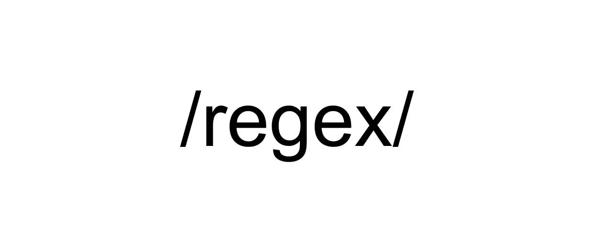
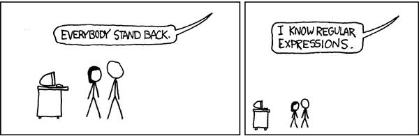

# 正则表达式

> 原文：<https://medium.com/codex/regular-expressions-bb6063d12aaf?source=collection_archive---------10----------------------->

许多编程语言都使用正则表达式(通常称为 Regex)来匹配字符串中的字符模式。一开始学习它们的语法可能有点令人生畏，但是一旦你学会了一些基础知识，它们会非常有用。使用正则表达式，您可以搜索字符串以确定模式是否存在，验证密码、电子邮件、电话号码等。，或者执行搜索并替换。我希望在本文结束时，您会对使用 Regex 的基础知识感到更加熟悉。

全漫画来自 [xkcd](https://xkcd.com/208/)

> 免责声明:
> 
> 在本文中，我将对正则表达式使用 JavaScript 语法。尽管不同编程语言的正则表达式的语法是相似的，但还是有一些不同。请务必在 Regex 上查看您的编程语言文档。

# 如何创建正则表达式

在 JavaScript 中，有两种方法定义正则表达式。正则表达式文字:

`const regEx = /abc123/`

这是定义正则表达式最简单的方法。只需将您希望匹配的模式用正斜杠`/regex/`括起来。定义正则表达式的另一种方法是使用 RegExp 对象的构造函数:

`const regEx = new RegExp(‘abc123’)`

以上两个例子都返回相同的正则表达式。第一个例子编写起来更简单，并且在大多数情况下都能工作，但是第二个例子有一个额外的好处，就是能够接受一个变量。当您知道正则表达式的值将会改变时，可以使用构造函数。

# 正则表达式基础

JavaScript 中有很多方法可以使用正则表达式。为了展示正则表达式的一些基础知识，我将使用 RegExp 方法`test()`。在正则表达式上调用此方法，并将一个字符串作为参数传入。`test()`将返回一个布尔值。如果找到匹配项，它将返回 true，如果没有找到匹配项，它将返回 false。

最基本的正则表达式是那些匹配字符串的表达式。例如，如果我们有字符串`“Hello World”`，我们可以使用正则表达式`/Hello/`搜索单词“Hello”。我们可以使用`test()`方法对此进行测试:

基本正则表达式的使用

## 忽略案例标志

正则表达式区分大小写，所以`/hello/`不会在我们的字符串`“Hello World”`中找到匹配。有一种方法可以用可选标志忽略区分大小写。任何可选标志都被添加到正则表达式末尾的正斜杠之后。您可以有多个可选标志。以下示例将展示这一点:

实际操作中的忽略案例标志

## 特殊字符

正则表达式中可以使用许多特殊字符。点号(也称为通配符)(`.`)将匹配任何字符。如果您要在`/./`上运行测试方法，任何非空字符串都将返回 true。这本身似乎不是很有用，但是当与其他字符结合使用时，这个特殊字符变得非常有用:

通配符的作用

点特殊字符很有帮助，但有时可能有点太有帮助了。我们可能不想匹配任何字符。我们可能只想匹配选定的几个字符。我们可以通过将选择的字符放在方括号中来做到这一点。

如果您有许多想要放在方括号中的字符，那么在方括号中输入每个字符似乎需要大量的输入。幸运的是，只要它们按顺序排列，您就可以使用连字符来显示一系列字符。例如，`/[a-z]/`将匹配所有小写字母，`/[A-L]/`将匹配从 A 到 L 的所有大写字母，

`/[0–9]/`将匹配所有数字。

有一些特殊字符可以匹配常见的字符范围。匹配所有字母数字字符是很常见的，并且对于 regex 有一个特殊的字符。`\w`匹配所有大小写字母、数字 0-9 以及(奇怪的是)下划线(_)。`/\w/`将与`/[a-zA-Z0–9_]/`匹配相同。另一个常见的字符范围是所有数字。`\d`是匹配所有数字 0-9 的特殊字符。`/\d/`将与`/[0–9]/`匹配相同。空白是字符串中的另一个常见字符。一个新单词不能没有空格。`\s`是匹配空白的特殊字符。

你可能已经注意到有很多特殊字符，但是如果你想匹配这些字符中的一个呢？例如，如果您想匹配一个句点、一个问号或一个正斜杠，该怎么办？这些在正则表达式中都有特殊的含义。为了能够使用这些字符并让 Regex 以不同于其特殊含义的方式读取它们，您必须对字符进行转义。这与在 JavaScript 字符串中转义引号是同一个概念。要对一个特殊字符进行转义，可以在它前面加一个反斜杠(`\`)。`/\./`将匹配句点，而不是像点特殊字符那样匹配任何字符。

## 避免重复你自己

到目前为止，所有的正则表达式示例都是一对一地匹配字符。`/hello/`将按照那个确切的顺序匹配那些确切的字符。`/[a-i]/`、`/\w/`、`/\d/`或`/\s/`都只匹配一个字符。如果正则表达式表示的字符之一出现在字符串中，您将得到一个匹配。如果你想匹配一行中的多个字符，你会怎么做？您可以在 Regex 中重复这个字符，例如:`/www/`匹配一行中的 3 个 w，或者`/\w\w\w/`匹配一行中的 3 个字母数字字符。这是可行的，但是为了匹配更长的字符串，你的正则表达式会变得很长并且重复。

有一些字符可以作为速记添加到正则表达式中，以匹配重复的字符或模式。加号(`+`)将匹配一个或多个相同类型的字符。

行动中的加号特殊字符

星号(`*`)将匹配零个或多个相同类型的字符。

行动中的明星特殊角色

问号(`?`)将匹配零个或一个前述类型的字符。

请注意,“cat54”是匹配的，因为正则表达式寻找字符 c、a、t 和 0-1 数字。“cat5”是匹配的。4 不会改变其功能。

## 阿尔法和欧米茄

有时，您会希望匹配的模式位于字符串的开头或结尾。例如，您可能想要编写一个验证来检查每个名称是否以大写字母开头，或者您可能想要检查某个内容。幸运的是，正则表达式在字符串的开头和结尾有特殊的字符用于匹配模式。

要构建匹配字符串开头的正则表达式，可以使用胡萝卜(`^`)。将胡萝卜加到模式的开头，如果模式在字符串的开头，正则表达式将只匹配一个字符串。

使用胡萝卜(^)匹配字符串开头的模式

构建正则表达式来匹配字符串末尾的模式也同样简单。在这种情况下，使用美元符号(`$`)并将其添加到正则表达式的末尾。

使用美元符号($)匹配字符串末尾的模式

> 关于胡萝卜的重要提示(`^`)
> 
> 如果在正则表达式中将胡萝卜(`^`)放在方括号(`[]`)中，它就有不同的含义。虽然将胡萝卜加到正则表达式的开头会匹配字符串开头的模式，但是在方括号内添加胡萝卜会将其含义改为 NOT。这意味着`/[^abc]/`将匹配除‘a’、‘b’或‘c’之外的任何字符。

## 全球旗帜

JavaScript 中另一个使用正则表达式的有用方法是`match()`。`match()`在字符串上被调用，并接受一个正则表达式作为参数。它返回在字符串中找到的匹配项的数组，如果没有找到匹配项，则返回 null。

这是引入全球旗帜的好时机(`g`)。您可以将此标志添加到正则表达式的末尾，以便多次匹配。如果不使用全局标志，`match()`将返回第一个匹配，但是使用全局标志，它将返回找到的所有匹配。

行动中的全球旗帜

这应该足够开始使用正则表达式了。还有许多特殊的字符我没有介绍。还有许多其他有用的 JavaScript 方法可以处理正则表达式。有一些很好的资源可以帮助您进一步了解正则表达式。Rubular.com 允许你根据一些样本文本检查你的正则表达式，这样你就可以确保你的正则表达式按预期执行。alf.nu/RegexGolf 是一个伟大的游戏来测试你的正则表达式创建技能。MDN 还有几页详细介绍了 JavaScript 中的正则表达式。

一旦你理解了正则表达式的工作原理，它就会变得非常有用。有了这些基础，您应该能够开始在自己的代码中使用它们了。编码快乐！