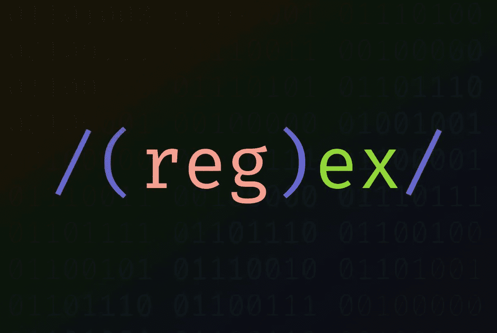
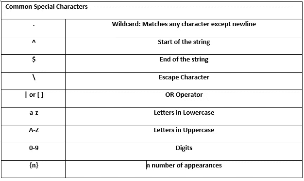

# Python 中的正则表达式

> 原文：<https://medium.com/codex/regular-expressions-in-python-535799f8ddfc?source=collection_archive---------4----------------------->


信用: [Avotrix](https://blog.avotrix.com/regex-expression-in-splunk/)

# 什么是正则表达式？

正则表达式(或简称 Regex)是匹配字符串模式的字符序列。许多编程语言使用正则表达式，如 Python、Java、C#等。在处理字符串时，Regex 是处理数据的一个非常方便的工具。

# 字符串操作和操纵


信用:[阿利卡科技](https://www.allika.tech/posts/py/010/)

字符串是用引号括起来的一系列字符。在深入学习正则表达式的基础知识之前，熟悉字符串操作是一个好主意。Python 有用于字符串操作的内置函数。一些受欢迎的是:

## 字符串索引

在字符串中，索引用于从字符串中选择一个字符或一组字符。python 中的索引是从零开始的，也就是说，位置是从零开始计数的，而不是从一开始计数。

> string_1 = "敏捷的棕色狐狸跳过懒惰的狗"

查看这个[文档](https://python-reference.readthedocs.io/en/latest/docs/brackets/indexing.html)以获得更多关于字符串索引的信息

## 剥离字符

剥离用于从字符串中移除特定字符。如果没有指定要去除的参数，python 会去除字符串中的空格。默认情况下，python 去掉了字符的尾随和前导空格。也可以指定去废(尾随、前导或两者)。要剥离的特定字符也可以作为参数传递，例如“$”

检查此[文件](https://python-reference.readthedocs.io/en/latest/docs/str/strip.html)中的剥离管柱

## 查找和替换

**index** 方法用于在指定位置的字符串中搜索子字符串。如果未指定搜索位置，则在整个字符串中搜索子字符串。如果子串存在于字符串中，则返回子串的位置，如果不存在，则返回值错误。

```
string_1.index("fox")
This returns the position of fox in string_1string_1.index("fox", 0,10)
This returns the position of fox, given that it exists in the specified location.
```

**replace** 方法用于将字符串中出现的子字符串替换为新的子字符串。如果未指定替换的出现次数，则替换所有出现次数。

```
string_1.replace("fox","monkey") 
This replaces all "fox" in the string with "monkey"string_1.replace(" ","_",2)This replaces the first 2 whitespace with underscores
```

## 字符串格式

字符串格式用于在已定义的文本中插入自定义字符串或变量。 **{}** 用作自定义字符串/变量的占位符。

```
Text : "My brother has 2 bags and 8 oranges in each bag"**Example 1:**print ("My brother has {} bags and {} oranges in each bag".format(2,8))We can also specify the index (index is zero indexed) in the placeholder i.e.:print ("My brother has {1} bags and {0} oranges in each bag".format(8,2))The number of decimal places for a float value can also be specified.**Example 2:**number_1 = 8/3
number_2 = 2/3print ("8 divided by 3 is {0:.2f} but 2 divided by 3 is {1:.2f}".format(number_1, number_2))The F-String literal is sometimes preferred:
print (f"8 divided by 3 into 2 decimal places is {number_1:.2f}")
```

# 正则表达式



Credit : [Coderpad](https://coderpad.io/blog/development/the-complete-guide-to-regular-expressions-regex/)

正则表达式使用元字符和特殊字符的组合来查找文本中的模式。这对于匹配复杂字符串中的模式特别有用。Python 使用 [**re**](https://docs.python.org/3/library/re.html) 模块来处理 Regex。一些常用的元字符和特殊字符是:


鸣谢:作者



鸣谢:作者

## 重新搜索( )

方法用于在字符串中搜索指定的正则表达式模式。例如，指定一个遵循美国标准邮政编码格式的正则表达式，我们可以应用 **re.search()** 来确认在一条语句中是否存在邮政编码。

## re.sub()

戒指。sub()方法用于用指定的值替换字符串中的模式。例如，会计可能希望从文本中删除货币符号，以便通过用空格替换这些符号来轻松执行定量分析。

## 重新拆分()

方法基于 split 参数返回一个字符串的子字符串。

## re.findall()

**re.findall()** 方法在一个字符串中搜索一个模式的匹配(非重叠)并返回该模式后面的子字符串列表。例如，我们可以应用 **findall()** 参数从字符串中提取电话号码。

有时候，在正则表达式中捕获组是很重要的。组是用括号括起来的正则表达式模式的一部分。使用上面的电话号码示例，我们可以使用捕获组方法选择学生的**姓名**。

> 正则表达式和字符串操作在字符串操作和数据争论中非常有用。在本文中，我们已经学习了字符串操作和正则表达式中的基本术语。我们还学习了一些使用 Python 的应用程序的字符串方法和正则表达式函数。