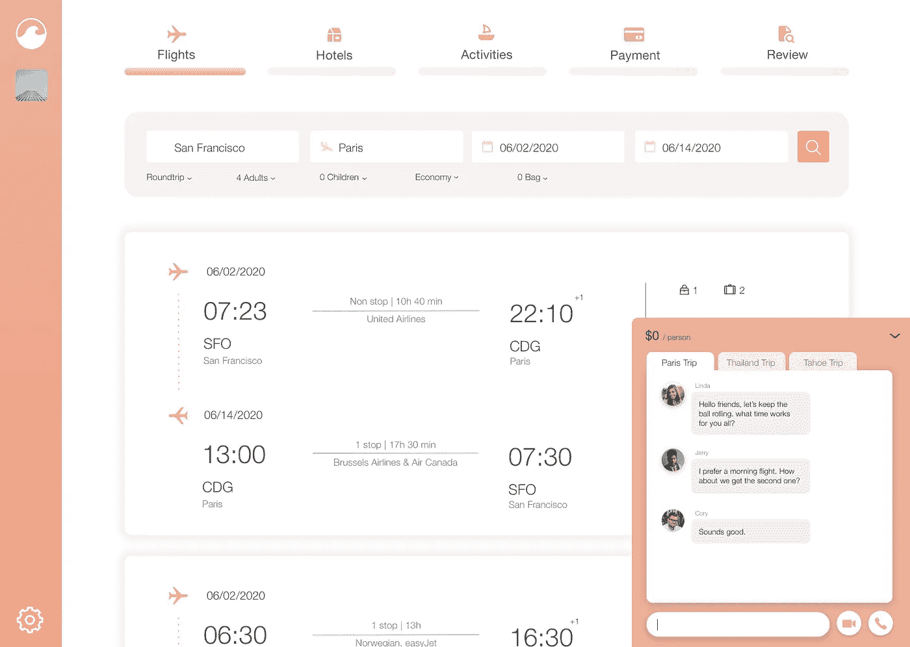
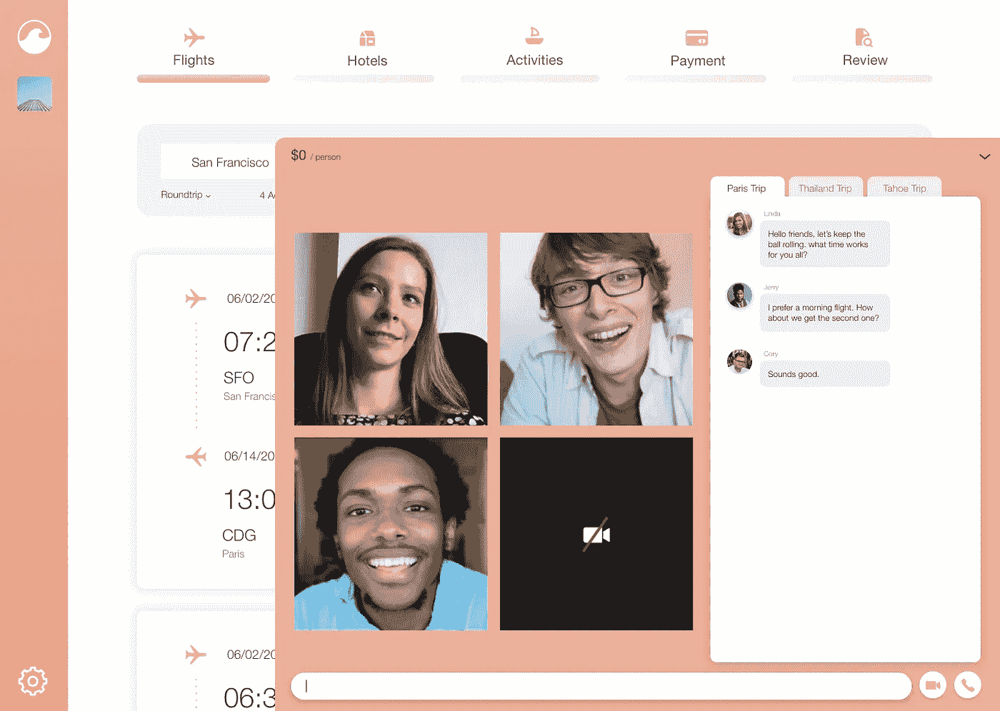

# 重新想象团体旅行体验——Tripanion

> 原文：<https://medium.com/codex/reimagine-group-travel-experience-tripanion-cd97008cea7a?source=collection_archive---------9----------------------->

跟团旅行比独自旅行要复杂得多。奋斗是从一起订行程开始的。每个人都有自己的偏好。有些人更喜欢早上的航班，而不是晚点的；有些人更喜欢直飞航班，而不是中途停留一两次；有些人更喜欢住在豪华酒店，而不是离景点更近的经济型酒店。底线，预订一个让所有人都满意的旅行是一项艰巨的任务。

作为一个经常跟团旅行的人，我知道这种痛苦。这就是为什么我与三名团队成员、一名设计师和三名软件工程师一起想象愉快的团体旅行预订体验。

# Tripanion 来了

Tripanion 是 trip 和 companion 之间的文字游戏，提供了一体化的团体旅行预订体验。它不仅可以提供最佳的旅行交易，还可以提供实时参与元素，如视频通话、音频通话和消息传递。

当你和朋友一起预订团队旅行时，你不必在旅行预订平台(如 Expedia)和交流平台(如 WhatsApp 和 iMessage)之间跳来跳去。每个与旅行相关的通信都保存在平台上，并按每次旅行进行分类。

如果觉得发短信太慢，可以一起开个群呼，现场讨论行程细节！得益于 Agora 的 RTE API，群呼可以支持 17 人同处一室，超低延迟(400ms)。

# 我们是如何建造它的

我们使用 Amadeus 的航空 API 获取最新的航班信息，使用 T2 Agora 的 API 获取视频、音频和消息服务。这是我们为 DeveloperWeek 2020 Hackathon 构建的项目。因为 48 小时的时间框架，我们不能得到所有的功能，我们想工作。但我们确实成功地连接到了 Amadeus 的服务器和数据库([航班报价搜索](https://developers.amadeus.com/self-service/category/air/api-doc/flight-offers-search))，收到了回调，并获取了航班信息。我们还连接到 Agora 的 RTC 引擎，以启动呼叫和消息功能。

# 我们面临的挑战

我们面临的最大挑战无疑是时间紧迫。但这对所有黑客马拉松参与者来说都不是秘密。我们面临的下一个挑战是如何组织海量的各类信息。

Amadeus 是一个如此强大的 API，它可以提供你能想到的关于预订体验的每一步的所有细节。也正因为如此，我们需要处理许多类别的信息。我们只是开始使用机票预订功能。但是在 JSON 回调中，有关于航班停靠点、承运人入口、运营航班、目的地等信息。我们必须决定哪些信息对用户有用，哪些是无用的。

请记住，这只是“航班优惠搜索”功能。还有其他 API 调用如“航班最便宜日期搜索”、“座位图显示”、“航班灵感搜索”、“航班限制”等等！同样的努力也将用于旅行预订体验的其他部分，如酒店、景点、租车等。

谢天谢地，因为我对 Agora 的 API 相当熟悉，所以实时参与特性的实现进展顺利。

# 还有什么更好的

Tripanion 是我们为 DeveloperWeek 2020 黑客马拉松做的一个项目。因为时间线的原因，我们只做了一个 MVP。如果我们有更多的时间，我们很乐意完成整个旅行预订体验，包括航班和酒店搜索和预订功能。

除此之外，以下是我们可以为该平台增加更多价值主张的功能:

*   **互动屏幕分享体验** **(Agora SDK:** [**屏幕分享**](https://docs.agora.io/en/Video/screensharing_web_ng?platform=Web) **+** [**白板**](https://docs.agora.io/en/whiteboard/product_whiteboard?platform=Web) **)** :与其用文字描述旅行细节，不如让所有用户看到同一个屏幕？该平台应该允许小组中的任何用户将他们的旅行信息分享给其他人，其他人可以在屏幕共享上突出显示或标记这些信息。Agora 已经提供了这些功能。
*   **要去的地方的存储库:** Tripanion 还应该允许用户在目的地添加和保存所有他们想去的地方，并在用户之间同步。可以是他们想去的餐馆列表，也可以是他们想去的景点列表。
*   **行程总结:**团队敲定行程细节后，Tripanion 应能提供一份简单易懂的行程安排和行程总结，包括航班信息、酒店位置、交通工具、每日行程、预算范围等信息。
*   **基于预订方的常旅客信息、忠诚度计划和航空公司/酒店偏好的旅行优化(Amadeus API:** [**航班报价+座位图显示**](https://developers.amadeus.com/blog/flight-api-updates-frequent-flyer-maximum-price-search) **)** :谁不喜欢从旅行中获得一些奖励呢？Tripanion 应允许用户存储各种常旅客和忠诚度计划信息，并根据旅行偏好和忠诚度计划优化座位和定价。
*   **休息室/信用卡优惠偏好****(Discover API:**[**机场休息室定位器**](https://developer.discover.com/views/AirportLoungeLocatorDoc.html#) **)** :旅行黑客总是希望自己的忠诚度和信用卡利益最大化。这就是为什么 Tripanion 也应该提供机场候机室的信息。
*   **原生应用**:我们在 web 上构建了 MVP。对于经常外出的用户来说，这不是一个理想的平台。这就是为什么在 iOS 和 Android 上启动原生应用程序非常重要。为此，我们可能会使用 Flutter 或 React Native。
*   **出行费用拆分功能(类似 Splitwise)** :这是一个简单的功能，目前很多出行应用都没有。团队中的所有旅行者都可以加入一个共享标签。无论谁为旅行项目付款，都可以在标签上添加费用。在旅行结束时，他们可以结算账单，并通过 Venmo 或 Cash 应用程序相互转移欠款。
*   **不同出发地点(Amadeus API:** [**航班报价**](https://developers.amadeus.com/self-service/category/air/api-doc/flight-offers-search) **):** 目前 MVP 只支持一个出发地点。可能有这样的情况，你和你的朋友从不同的地方旅行。Tripanion 应提供不同出发地点的航班选项。

# 最后

Tripanion 是我和我的队友们真正引以为豪的项目。我们不仅重新构想了在线团体旅游体验，这一市场价值估计超过 4000 亿美元，而且还解决了一个我们以前都经历过的问题。

哦，还有，锦上添花的是，那天我们赢得了 Amadeus 的黑客马拉松挑战赛！

它始于一个 MVP，但我们有更远的梦想，并展示了在线团体旅游的体验。